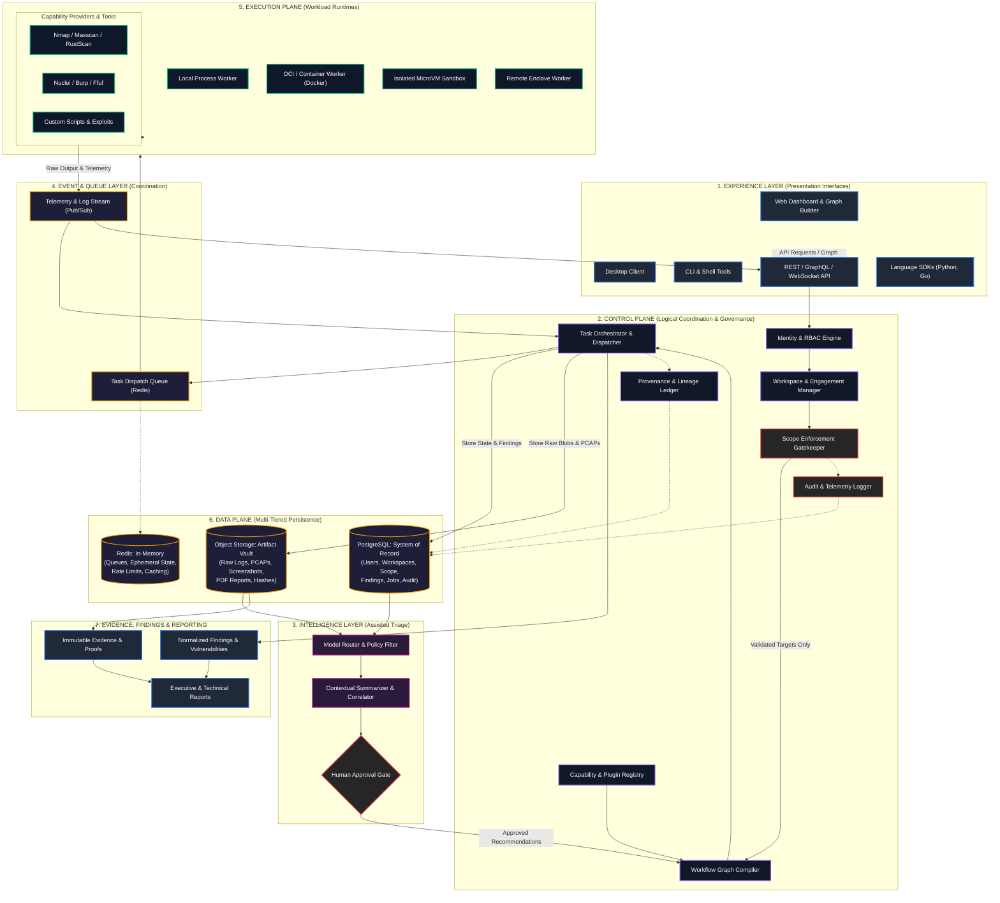

**Title**: Shadow : Helix Nebula (SHN)  
**Phase**: 0.1 — Product Identity & Purpose  
**Status**: Foundational Architecture  

> **Authoritative Specification Notice**: This document is the authoritative Phase 0.1 architectural specification for Shadow : Helix Nebula (SHN). It establishes the foundational product identity, canonical definition, operational purpose, system philosophy, architectural layers, core models, governance frameworks, and evolution roadmap. This specification serves as the binding architectural source of truth for all subsequent design and implementation phases.

---

# 1. Product Identity

### 1.1 Formal Nomenclature & Designation
- **Official Product Name**: Shadow : Helix Nebula
- **Canonical Abbreviation**: SHN
- **Industry Category**: Cybersecurity Operations & Security Engineering Platform
- **Core Architectural Role**: Unified Security Control Plane

### 1.2 Product Persona & Character
Shadow : Helix Nebula (SHN) is conceived and designed as a serious, production-grade, long-lived cybersecurity platform for professional operators and security engineering organizations. It is explicitly not an academic demonstrator, a temporary script wrapper, an ad-hoc collection of exploit modules, or a lightweight utility. 

SHN embodies the following character traits:
- **Operational Rigor**: Prioritizes deterministic execution, comprehensive logging, explicit authorization boundaries, and verifiable results over opaque automation.
- **Engineering Discipline**: Emphasizes clean architectural separation, strict typing, decoupling of coordination from workload execution, and infrastructure neutrality.
- **Defensibility & Provenance**: Treats every observation, finding, and generated artifact as forensic-grade evidence backed by cryptographic lineage.
- **Sovereign Operator Control**: Treats human operators as the ultimate decision-makers, employing artificial intelligence and automation exclusively as force multipliers rather than autonomous actors.

### 1.3 Long-Term Product Identity
Over its lifecycle, SHN is designed to evolve into the standard operational control plane for offensive, defensive, and collaborative security engineering. It bridges the gap between disparate security utilities, automated scanners, manual tradecraft, intelligence synthesis, workflow orchestration, and executive reporting.

---

# 2. Product Definition & Canonical Definition

### 2.1 Canonical Definition
> **"Shadow : Helix Nebula (SHN) is a production-oriented, extensible cybersecurity operations and security engineering platform that acts as a unified control plane for security capabilities, workflows, execution environments, intelligence, evidence, governance, and reporting."**

### 2.2 Platform vs. Toolkit Distinction
A fundamental architectural tenet is that **SHN is a platform, not a toolkit**.

| Architectural Dimension | Security Toolkit | SHN Platform |
| :--- | :--- | :--- |
| **Primary Abstraction** | Disjoint CLI tools and scripts | Abstract security capabilities and execution graphs |
| **Operational Flow** | Ad-hoc manual copy-pasting of outputs | Structured, reproducible, stateful workflow graphs |
| **State Management** | Ephemeral files, local shell history | Centralized relational store, state machine, and object store |
| **Data Normalization** | Proprietary tool outputs (text/XML/JSON) | Standardized schemas, unified models, unified findings |
| **Evidence & Integrity** | Loose screenshots, unhashed logs | Cryptographically signed, provenance-tracked evidence chains |
| **Extensibility** | Writing isolated one-off wrapper scripts | First-class plugin architecture with versioned contracts |
| **Control & Governance** | Trust in the user's terminal environment | Strict policy enforcement, role-based access, and auditable scope |

### 2.3 Layered Conceptual Architecture
SHN partitions system responsibilities across five distinct conceptual layers:

```
+-----------------------------------------------------------------------+
|                           EXPERIENCE LAYER                            |
|             (Web UI / Desktop / CLI / REST API / SDKs)                |
+-----------------------------------------------------------------------+
                                   |  (API-First Protocol / JSON-RPC)
                                   v
+-----------------------------------------------------------------------+
|                            CONTROL PLANE                              |
|   Workspaces | Engagements | Scope Engine | Capabilities | Workflows  |
|      Governance & RBAC | Provenance Ledger | Audit & Telemetry        |
+-----------------------------------------------------------------------+
        |                                    |                      |
        | (State / Record)                   | (Dispatch / Manage)  | (Context)
        v                                    v                      v
+------------------+             +--------------------+    +------------------+
|    DATA PLANE    |             |  EXECUTION PLANE   |    |   INTELLIGENCE   |
| PostgreSQL (Core)|             | Local Process      |    |      LAYER       |
| Redis (Queues)   |             | Container Runtime  |    | Model Routing    |
| Object Storage   |             | Isolated Workers   |    | Analysis & Synth |
| (Artifacts/PCAP) |             | Remote Workers     |    | Policy Gates     |
+------------------+             +--------------------+    +------------------+
```

1. **Experience Layer**: The client presentation and interaction tier. It captures operator intent and visualizes state without containing authoritative business logic.
2. **Control Plane**: The central brain and coordination engine. It enforces policy, tracks state, compiles workflows, and supervises operations.
3. **Execution Plane**: The distributed, isolated workload runtime. It executes actual security operations across local or remote environments.
4. **Data Plane**: The multi-tiered persistence layer managing structured records, high-speed queues, and raw artifact blobs.
5. **Intelligence Layer**: The contextual assistance engine providing analysis, correlation, natural language synthesis, and operational recommendations subject to human approval.

---

# 3. Product Purpose

### 3.1 Operational Mission
The fundamental purpose of SHN is to transform fragmented, error-prone, and unobservable security operations into a unified, customizable, repeatable, observable, evidence-driven, workflow-oriented, and extensible security environment.

### 3.2 Transforming the Operational Lifecycle
Modern security operations suffer from severe operational friction. SHN resolves this by transforming the operational lifecycle:

```
Fragmented Security Tools
  --> Unified Abstract Capabilities
  --> Composable & Reusable Workflows
  --> Enforceable Scope & Policy Verification
  --> Controlled, Isolated Execution
  --> Normalized Output Schemas
  --> Cross-Source Information Correlation
  --> Contextual AI-Assisted Intelligence
  --> Forensic Evidence Preservation
  --> Verified Finding Lifecycle Management
  --> Actionable Stakeholder Reporting & Auditable Archival
```

### 3.3 The Operator North-Star Lifecycle
SHN is architected to support a comprehensive 20-step lifecycle for authorized operators:
1. **Create a Workspace**: Establish an isolated operational context with defined access controls.
2. **Define an Engagement**: Set operational parameters, timelines, customer boundaries, and rules.
3. **Define Authorized Scope**: Input exact inclusions, exclusions, CIDR blocks, domains, and action rules.
4. **Identify & Manage Assets**: Ingest, discover, tag, and categorize targets within the workspace.
5. **Discover Capabilities**: Enumerate available security capabilities across installed plugins.
6. **Select & Configure Capabilities**: Parameterize target capabilities to meet engagement parameters.
7. **Build/Select a Workflow**: Assemble a directed execution graph of interconnected security steps.
8. **Validate Scope & Authorization**: Mechanically verify that all workflow steps obey scope boundaries.
9. **Dispatch to Execution Runtime**: Send tasks to appropriate local, containerized, or remote workers.
10. **Observe Execution Real-Time**: Stream telemetry, logs, process metrics, and health indicators.
11. **Capture Raw Output**: Persist unmodified raw outputs, stdout, stderr, exit codes, and network traffic.
12. **Normalize Results**: Transform vendor-specific outputs into uniform domain models.
13. **Correlate Information**: Merge multi-source outputs, link network data to vulnerabilities, and identify patterns.
14. **Create & Manage Findings**: Track potential vulnerabilities, misconfigurations, and exposures.
15. **Preserve Evidence**: Cryptographically hash and link artifacts, screenshots, and logs to findings.
16. **Preserve Provenance**: Log exact execution parameters, tool versions, timestamps, and operator IDs.
17. **Engage Intelligence**: Apply models for summarization, contextual analysis, and triage recommendations.
18. **Review Findings**: Operator validates, adjusts severity, dismisses false positives, and confirms impacts.
19. **Generate Reports**: Compile stakeholder-specific deliverables (technical, executive, compliance).
20. **Preserve Auditable History**: Lock engagement records, archive evidence, and preserve verifiable audit trails.

---

# 4. Security Tool Fragmentation Problem

### 4.1 The Landscape of Tool Dispersal
Modern cybersecurity practitioners do not suffer from an absence of specialized software. Instead, they face an overwhelming proliferation of disparate, single-purpose utilities:
- **Network Reconnaissance & Discovery**: Nmap, Masscan, RustScan, ZMap, ARP scanners.
- **Web Application Security**: Burp Suite, OWASP ZAP, Caido, Nikto, ffuf, Gobuster, sqlmap.
- **Vulnerability Scanners**: Nuclei, OpenVAS, Nessus, Trivy, Grype.
- **OSINT & Enumeration**: theHarvester, Amass, Sublist3r, Recon-ng, Shodan/Censys clients.
- **Traffic & Packet Analysis**: Wireshark, tshark, tcpdump, Zeek.
- **Frameworks & Custom Tradecraft**: Metasploit, Cobalt Strike, custom Python/Go/Bash scripts.
- **Auxiliary Systems**: Terminal multiplexers (tmux), local markdown files, spreadsheets, screenshots in scratch folders, disconnected LLM chats, and ad-hoc report templates.

### 4.2 The Operational Friction of Tool Fragmentation
Because these tools operate in total isolation:
- **Data Siloing**: Outputs remain trapped in proprietary text formats, arbitrary XML, or irregular JSON.
- **Manual Glue Code**: Practitioners spend substantial effort copying IP addresses, parsing strings, and feeding data manually between tools.
- **Cognitive Overload**: Operators must constantly shift contexts between command lines, browser tabs, and desktop GUIs.
- **Accidental Scope Violation**: Human error in copy-pasting targets frequently leads to scanning unauthorized assets.
- **Evidence Degradation**: Output files are easily overwritten, screenshots lack context, and logs lack cryptographic integrity.
- **Non-Reproducibility**: Months later, reproducing the exact findings of a test is often impossible because tool flags, environment variables, and tool versions were not recorded.

### 4.3 Conventional Flow vs. SHN Flow
```
Conventional Fragmented Flow:
[Tool A] -> Manual Copy -> [Tool B] -> Save Output -> Terminal Analysis -> [Tool C] -> Screenshots -> Scratch Notes -> Word Doc

SHN Orchestrated Flow:
[Workspace] 
    --> [Scope Engine] 
    --> [Abstract Capabilities] 
    --> [Directed Workflow Graph] 
    --> [Isolated Execution Runtime] 
    --> [Normalized Data Schemas] 
    --> [Correlation Engine] 
    --> [AI Contextual Analysis] 
    --> [Evidence & Provenance Vault] 
    --> [Finding Lifecycle] 
    --> [Auditable Reports]
```

SHN solves this problem not by wrapping individual tools in superficial graphical interfaces, but by providing a cohesive architectural control plane that standardizes capabilities, execution, data models, and evidence.

---

# 5. Target Users & Stakeholders

SHN explicitly differentiates between **Primary Operators** who directly execute security workloads and **Secondary Stakeholders** who consume, govern, or configure outputs.

```
+---------------------------------------------------------------------------------+
|                               TARGET USER MATRIX                                |
+---------------------------------------------------------------------------------+
| PRIMARY OPERATORS (Hands-On Control)          | SECONDARY STAKEHOLDERS (Governance)    |
+-----------------------------------------------+---------------------------------+
| - Penetration Testers                         | - DevSecOps / AppSec Engineers  |
| - Red-Team Operators                          | - Security Consultants / Firms  |
| - Blue-Team / SOC Analysts                    | - CISOs & Security Leadership   |
| - Purple-Team Practitioners                   | - Compliance & Audit Personnel  |
| - Cybersecurity Engineers                     | - Academic Researchers & Faculty|
| - Vulnerability Researchers                   | - Capture-The-Flag (CTF) Teams  |
+-----------------------------------------------+---------------------------------+
```

### 5.1 Primary Operators
1. **Penetration Testers**: Require structured workspaces, automated reconnaissance pipelines, rigorous scope enforcement, and rapid, evidence-backed report compilation.
2. **Red-Team Operators**: Demand reproducible multi-stage operation graphs, stealth profile configuration, execution isolation, and operational logging.
3. **Blue-Team / SOC Practitioners**: Utilize capabilities for threat emulation, active verification of telemetry, attack-surface monitoring, and alert validation.
4. **Purple-Team Practitioners**: Need collaborative workspaces where offensive actions and defensive detections are mapped concurrently in real time.
5. **Cybersecurity Engineers**: Integrate automated security validation workflows into operational environments and test infrastructure defenses.
6. **Authorized Vulnerability Researchers**: Rely on deep raw output capture, payload iteration, target variable scoping, and precise proof-of-concept evidence retention.

### 5.2 Secondary Stakeholders
1. **DevSecOps & Security Engineering Teams**: Consume normalized findings, trigger automated security verification workflows via API, and ingest structured audit feeds.
2. **Security Consulting Leadership**: Track engagement timelines, enforce standardized testing methodologies across teams, and ensure deliverables meet firm-wide quality bars.
3. **CISOs & Executive Leadership**: Review high-level posture summaries, risk metrics, finding trends, and compliance attestations.
4. **Academic Researchers & Students**: Utilize structured environments to study attack methodologies, evaluate security tools systematically, and document experimental results.
5. **CTF Practitioners**: Leverage rapid capability orchestration and automated flag/artifact capture within challenge environments.

---

# 6. Product Philosophy

The architecture of SHN is governed by sixteen core philosophical principles. For every principle, we define **WHAT** it is, **WHY** it is critical, and its **FUTURE IMPLICATION**.

### 6.1 Modularity
- **WHAT**: System capabilities, runtimes, storage drivers, and presentation layers are decomposed into discrete, loosely coupled modules with clean boundary interfaces.
- **WHY**: Monolithic security suites become unmaintainable, prevent selective upgrades, and force all operators into a rigid operational model.
- **FUTURE IMPLICATION**: Subsystems can be refactored, replaced, or scaled independently without destabilizing the core control plane.

### 6.2 Extensibility
- **WHAT**: The platform provides formal mechanisms to extend capabilities, data schemas, workflow nodes, UI panels, and intelligence providers.
- **WHY**: The cybersecurity landscape evolves faster than any single development team can track; new tools, techniques, and protocols emerge continuously.
- **FUTURE IMPLICATION**: SHN fosters a vibrant ecosystem where third parties and internal security teams author plugins without modifying core code.

### 6.3 Tool-Agnostic Design
- **WHAT**: The core platform remains agnostic to specific underlying CLI binaries, scripts, or commercial tools.
- **WHY**: Hardcoding specific tools into domain logic makes the platform brittle and vulnerable to tool deprecation or licensing shifts.
- **FUTURE IMPLICATION**: Operators can substitute underlying tools (e.g., swapping Nmap for Masscan or RustScan) without altering workflows or downstream data processors.

### 6.4 Capability-First Abstraction
- **WHAT**: Workflows and operators interact with abstract security intents (e.g., `capability:network.port-scan`) rather than concrete tool invocations.
- **WHY**: Allows workflow definitions to remain stable over decades, irrespective of which binary executes the task on a given node.
- **FUTURE IMPLICATION**: Enables intelligent provider routing, automatic fallback, and multi-tool consensus validation.

### 6.5 Workflow-First Orchestration
- **WHAT**: Operational activities are defined as directed graphs composed of sequential, parallel, conditional, and human-gated steps.
- **WHY**: Real-world security work is rarely a single command; it is an iterative sequence of reconnaissance, analysis, decision-making, and targeted actions.
- **FUTURE IMPLICATION**: Complex multi-stage assessments can be codified, versioned in source control, audited, shared, and repeated reliably.

### 6.6 Evidence-First Architecture
- **WHAT**: Every assertion, finding, or report entry must be linked to verifiable, immutable raw execution artifacts.
- **WHY**: Unsubstantiated findings undermine client trust, complicate remediation, and fail legal or compliance evidentiary standards.
- **FUTURE IMPLICATION**: Automatic chain-of-custody tracking, tamper detection, and deterministic forensic validation for every finding.

### 6.7 Provenance
- **WHAT**: Full tracking of the exact lineage of every piece of data: which operator, tool version, plugin, argument string, target, and timestamp produced it.
- **WHY**: Security practitioners must be able to explain exactly how a vulnerability was identified, down to the byte and millisecond.
- **FUTURE IMPLICATION**: Complete auditability that withstands rigorous regulatory scrutiny and internal incident post-mortems.

### 6.8 Governance
- **WHAT**: Architectural enforcement of authentication, authorization, role-based access control (RBAC), least privilege, and operational policies.
- **WHY**: Security tools possess significant destructive and intrusive potential; unrestricted access creates severe organizational risk.
- **FUTURE IMPLICATION**: Enterprise readiness, multi-operator access controls, client confidentiality guarantees, and strict audit compliance.

### 6.9 Human-in-the-Loop Control
- **WHAT**: Automation operates under strict human supervision, requiring explicit operator authorization for actions exceeding defined risk thresholds.
- **WHY**: Fully autonomous security tools cause operational outages, trigger defensive blacklisting, and lack critical business context.
- **FUTURE IMPLICATION**: Operators retain sovereign control, utilizing automation for tedious lifting while reserving authorization for sensitive actions.

### 6.10 Observability
- **WHAT**: Comprehensive exposure of structured logs, telemetry metrics, execution traces, and state transitions across all platform layers.
- **WHY**: Without deep observability, distributed execution becomes an opaque black box, hindering troubleshooting and operational visibility.
- **FUTURE IMPLICATION**: Out-of-the-box integration with modern telemetry pipelines (OpenTelemetry, Prometheus) and real-time execution dashboards.

### 6.11 Reproducibility
- **WHAT**: The ability to reconstruct the exact operational state, configuration, and execution parameters of any historical action.
- **WHY**: Verifying vulnerability remediation or answering client disputes requires exact re-testing under identical conditions.
- **FUTURE IMPLICATION**: One-click workflow re-execution against updated targets to systematically verify fixes over time.

### 6.12 Secure-by-Design Direction
- **WHAT**: Embedding defensive security practices directly into the architecture (e.g., memory safety, input sanitization, least privilege, zero-trust IPC).
- **WHY**: Security platforms are prime targets for adversaries; vulnerabilities in an orchestration platform can compromise an entire enterprise.
- **FUTURE IMPLICATION**: The platform maintains a hardened attack surface resistant to remote code execution through malicious tool outputs or untrusted inputs.

### 6.13 Local-First Operation
- **WHAT**: The platform is fully operational on a single operator's workstation without mandatory external cloud connections.
- **WHY**: Penetration testers and researchers frequently work in air-gapped environments, client networks, or strict offline settings.
- **FUTURE IMPLICATION**: Single-node developer agility and sovereign offline capability without architectural lock-in to cloud vendors.

### 6.14 Distributed-Readiness
- **WHAT**: Logical interfaces and messaging patterns are architected so components can transition from local IPC to distributed networks seamlessly.
- **WHY**: Scaling from an individual tester to a 50-person red team with remote execution nodes across global cloud regions requires distributed execution.
- **FUTURE IMPLICATION**: The platform scales horizontally from a local developer machine to enterprise-scale distributed clusters without rewriting core domain logic.

### 6.15 API-First Architecture
- **WHAT**: All platform capabilities, data models, and control functions are designed as first-class, versioned APIs before user interfaces are built.
- **WHY**: Decouples domain logic from UI presentation, enabling headless automation, custom integrations, and multi-client ecosystems.
- **FUTURE IMPLICATION**: First-class support for CLI tools, web applications, IDE plugins, CI/CD pipelines, and custom enterprise scripts.

### 6.16 Customization
- **WHAT**: Extensibility applied to user experiences, report layouts, risk matrices, finding taxonomies, and dashboard widgets.
- **WHY**: Different organizations, compliance frameworks, and methodologies require distinct reporting styles and operational configurations.
- **FUTURE IMPLICATION**: Elimination of rigid vendor-imposed workflows in favor of bespoke operator environments.

---

# 7. Product Pillars

SHN is built upon eight foundational product pillars that define its core capability spectrum:

```
+-------------------------------------------------------------------------------+
|                             EIGHT PRODUCT PILLARS                             |
+-------------------------------------------------------------------------------+
| 1. EXTENSIBILITY      | 2. ORCHESTRATION    | 3. SEC OPERATIONS | 4. INTELLIGENCE   |
| First-class plugins,  | Directed execution  | Asset discovery,  | Contextual triage,|
| custom capabilities,  | graphs, stateful    | target profiling, | correlation,      |
| modular runtimes      | workflows, policies | task management   | guided assistance |
+-----------------------+---------------------+-------------------+-------------------+
| 5. ANALYSIS           | 6. EVIDENCE         | 7. REPORTING      | 8. GOVERNANCE     |
| Normalized schemas,   | Provenance tracking,| Multi-stakeholder | Strict RBAC,      |
| finding correlation,  | immutable hashes,   | engines, custom   | scope boundaries, |
| deduplication         | forensic chain      | styling, exports  | auditable trails  |
+-------------------------------------------------------------------------------+
```

1. **Extensibility**: A robust plugin ecosystem covering capabilities, tools, parsers, workflows, runtimes, and UI panels.
2. **Orchestration**: Advanced workflow engines capable of compiling and executing complex, stateful, multi-step execution graphs.
3. **Security Operations**: Practical, daily tooling for target scoping, credential handling, asset management, and execution supervision.
4. **Intelligence**: Contextual reasoning, finding summarization, duplicate detection, and attack-path analysis governed by human oversight.
5. **Analysis**: Automated normalization, cross-tool correlation, risk scoring, vulnerability deduplication, and impact assessment.
6. **Evidence**: Complete evidentiary lifecycle tracking, linking raw stdout/stderr, network PCAPs, screenshots, and logs to findings.
7. **Reporting**: Highly customizable report generation producing executive summaries, technical remediation guides, and compliance attestations.
8. **Governance**: Explicit boundary controls, organizational scopes, least-privilege role separation, and tamper-resistant audit logs.

---

# 8. Control Plane Architecture

### 8.1 Definition & Scope
The **Control Plane** represents the logical coordination, governance, and state management layer of SHN. It is the authoritative brain of the platform.

> **Architectural Boundary Invariant**: The Control Plane decides, compiles, and coordinates; it **never** directly executes security tools or untrusted workloads within its own process boundary.

### 8.2 Core Responsibilities
The Control Plane is responsible for:
- **Identity & Access Management**: Enforcing user authentication, role assignments, and session lifecycles.
- **Organizational & Workspace Governance**: Managing tenancy, project boundaries, and resource quotas.
- **Engagement Administration**: Defining engagement schedules, rules of engagement (RoE), and operational metadata.
- **Scope Verification**: Serving as the mechanical gatekeeper validating all targets and actions against defined boundaries.
- **Capability Registry**: Indexing available capabilities, providers, version matrices, and input/output contracts.
- **Workflow Compilation**: Validating workflow graphs, checking dependencies, resolving variables, and emitting execution plans.
- **Job Orchestration**: Dispatching compiled execution tasks to workers across the Execution Plane.
- **Finding & Evidence State Tracking**: Maintaining relational integrity between assets, vulnerabilities, evidence, and reports.
- **Provenance Ledger**: Recording every execution event, parameter, operator ID, and artifact hash.
- **Audit & Compliance Telemetry**: Emitting immutable audit records for every user and system action.

---

# 9. Execution Plane Architecture

### 9.1 Definition & Role
The **Execution Plane** is the isolated runtime environment dedicated to executing concrete security workloads (tools, scripts, network probes, and custom payloads).

### 9.2 Execution Runtime Abstraction
To prevent coupling the platform to any single execution mechanism, SHN introduces the **Execution Runtime** interface. An Execution Runtime accepts a standardized task specification and executes it within a controlled environment.

```
                    +-----------------------------+
                    |  Standard Task Descriptor   |
                    |  - Capability ID            |
                    |  - Provider Binary / Script |
                    |  - Standardized Arguments   |
                    |  - Target & Scope Tokens    |
                    |  - Environment & Limits     |
                    +-----------------------------+
                                   |
                                   v
             +-------------------------------------------+
             |        Execution Runtime Interface        |
             +-------------------------------------------+
                                   |
         +-----------------+-------+---------+-----------------+
         |                 |                 |                 |
         v                 v                 v                 v
+-----------------+ +---------------+ +---------------+ +---------------+
|  Local Process  | |   Container   | |Isolated Worker| | Remote Worker |
|  Runtime (Host) | | Runtime (OCI) | |  VM / Sandbox | | (Distributed) |
+-----------------+ +---------------+ +---------------+ +---------------+
```

### 9.3 Runtime Implementations
- **Local Process Runtime**: Direct execution on the host OS for lightweight development and local-first operation.
- **Container Runtime (OCI / Docker)**: Execution inside ephemeral containers ensuring isolated dependencies, clean environments, and resource constraints.
- **Isolated Worker Runtime**: Execution within hardened microVMs or sandboxes for high-risk or untrusted scripts.
- **Remote / Distributed Worker**: Execution on remote agent nodes located inside target networks, private clouds, or client enclaves.

### 9.4 Execution Flow Invariant
```
[Experience Layer / UI]
      |
      v
[API Gateway]
      |
      v
[Control Plane Core]
      |
      v
[Task Orchestrator / Queue]
      |
      v
[Execution Worker] ---> [Execution Runtime] ---> [Tool / Capability]
                                                        |
                                                        v
                                                   [Raw Output]
                                                        |
                                                        v
[Data Plane Storage] <--- [Evidence & Normalizer] <-----+
```
**Strict Architectural Rule**: The Frontend / Experience layer must NEVER execute security tools directly or communicate with execution workers out-of-band.

---

# 10. Data Plane Architecture

The Data Plane manages persistent state, operational queues, and artifact storage. SHN establishes clear directional technology choices based on workload characteristics.

```
+---------------------------------------------------------------------------------+
|                              DATA PLANE TAXONOMY                                |
+---------------------------------------------------------------------------------+
| PERSISTENCE TIER   | ROLE                          | WORKLOADS                  |
+--------------------+-------------------------------+----------------------------+
| PostgreSQL         | Structured System of Record   | Workspaces, Users, Scope,  |
|                    | (ACID Relational Store)       | Findings, Workflows, Jobs, |
|                    |                               | Metadata, Audit Logs       |
+--------------------+-------------------------------+----------------------------+
| Redis              | Transient State & Streaming   | Job Queues, Cache, Pub/Sub,|
|                    | (In-Memory High Speed)        | Ephemeral Execution State, |
|                    |                               | Rate Limiting, Semaphores  |
+--------------------+-------------------------------+----------------------------+
| Object Storage     | Large Artifact Storage        | Raw Tool Logs, Screenshots,|
| (S3-API / Blob)    | (Unstructured BLOB Store)     | Network PCAPs, HTML Dumps, |
|                    |                               | Compiled PDF Reports       |
+---------------------------------------------------------------------------------+
```

### 10.1 PostgreSQL: Structured System of Record
PostgreSQL is established as the foundational structured database. It provides:
- Strong relational integrity for complex domain entities (Workspaces, Engagements, Assets, Findings).
- ACID transactional guarantees for audit trails, scope definitions, and permissions.
- Rich indexing (B-Tree, GIN) and native JSONB support for semi-structured normalized scan outputs.

### 10.2 Redis: Transient Infrastructure & Queue Engine
Redis serves as the high-throughput, low-latency coordination layer:
- **Task Queues**: Backing distributed worker queues with reliable delivery semantics.
- **Ephemeral State**: Holding live process status, worker heartbeats, and progress counters.
- **Real-Time Pub/Sub**: Relaying live log streams from execution workers to the Control Plane and Experience Layer.
- **Rate Limiting & Locks**: Enforcing target rate limits and concurrency locks across distributed workers.

### 10.3 Object Storage: Large Artifact Vault
Large and binary artifacts generated during assessments are segregated from the relational database and stored in object storage:
- **Artifact Categories**: Raw scan dumps, full stdout/stderr streams, PCAP packet traces, high-resolution screenshots, memory dumps, and compiled final reports.
- **Integrity, Retention & Immutability**: 
  > **Architectural Clarification**: Object storage is **not** assumed to be magically immutable by default. Immutable characteristics are enforced through architectural mechanisms: calculating cryptographic SHA-256 hashes upon ingestion, recording hashes in the PostgreSQL provenance ledger, and applying Write-Once-Read-Many (WORM) or object-lock retention policies where regulatory or evidentiary standards dictate.

---

# 11. Intelligence Layer

### 11.1 Framing: Assisted Intelligence, Not "Autonomous Hacking"
SHN explicitly rejects the framing of the platform as an "autonomous AI hacker" or an unrestricted offensive AI agent. Autonomous tools in security operations introduce unacceptable risks of service disruption, hallucinations, and catastrophic scope violations.

Instead, the **Intelligence Layer** is architected as an **Operator Assistance and Acceleration Engine**.

### 11.2 Architectural Scope of AI Capabilities
The Intelligence Layer provides targeted, high-value cognitive acceleration:
- **Result Summarization**: Condensing thousands of lines of raw tool outputs into actionable executive and technical summaries.
- **Finding Correlation**: Identifying cross-tool relationships (e.g., matching open ports found by Masscan with web endpoints discovered by Gobuster and vulnerabilities flagged by Nuclei).
- **Duplicate & False-Positive Triage**: Recognizing redundant findings across tools and flagging low-confidence alerts for operator inspection.
- **Attack-Surface Interpretation**: Analyzing graph topologies to highlight probable lateral movement paths and exposure clusters.
- **Evidence Analysis**: OCR extraction from screenshots and contextual matching of logs to Common Weakness Enumerations (CWE).
- **Report Drafting**: Synthesizing technical remediation guidance tailored to specific programming languages and infrastructure frameworks.
- **Natural Language Workspace Queries**: Allowing operators to query complex workspace states (e.g., *"Show all hosts with expired SSL certificates running SSH on non-standard ports"*).

### 11.3 AI Governance & Execution Gate
Under no circumstances does the Intelligence Layer possess direct, unrestricted execution authority. All model-generated operational recommendations must pass through a strict policy and authorization pipeline:

```
[Security Data / Outputs]
           |
           v
[Intelligence Layer (AI Engine)]
           |
           v
[Structured Recommendation / Action Plan]
           |
           v
[Policy & Scope Evaluation Gate]
           |
    +------+------+
    |             |
(Violates)    (Permitted)
    v             v
[REJECTED]  [Human Approval Required?]
                  |
            +-----+-----+
            |           |
          (Yes)        (No - Low Risk Passive)
            v           v
    [Operator Prompt] [Authorized Execution]
            |
    +-------+-------+
    |               |
(Approved)      (Rejected)
    v               v
[EXECUTE]       [ABORT & LOG]
```

---

# 12. Experience Layer

### 12.1 Presentation Interfaces
The Experience Layer represents the client interfaces through which operators interact with the platform. SHN is architected to support multiple concurrent presentation surfaces:
- **Modern Web UI**: Rich, interactive dashboards, visual workflow graph builders, real-time log viewers, finding management tables, and report previewers.
- **Desktop Client**: Native or packaged desktop interfaces for intensive local operations and offline access.
- **Command Line Interface (CLI)**: Fast, scriptable, terminal-native client for power operators, CI/CD integrations, and remote headless environments.
- **REST / WebSocket APIs**: Direct programmatic access for custom enterprise integrations and automated pipelines.
- **Software Development Kits (SDKs)**: Strongly typed libraries (Python, Go, TypeScript) enabling developers to automate workspace tasks.

### 12.2 Separation of Presentation and Domain Logic
> **Fundamental Invariant**: The Experience Layer is strictly a consumer of the Control Plane API. No business logic, authorization decisions, scope enforcement, or direct execution management may ever reside exclusively within the frontend. The frontend is disposable; the Control Plane is authoritative.

---

# 13. Capability-First Model

### 13.1 Conceptual Foundation
A cornerstone architectural principle of SHN is that **Security Capabilities are the primary platform abstraction, while specific tools are mere providers**.

Traditional security tools lock workflows to their specific CLI syntax, argument conventions, and output formats. SHN decouples intent from implementation.

```
Traditional (Tool-Coupled):
Workflow Step: "Execute /usr/bin/nmap -sS -p 1-65535 -T4 10.0.0.1" (Brittle, unportable)

SHN Model (Capability-First):
Workflow Step: "Request capability: network.discovery.port-scan with target: 10.0.0.1"
      |
      v
Capability Resolution Engine:
Select Provider:
  - Provider A: Nmap (Standard accuracy)
  - Provider B: Masscan (High speed)
  - Provider C: RustScan (Adaptive speed)
  - Provider D: Custom Internal Scanner
```

### 13.2 Capability Definition Structure
A Capability represents a canonical security function:
- **Namespace & Identifier**: Unique canonical URI (e.g., `shn://capabilities/network/port-scan`, `shn://capabilities/web/fuzzing`).
- **Input Contract**: Strictly typed schema defining required and optional parameters (e.g., target list, port ranges, rate limits).
- **Output Contract**: Standardized schema defining normalized output data structures (e.g., host records, open port arrays, service banners).
- **Execution Semantics**: Operational characteristics (e.g., passive vs. active, invasive vs. non-invasive).

### 13.3 Architectural Advantages
1. **Provider Interchangeability**: An operator or workflow can substitute underlying binaries without altering a single downstream analysis step.
2. **Workflow Portability**: Workflows written for SHN remain functional across diverse environments regardless of which specific tools are locally installed.
3. **Consensus Validation**: Workflows can execute multiple competing providers for the same capability and compare normalized results to eliminate false positives.
4. **Intelligent Dynamic Routing**: Future engines can dynamically select providers based on network latency, target responsiveness, or detected defensive controls.

---

# 14. Plugin-First Architectural Direction

### 14.1 Ecosystem Architecture
To ensure long-term sustainability, SHN is architected around a first-class **Plugin Model**. Rather than hardcoding tool support into core repositories, functionality is delivered via modular, versioned plugins.

### 14.2 Plugin Categories
- **Capability Plugins**: Implement specific security capabilities by wrapping tools or providing native logic.
- **Scanner Plugins**: Provide specialized vulnerability detection routines and rule sets.
- **Analyzer Plugins**: Process normalized data to correlate events, calculate risk scores, or flag patterns.
- **Workflow Plugins**: Distribute pre-packaged operational workflows for specific methodologies (e.g., External Network Assessment, API Security Review).
- **Integration Plugins**: Connect SHN with external platforms (Jira, GitHub, Splunk, ServiceNow, Slack).
- **Intelligence Plugins**: Interface with local or remote AI models and threat intelligence feeds.
- **Reporting Plugins**: Deliver custom report templates, document layouts, and export formats.
- **Data-Source Plugins**: Ingest external threat data, asset inventories, and attack-surface feeds.
- **Execution Runtime Plugins**: Provide novel workload isolation runtimes (e.g., specialized cloud runners).
- **UI Extension Plugins**: Register custom dashboard widgets, visualizers, and configuration panels.

### 14.3 Plugin Manifest & Contract
Every plugin exposes an authoritative manifest declaring:
- **Identity & Metadata**: Unique UUID, namespace, version (SemVer), author, and description.
- **Provided Capabilities**: List of capability URIs implemented, including schema versions.
- **Execution Requirements**: OS compatibility, binary dependencies, container requirements, memory/CPU minimums.
- **Configuration Schema**: Strict JSON Schema defining user-configurable options and defaults.
- **Permissions Requested**: Required network access, filesystem mounts, and secret bindings.

### 14.4 Plugin Security & Isolation Direction
Because plugins execute security tooling, they represent significant supply-chain risk. The plugin architecture mandates:
- **Cryptographic Signing**: Verification of plugin signatures against trusted organizational or community keys.
- **Sandboxed Execution**: Plugins execute inside isolated container or process namespaces with least-privilege capability drops.
- **Granular Permissions**: Explicit policy grants for network access, target routing, and storage access.
- **Lifecycle Auditing**: Every plugin invocation, argument set, and exit state is immutably logged.
- **Revocation Mechanism**: Ability to administratively revoke and blacklist compromised plugins across all nodes.

---

# 15. Workflow-First Architectural Direction

### 15.1 Directed Execution Graphs
Security operations are fundamentally non-linear, multi-phase processes. SHN establishes the **Directed Workflow Graph** as the primary unit of operational orchestration.

> **Architectural Invariant**: Workflows are **not** restricted to strict Directed Acyclic Graphs (DAGs). Real-world security work requires iterative loops (e.g., fuzzing until a condition is met, retrying failed probes, or recursively spidering newly discovered endpoints). The execution engine must support cyclic execution with explicit termination guards.

```
                  +----------------------+
                  | Node 1: Scope Ingest |
                  +----------------------+
                             |
                             v
                  +----------------------+
                  | Node 2: Port Discovery|
                  +----------------------+
                             |
             +---------------+---------------+
             |                               |
             v                               v
+------------------------+      +------------------------+
| Node 3A: Web Profiling |      | Node 3B: SSL Analysis  |
+------------------------+      +------------------------+
             |                               |
             +---------------+---------------+
                             |
                             v
                  +----------------------+
                  | Node 4: Policy Gate  | <--- Human Approval Required
                  +----------------------+      if aggressive probes selected
                             |
                             v
                  +----------------------+
                  | Node 5: Vuln Scan    |
                  +----------------------+
```

### 15.2 Workflow Primitives
- **Nodes**: Discrete execution units (Capability Invocation, Data Transformer, Condition Evaluator, Human Approval Gate, Sub-Workflow).
- **Edges**: Directed execution transitions, optionally conditioned on output expressions (e.g., `if exit_code == 0 and findings.count > 0`).
- **Variables & Context**: Strongly typed data context passed across nodes, scoped to workspace or engagement.
- **Human Approval Gates**: Explicit pauses requiring an authorized operator to review intermediate data and click "Approve" before dangerous steps proceed.
- **Execution Policies**: Node-level retry logic, timeout ceilings, concurrency throttles, and error-handling strategies.
- **Artifact Bindings**: Declarations specifying which node outputs must be preserved as formal evidence.

---

# 16. Workspace Model

### 16.1 Conceptual Boundary
The **Workspace** is the fundamental organizational, isolation, and operational boundary within SHN. All operational security activities occur inside the context of an active workspace.

### 16.2 Workspace Hierarchy & Architecture
A workspace encapsulates all resources, state, and historical records required for an operational endeavor:

```
Workspace
├── Metadata (ID, Title, Description, Creation Date, Tags)
├── Scope (Authoritative Inclusions, Exclusions, Constraints, Rules)
├── Targets & Assets (Discovered Hosts, Domains, Endpoints, Cloud Assets)
├── Workflows (Imported, Compiled, and Custom Execution Graphs)
├── Jobs & Runs (Historical & Active Workflow Tasks, Live Telemetry)
├── Findings (Identified Vulnerabilities, Exposures, Triage State)
├── Evidence (Raw Tool Outputs, Cryptographic Hashes, Screenshots, PCAPs)
├── Notes & Scratchpad (Operator Annotations, Hypotheses, Collaboration)
├── Logs & Audits (Immutable Operational Timeline, User Action Records)
├── Artifacts (Binary Blobs, Intermediate Cache, Export Bundles)
└── Reports (Drafted, Generated, and Published Deliverables)
```

### 16.3 Workspace Isolation Invariant
Data within a workspace is strictly isolated. Assets, findings, and evidence in Workspace $A$ are never accessible or leaked to Workspace $B$ unless an explicit, auditable cross-workspace export is executed by an authorized administrator.

---

# 17. Engagement Model

### 17.1 Multi-Tiered Organizational Structure
To support consulting firms, enterprise security teams, and multi-client consultancies, SHN is designed around an extensible hierarchical structure:

```
Organization (Enterprise Entity / Consulting Firm / Security Dept)
└── Workspace (Client Environment / Dedicated Operational Boundary)
    ├── Engagement A (e.g., Q1-2026-External-Penetration-Test)
    │   ├── Scope Specification
    │   ├── Target Assets
    │   ├── Executed Workflows & Jobs
    │   ├── Verified Findings
    │   └── Associated Evidence Vault
    ├── Engagement B (e.g., Internal-Active-Directory-Audit)
    └── Projects / Sustained Operations (e.g., Continuous Attack-Surface Monitor)
```

### 17.2 Engagement Characteristics
An Engagement represents a bounded, time-delimited security assessment conducted against a subset of workspace assets:
- **Rules of Engagement (RoE)**: Formal documentation of permitted testing windows, escalation contacts, emergency stop procedures, and prohibited techniques.
- **Time Boundaries**: Strict activation and expiration timestamps; execution plane automatically refuses to dispatch tasks outside active engagement windows.
- **Legal & Authorization Metadata**: Signed authorization records and client agreements attached directly to the engagement record.

---

# 18. Scope as a Security Boundary

### 18.1 Architectural Principle
> **Scope is an enforceable security boundary, not an informational label.**

Accidental scanning, exploitation, or probing of out-of-scope assets is among the most catastrophic failures a security team can commit. SHN treats scope as a hard programmatic constraint enforced by the Control Plane before any execution task is dispatched.

```
Engagement
└── Scope Specification
    ├── Included Targets (CIDRs, FQDNs, IPs, URL Paths, Wildcards)
    ├── Excluded Targets (Explicit Blacklists: e.g., Production DBs, Third-Party APIs)
    ├── Allowed Capability Actions (Passive Recon, Active Probing, Vulnerability Verification)
    ├── Disallowed Capability Actions (Exploitation, Denial of Service, Credential Stuffing)
    ├── Time-of-Day Windows (e.g., 00:00 - 06:00 UTC only)
    └── Concurrency & Rate Ceilings (Max 50 req/sec, Max 2 concurrent host probes)
```

### 18.2 Mechanical Scope Gatekeeper
Before the Task Orchestrator commits a task to an execution queue:
1. Target identifiers are resolved to their canonical IP addresses and domains.
2. The resolver checks targets against the explicit **Exclusion List**; any match triggers an immediate hard abort.
3. The resolver verifies that the target is contained within the explicit **Inclusion List**; targets failing inclusion are rejected.
4. The requested capability and flags are checked against **Allowed Actions**.
5. Current timestamp is validated against authorized **Time Windows**.
6. If any check fails, the task is dropped, an alert is dispatched, and a high-severity audit record is written.

---

# 19. Evidence-First Model

### 19.1 Evidentiary Integrity
In security operations, an assertion without reproducible evidence is invalid. SHN establishes an **Evidence-First** data model where findings do not exist in isolation—they exist as high-level interpretations anchored to immutable evidence.

### 19.2 The Evidentiary Lifecycle Chain
```
[Operator / Workflow Action]
             |
             v
[Controlled Execution on Runtime]
             |
             v
[Raw Unmodified Output Captured] (stdout, stderr, exit code, raw packets)
             |
             v
[Cryptographic Ingestion & Hashing] (SHA-256 computed immediately)
             |
             v
[Normalized Result Produced] (Structured JSON representation)
             |
             v
[Finding Created / Updated] (Vulnerability linked to Normalized Result)
             |
             v
[Evidence Vault Binding] (Raw output + hash permanently tied to Finding)
             |
             v
[Human / AI Analysis] (Contextual notes, CVSS, remediation guidance)
             |
             v
[Final Report Compilation] (Report exports evidence excerpts & audit hashes)
```

### 19.3 Evidentiary Requirements
- **Immutability**: Raw evidence blobs, once ingested, cannot be modified or replaced.
- **Traceability**: Every excerpt in a report contains a direct pointer to the underlying raw evidence record.
- **Verifiability**: SHA-256 hashes allow third-party auditors to verify that evidence was not manipulated post-execution.

---

# 20. Provenance Model

### 20.1 Full Lineage Tracking
Provenance is the complete, unbroken historical record of how an artifact, finding, or observation came into existence. SHN requires full lineage tracking across all generated data.

### 20.2 Conceptual Provenance Chain
```
Finding
  └── Derived from: Normalized Result
        └── Generated by: Analyzer Plugin (v1.4.2)
              └── Parsed from: Execution Task (#job-84920)
                    └── Invoked Capability: network.port-scan (v2.1.0)
                          └── Executed Provider: Nmap Binary (v7.94)
                                └── With Exact CLI: "-sV -sC -p 443 -oX - 192.168.1.50"
                                      └── Against Target: 192.168.1.50 (Asset #ast-1092)
                                            └── Under Scope: Engagement Q1-Scope (#scp-004)
                                                  └── Within Workspace: Corp-PenTest (#wks-8812)
                                                        └── Authorized by Operator: Alice (#usr-009)
                                                              └── At Timestamp: 2026-09-17T23:59:00Z
```

### 20.3 Standardized Artifact Provenance Metadata
Every artifact produced within SHN embeds a standardized provenance header:
- `artifact_id`: Unique UUIDv4.
- `workspace_id`: Enclosing workspace.
- `execution_id`: Specific execution run identifier.
- `capability_id` & `capability_version`: Abstract capability invoked.
- `provider_id` & `provider_version`: Specific tool or script executed.
- `input_hash`: Cryptographic hash of the exact input payload/arguments.
- `output_hash`: Cryptographic SHA-256 hash of the generated artifact.
- `parent_artifact_id`: Optional pointer to the upstream artifact that triggered this task.
- `operator_id`: Identity of the user or system service triggering the action.
- `timestamp`: UTC ISO-8601 millisecond-precision timestamp.

---

# 21. Governance & Security Controls

SHN is itself an operational platform with significant access to sensitive infrastructure. It must be defended with the highest standard of internal security engineering.

### 21.1 Core Governance Controls
- **Identity & Authentication**: Multi-factor authentication (MFA), OpenID Connect (OIDC) / SAML 2.0 integration for enterprise identity providers, and cryptographically secure session management.
- **Role-Based Access Control (RBAC)**: Fine-grained permissions (e.g., Workspace Admin, Operator, Analyst, Auditor, Read-Only Observer).
- **Principle of Least Privilege**: Execution workers, database roles, and API tokens operate with the minimum permissions required for their specific function.
- **Secrets Management**: Credentials, API keys, SSH keys, and client passwords are never stored in plaintext. They are encrypted using envelope encryption (AES-256-GCM) with master keys backed by HSMs or secure key vaults.
- **Comprehensive Audit Logging**: Every login, scope modification, workflow dispatch, finding status change, and report generation generates an immutable audit record.
- **Strict Input Validation**: All user inputs, workflow graph structures, and imported plugins are validated against strict schemas to eliminate injection attacks.
- **Execution Isolation**: Security workloads run under restricted OS accounts, dropping capabilities (`CAP_SYS_ADMIN`, etc.), with restricted filesystem mounts and memory/CPU limits.
- **Encryption in Transit & at Rest**: Mandatory TLS 1.3 for all client-to-control-plane and control-plane-to-worker communications; full disk/column-level encryption for persistent stores.

---

# 22. Human-in-the-Loop

### 22.1 Operational Philosophy
Full automation without human oversight in security operations is dangerous and irresponsible. Automated scanners and AI models lack business context, cannot assess real-world operational blast radius, and may trigger devastating outages.

SHN is fundamentally architected as a **Human-Centric, Operator-Supervised Control Plane**.

```
[System / Workflow Recommendation]
                 |
                 v
     [Risk Assessment Evaluation]
                 |
    +------------+------------+
    |                         |
(Low Risk / Passive)   (Medium / High / Invasive)
    |                         |
    v                         v
[Automatic Execution]   [Mandatory Human Approval Gate]
                              |
                     +--------+--------+
                     |                 |
                 (Approve)          (Reject)
                     |                 |
                     v                 v
            [Dispatch to Worker] [Abort, Log & Alert]
```

### 22.2 Dynamic Risk Evaluation
Actions are evaluated against dynamic risk profiles:
- **Low Risk / Non-Intrusive**: DNS lookups, public certificate transparency log queries, passive traffic analysis, passive OSINT. (Can proceed automatically).
- **Medium Risk / Active Probing**: Port scanning, HTTP endpoint spidering, banner grabbing, SSL configuration checks. (Configurable policy: automated or manual).
- **High Risk / Invasive**: Web application fuzzing, authenticated vulnerability verification, credential spraying, exploit payload testing. (Mandatory human confirmation required).

---

# 23. Observability Foundation

### 23.1 Production Telemetry
SHN incorporates deep, full-stack observability into its foundational architecture:
- **Structured Logging**: All system components emit structured JSON logs containing timestamp, component, severity, correlation ID, workspace ID, and contextual key-values.
- **Metrics**: Exposing operational metrics (worker queue depth, task latencies, memory/CPU consumption, error rates) compatible with Prometheus.
- **Distributed Tracing**: OpenTelemetry-compatible trace contexts propagated across every hop:
  $$\text{Frontend} \longrightarrow \text{API} \longrightarrow \text{Control Plane} \longrightarrow \text{Task Queue} \longrightarrow \text{Worker} \longrightarrow \text{Tool Process}$$
- **Real-Time Execution Telemetry**: Streaming live stdout/stderr, progress bars, and resource consumption back to the operator dashboard via WebSockets.
- **Health Checks**: Comprehensive liveness, readiness, and startup probes across all platform services and background workers.

---

# 24. Local-First / Distributed-Ready Architecture

### 24.1 The Dual-Topology Requirement
A core design constraint of SHN is that it must serve an individual consultant running on an offline laptop while simultaneously supporting enterprise red teams operating across global infrastructure.

```
+---------------------------------------------------------------------------------+
| LOCAL-FIRST TOPOLOGY (Single Laptop / Air-Gapped / Offline)                     |
|                                                                                 |
|   +----------+      +-------------+      +----------------+                     |
|   | Web / UI | ---> | Core API &  | ---> | Local Worker   | ---> [Local Tools]  |
|   +----------+      | Control     |      +----------------+                     |
|                     +-------------+                                             |
|                      |           |                                              |
|                      v           v                                              |
|               [PostgreSQL]    [Redis]                                           |
+---------------------------------------------------------------------------------+

+---------------------------------------------------------------------------------+
| DISTRIBUTED-READY TOPOLOGY (Enterprise / Multi-Region / Distributed Clusters)  |
|                                                                                 |
|   +----------+      +---------------+      +-------------+                      |
|   | Clients  | ---> | Load Balancer | ---> | API Service |                      |
|   +----------+      +---------------+      |  Replicas   |                      |
|                                            +-------------+                      |
|                                                   |                             |
|                           +-----------------------+                             |
|                           |                                                     |
|                           v                                                     |
|               +-----------------------+                                         |
|               |  Redis Cluster / Bus  |                                         |
|               +-----------------------+                                         |
|                  |        |        |                                            |
|                  v        v        v                                            |
|             +--------+ +--------+ +--------+                                    |
|             | Worker | | Worker | | Remote |                                    |
|             | Node A | | Node B | | Enclave|                                    |
|             +--------+ +--------+ +--------+                                    |
|                 |          |          |                                         |
|                 +----+-----+----------+                                         |
|                      |                                                          |
|                      v                                                          |
|         +-------------------------+                                             |
|         | S3-Compatible Object St.|                                             |
|         +-------------------------+                                             |
+---------------------------------------------------------------------------------+
```

### 24.2 Evolutionary Path
1. **Local-First Development & Deployment**: Runs as a compact set of local containers or lightweight binaries. Zero external internet dependencies; fully functional in an air-gapped test range.
2. **Distributed Scale-Out**: Without modifying core domain code, background workers can be decoupled from the API host and distributed across remote virtual machines, cloud enclaves, or client-side probe nodes.

---

# 25. Containerization Philosophy

### 25.1 Technology vs. Architecture
> **Architectural Invariant**: Docker and OCI containers are deployment mechanisms and task execution environments; **they are not the product architecture**.

SHN avoids tight coupling to Docker-specific APIs in core domain logic. The platform interacts with containers exclusively through abstract interfaces (e.g., `ContainerRunnerInterface`, `ProcessRunnerInterface`).

### 25.2 Container Roles in SHN
- **Application Deployment**: Packaging SHN services (API, Control Plane, Web UI) into standard, portable OCI images for predictable deployment.
- **Workload Sandboxing**: Packaging individual security tools and their complex, often conflicting dependencies (Python 2 legacy scripts, specific library versions) into isolated, ephemeral execution containers.
- **Future Runtime Flexibility**: Allows SHN to support alternative runtimes (Podman, containerd, Kubernetes, WebAssembly sandboxes) in future phases without rewriting capability logic.

---

# 26. API-First Direction

### 26.1 Decoupled Application Architecture
SHN enforces a strict API-First development model:

$$\text{Client Interfaces} \longrightarrow \text{API Layer} \longrightarrow \text{Application Services} \longrightarrow \text{Domain Core} \longrightarrow \text{Infrastructure}$$

- **No Secret Channels**: The official Web UI uses the exact same versioned public API endpoints available to external CLI tools, SDKs, and third-party integrations.
- **Domain Independence**: Core domain entities (Workspaces, Findings, Assets) know nothing of HTTP, WebSockets, or UI frameworks.
- **Contract-Driven Design**: APIs are formally specified using OpenAPI 3.1 / AsyncAPI standards before client endpoints are implemented.

---

# 27. Customization & Ecosystem Vision

### 27.1 Operator Customization Vectors
To adapt to diverse organizational requirements, SHN provides deep customization across multiple vectors:
- **Dashboards**: Configurable widgets, layouts, and threat-metric summaries.
- **Workflows**: Visual and code-based authoring of proprietary execution graphs.
- **Tool Profiles**: Custom execution flags, timing templates, and stealth presets.
- **Finding Taxonomies**: Custom risk rating matrices (CVSS v3/v4, DREAD, qualitative risk models).
- **Report Templates**: Fully customizable HTML/CSS and Markdown templates matching corporate brand guidelines.
- **Governance Policies**: Bespoke rules of engagement, rate limits, and approval workflows.

### 27.2 Long-Term Ecosystem Vision
In future phases, SHN envisions a vibrant security engineering ecosystem:
- **Plugin Registries**: Public community repositories and private enterprise registries for distributing signed capability and workflow plugins.
- **Workflow Marketplaces**: Community-curated execution graphs codifying industry-standard testing methodologies (e.g., OWASP WSTG, PTES, NIST 800-115).
- **Dependency & Compatibility Resolution**: Automated dependency managers ensuring plugins and underlying tool binaries match platform compatibility requirements.

---

# 28. Product Boundaries

To maintain engineering focus and prevent scope creep, SHN establishes clear boundaries defining what belongs inside the platform versus what remains external.

### 28.1 What SHN Owns & Governs
- Unified operator experience and presentation interfaces.
- Workspace, engagement, and asset management.
- Scope definition and mechanical enforcement.
- Capability abstraction and provider resolution.
- Plugin management, verification, and sandboxing.
- Directed workflow compilation, scheduling, and orchestration.
- Execution task dispatch and worker supervision.
- Result normalization, cross-tool correlation, and finding lifecycles.
- Evidence integrity vaults, cryptographic hashing, and provenance ledgers.
- Assisted intelligence routing, prompt governance, and approval gates.
- Multi-stakeholder reporting engines and export pipelines.
- Comprehensive governance, RBAC, and audit logging.

### 28.2 What SHN Leverages & Integrates With (External)
- **Underlying Host Operating Systems**: Linux, macOS, Windows.
- **Specialized Security Distributions**: Kali Linux, Parrot Security OS, BlackArch (SHN runs *on* or orchestrates them; it does not replace them).
- **Individual Tool Binaries**: Nmap, Burp Suite, Nuclei, Masscan, Metasploit, etc.
- **Foundational Infrastructure**: PostgreSQL database engines, Redis clusters, S3-compatible object storage.
- **Container Runtimes**: Docker, Podman, containerd, Kubernetes.
- **AI Model Providers**: OpenAI, Anthropic, Google Gemini, local Ollama/vLLM instances (SHN provides the routing and governance, not the foundational model weights).
- **Enterprise SIEMs & Ticketing**: Jira, ServiceNow, Splunk, Elastic, DefectDojo.

---

# 29. What SHN Is Not

To prevent misunderstanding of the platform's vision, we explicitly declare what SHN is **not**:

1. **NOT an Nmap GUI**: It is not a superficial visual frontend for a single network scanner.
2. **NOT a Generic Tool Wrapper**: It does not merely execute shell commands in terminal tabs; it normalizes data, tracks evidence, and orchestrates workflows.
3. **NOT a Kali Linux Replacement**: It is an operational control plane that can leverage Kali tools, but does not aim to be a Linux distribution.
4. **NOT a Vulnerability Scanner**: It does not replace Nuclei, Nessus, or OpenVAS; it orchestrates them as capability providers.
5. **NOT an Exploitation Framework**: It does not replace Metasploit or Cobalt Strike; it coordinates assessment lifecycles and manages findings.
6. **NOT an Autonomous AI Hacking Bot**: It strictly rejects unsupervised, hallucination-prone autonomous exploitation in favor of governed, human-in-the-loop assistance.
7. **NOT a Static Reporting Dashboard**: It is an active operational control plane, not a post-test data entry portal.
8. **NOT an Ad-Hoc Script Collection**: It replaces fragile, unmaintained bash/python scripts with structured, versioned, and auditable workflows.

### 29.1 Canonical Mental Model Summary
```
Tools         == Implementation Components (Binaries & Scripts)
Capabilities  == Reusable Platform Abstractions (Standardized Intents)
Workflows     == Repeatable Operational Logic (Execution Graphs)
Workspaces    == Isolated Security Environments (Data & Scope Boundaries)
Evidence      == Traceable Forensic Records (Raw Outputs & Hashes)
Intelligence  == Contextual Cognitive Analysis (Assisted Triage & Synthesis)
SHN           == Unified Security Control Plane (The Coordinating Brain)
```

---

# 30. North-Star Workflow Lifecycle

The North-Star Workflow represents the complete, conceptual end-to-end operational lifecycle that SHN is architected to support.

```
+---------------------------------------------------------------------------------+
|                          NORTH-STAR WORKFLOW LIFECYCLE                          |
+---------------------------------------------------------------------------------+
| [01] DEFINE           Establish Workspace, Engagement, and Team Roles          |
|        |                                                                        |
|        v                                                                        |
| [02] SCOPE            Define Authorized Inclusions, Exclusions, RoE & Constraints|
|        |                                                                        |
|        v                                                                        |
| [03] DISCOVER         Ingest and Profile Initial Target Assets and Domains      |
|        |                                                                        |
|        v                                                                        |
| [04] PLAN WORKFLOW    Compile Directed Execution Graph of Security Capabilities |
|        |                                                                        |
|        v                                                                        |
| [05] CONFIGURE        Parameterize Capabilities, Tool Profiles & Timing Presets |
|        |                                                                        |
|        v                                                                        |
| [06] AUTHORIZE        Evaluate Scope Gatekeeper; Obtain Human Approvals         |
|        |                                                                        |
|        v                                                                        |
| [07] EXECUTE          Dispatch Tasks to Isolated Local/Remote Execution Runtimes|
|        |                                                                        |
|        v                                                                        |
| [08] OBSERVE          Stream Live Telemetry, Logs, Metrics, and Task Statuses   |
|        |                                                                        |
|        v                                                                        |
| [09] NORMALIZE        Parse Raw Vendor Outputs into Unified Domain Schemas      |
|        |                                                                        |
|        v                                                                        |
| [10] CORRELATE        Cross-Reference Findings, Merge Multi-Tool Insights       |
|        |                                                                        |
|        v                                                                        |
| [11] ANALYZE          Apply Contextual Intelligence, CVSS Scoring, Attack Paths |
|        |                                                                        |
|        v                                                                        |
| [12] COLLECT EVIDENCE Cryptographically Bind Raw Logs, PCAPs, and Screenshots   |
|        |                                                                        |
|        v                                                                        |
| [13] REVIEW FINDINGS  Operator Validates Findings, Filters False Positives      |
|        |                                                                        |
|        v                                                                        |
| [14] REPORT           Generate Tailored Technical and Executive Deliverables    |
|        |                                                                        |
|        v                                                                        |
| [15] ARCHIVE          Lock Engagement State, Preserve Tamper-Proof Audit Trail  |
+---------------------------------------------------------------------------------+
```

### Detailed Lifecycle Phases:
1. **DEFINE**: Operator initializes the workspace, links client metadata, establishes user permissions, and defines engagement objectives.
2. **SCOPE**: Strict CIDRs, domains, IP ranges, excluded assets, and operational time windows are locked into the scope engine.
3. **DISCOVER**: Seed targets are ingested; initial non-invasive discovery expands the known asset inventory.
4. **PLAN WORKFLOW**: Operator selects or designs a workflow graph combining desired capabilities (e.g., Discovery $\rightarrow$ Port Scan $\rightarrow$ Web Spider $\rightarrow$ Vuln Scan).
5. **CONFIGURE**: Capability providers are assigned (e.g., Nmap vs Masscan) and timing/stealth parameters are bound.
6. **AUTHORIZE**: The scope gatekeeper mechanically evaluates all targets and flags; operator grants explicit sign-off on invasive phases.
7. **EXECUTE**: Orchestrator assigns tasks across execution workers; workloads run in sandboxed container or process runtimes.
8. **OBSERVE**: Real-time telemetry streams stdout/stderr and resource usage back to the Control Plane and Experience Layer.
9. **NORMALIZE**: Raw tool outputs (XML, JSON, text) are processed by parsers into standardized SHN asset and vulnerability schemas.
10. **CORRELATE**: Aggregation engines link open ports to running services, map vulnerabilities to endpoints, and deduplicate redundant alerts.
11. **ANALYZE**: Intelligence models assist the operator by evaluating attack paths, identifying exploit chains, and drafting impact statements.
12. **COLLECT EVIDENCE**: The evidence vault hashes, timestamps, and immutably links raw outputs, screenshots, and PCAPs to specific findings.
13. **REVIEW FINDINGS**: The human operator exercises sovereign oversight: verifying proof-of-concept evidence, adjusting severities, and dismissing false positives.
14. **REPORT**: The reporting engine compiles structured findings and evidence into professional, multi-format deliverables (PDF, HTML, JSON).
15. **ARCHIVE**: Engagement is formally closed; all records, evidence hashes, and audit trails are sealed into an immutable archive.

---

# 31. Canonical Product Equations

To codify the system architecture, SHN establishes two canonical conceptual product equations. These equations represent structural composition and layering rather than arithmetic calculations.

### 31.1 Conceptual Component Composition
$$\begin{aligned}
\mathbf{SHN} = &\ \text{Identity} + \text{Scope} + \text{Workspace} + \text{Capabilities} + \text{Plugins} \\
&+ \text{Workflows} + \text{Execution} + \text{Events} + \text{Analysis} + \text{Intelligence} \\
&+ \text{Evidence} + \text{Governance} + \text{Reporting}
\end{aligned}$$

Where:
- **Identity**: Authentication, user personas, organizational tenancy, and session authority.
- **Scope**: Programmatic boundary defining inclusions, exclusions, and rules of engagement.
- **Workspace**: Isolated operational boundary encapsulating state, data, and tasks.
- **Capabilities**: Standardized, abstract security intents decoupled from specific tool syntax.
- **Plugins**: Modular, versioned, sandboxed extensions providing concrete capabilities and tools.
- **Workflows**: Directed execution graphs defining multi-step operational logic.
- **Execution**: Isolated runtimes executing workloads across local or distributed nodes.
- **Events**: High-throughput message streaming, state transitions, and real-time telemetry.
- **Analysis**: Data normalization, cross-tool correlation, deduplication, and risk calculation.
- **Intelligence**: Governed AI assistance, contextual triage, summarization, and query interfaces.
- **Evidence**: Forensic vault managing immutable raw outputs, screenshots, and cryptographic hashes.
- **Governance**: RBAC, least privilege, audit logging, and human-in-the-loop authorization gates.
- **Reporting**: Dynamic compilation of multi-audience deliverables and compliance documentation.

### 31.2 Layered System Topology
$$\mathbf{SHN} = \text{Experience Layer} + \text{Control Plane} + \text{Execution Plane} + \text{Data Plane} + \text{Intelligence Layer}$$

Where:
- **Experience Layer**: Client presentation interfaces (Web, Desktop, CLI, API, SDKs).
- **Control Plane**: Authoritative coordination, workflow compilation, scope enforcement, and state governance.
- **Execution Plane**: Sandboxed workload execution across local processes, containers, or distributed workers.
- **Data Plane**: Multi-tiered persistence (PostgreSQL for records, Redis for queues/cache, Object Storage for blobs).
- **Intelligence Layer**: Assisted cognitive triage, contextual summarization, and supervised analysis.

---

# 32. Target / Conceptual Architecture

The following diagram illustrates the target conceptual architecture of Shadow : Helix Nebula. 

> **Architectural Status Notice**: This diagram represents the comprehensive, long-term conceptual target architecture. It is explicitly **not** the Phase 0.1 implementation topology. Microservices, distributed clusters, and message brokers depicted represent logical architectural layers and must not be implemented prematurely.



---

# 33. Architectural Decision Register

The following Architectural Decision Register (ADR) documents the foundational and directional architectural choices governing SHN.

| ADR ID | Architectural Decision | Rationale | Consequences & Trade-Offs | Future Implications | Status |
| :--- | :--- | :--- | :--- | :--- | :--- |
| **ADR-01** | **Product Category**: Cybersecurity Operations & Security Engineering Platform | Establishes SHN as an enterprise-grade control plane rather than a disposable single-purpose security tool. | Requires rigorous architectural design, strict boundaries, and comprehensive lifecycle modeling. | Eliminates architectural dead-ends; ensures modularity across future development phases. | **FOUNDATIONAL** |
| **ADR-02** | **Core Role**: Unified Security Control Plane | Solves the fundamental industry problem of security tool fragmentation and lack of operational cohesion. | Must decouple coordination logic from workload execution; higher initial design overhead. | Enables central governance, unified telemetry, and cross-tool orchestration. | **FOUNDATIONAL** |
| **ADR-03** | **Capability-First Abstraction**: Decouple tools from operational intent | Hardcoding tool CLI syntax makes workflows brittle and prevents tool interchangeability. | Requires building an abstract capability resolution layer and standardized input/output schemas. | Workflows remain stable across decades; allows dynamic multi-provider routing and consensus validation. | **FOUNDATIONAL** |
| **ADR-04** | **Plugin-First Direction**: Modular capability extension | The cybersecurity tooling ecosystem evolves too rapidly for a single monolithic codebase. | Requires defining formal plugin manifest contracts, IPC boundaries, and security sandboxes. | Third parties and internal teams can build custom capability, analyzer, and UI plugins. | **DIRECTIONAL** |
| **ADR-05** | **Workflow-First Direction**: Directed Execution Graphs | Security assessments are multi-stage, stateful, and non-linear processes requiring iterative loops. | Graph compiler is more complex than a simple sequential runner; requires cycle detection and step state management. | Enables visual workflow design, automated multi-stage pipelines, and reproducible tradecraft. | **DIRECTIONAL** |
| **ADR-06** | **Control Plane & Execution Plane Separation** | Running security tools inside the central coordination process creates severe instability and security risks. | Requires asynchronous IPC, task queues, worker management, and distributed state synchronization. | Protects control plane stability; allows execution to scale across local containers or remote clusters. | **FOUNDATIONAL** |
| **ADR-07** | **PostgreSQL as Structured System of Record** | ACID compliance, strong relational modeling, and rich JSONB indexing are required for security state and audit logs. | Requires database schema management and migration tooling in later phases. | Rock-solid persistence for workspaces, scope, findings, evidence metadata, and compliance audits. | **FOUNDATIONAL** |
| **ADR-08** | **Redis for Transient State & Messaging** | High-speed in-memory queuing, rate-limiting semaphores, and pub/sub streaming are essential for real-time operations. | Introduces a second data technology to maintain and monitor. | Enables low-latency task dispatch, live stdout/stderr streaming, and worker synchronization. | **DIRECTIONAL** |
| **ADR-09** | **Object Storage Direction for Large Artifacts** | Storing multi-gigabyte raw scan dumps, PCAPs, and videos in PostgreSQL degrades relational performance. | Requires an external or local S3-compatible blob storage layer and metadata linkage. | Uncapped scalability for raw evidence, screenshots, and logs without bloating the relational database. | **DIRECTIONAL** |
| **ADR-10** | **Docker / OCI as Deployment & Execution Mechanism** | OCI containers provide reproducible dependency packaging and sandboxed runtime environments. | Docker daemon dependency on host; container startup overhead for short-lived tasks. | Simplifies deployment; provides clean environments for tools with conflicting dependencies. | **DIRECTIONAL** |
| **ADR-11** | **API-First Architecture**: Decouple frontend from domain core | Trapping business logic in the web UI prevents headless automation, CLI integration, and third-party tooling. | Every feature must be designed as a versioned API endpoint before UI implementation. | First-class CLI, SDK, and enterprise integrations share identical capabilities with the official web UI. | **FOUNDATIONAL** |
| **ADR-12** | **Assisted Intelligence Layer (No Autonomous Execution)** | Autonomous offensive AI tools create severe risks of hallucinations, collateral damage, and scope violations. | AI cannot execute actions autonomously; must pass through policy gates and human approval workflows. | Safe, compliant cognitive acceleration for summarization, triage, correlation, and report drafting. | **FOUNDATIONAL** |
| **ADR-13** | **Evidence-First Architecture**: Immutable raw outputs | Unsubstantiated findings destroy client trust and fail legal or regulatory audit standards. | Higher storage requirements; every finding must maintain cryptographic links to raw evidence. | Verifiable, tamper-proof findings that withstand rigorous post-assessment scrutiny. | **FOUNDATIONAL** |
| **ADR-14** | **Provenance Model**: Full execution lineage | Practitioners must be able to prove exactly how, when, and by what tool an observation was derived. | Detailed metadata must be captured and indexed for every task execution and generated artifact. | Complete forensic accountability and auditability for every finding in every report. | **FOUNDATIONAL** |
| **ADR-15** | **Scope as an Enforceable Security Boundary** | Accidental testing of out-of-scope targets is an operational and legal catastrophe. | Mechanical gatekeeper must validate all targets prior to dispatch; adds validation step to execution pipeline. | Prevents unauthorized network probing; eliminates human copy-paste errors during operations. | **FOUNDATIONAL** |
| **ADR-16** | **Governance & Least Privilege Foundation** | Security platforms manage highly privileged credentials and possess destructive capabilities. | Requires comprehensive RBAC, secrets envelope encryption, input sanitization, and audit logging. | Enterprise security readiness; prevents privilege escalation or credential exposure across workspaces. | **FOUNDATIONAL** |
| **ADR-17** | **Observability Foundation**: OpenTelemetry & Structured Logs | Distributed execution and complex workflows become impossible to debug without deep telemetry. | Developers must instrument all services with structured logging, traces, and metrics. | Real-time operational visibility, rapid troubleshooting, and enterprise monitoring integration. | **DIRECTIONAL** |
| **ADR-18** | **Local-First / Distributed-Ready Architecture** | Must support solo offline operators on laptops while scaling to multi-region enterprise red teams. | Core code must avoid hardcoded assumptions about local filesystems or single-node process boundaries. | Single architecture serves both solo consultants and large enterprise security operations teams. | **FOUNDATIONAL** |

---

# 34. Explicit Phase 0.1 Non-Goals

To maintain absolute architectural integrity and prevent premature implementation, the following items are **explicitly declared as NON-GOALS for Phase 0.1**:

1. **No Application Source Code**: No backend application code (Python, Go, Node, Rust, C++).
2. **No Frontend Code**: No HTML, CSS, JavaScript, TypeScript, React, Vue, or Svelte scaffolding.
3. **No Database Migrations or Schemas**: No SQL scripts, ORM models, or migration manifests.
4. **No Docker / Container Infrastructure**: No Dockerfiles, Compose files, or container registries.
5. **No Redis Infrastructure**: No running Redis instances, configuration files, or queue consumers.
6. **No Object Storage Setup**: No S3 buckets, MinIO configurations, or blob storage drivers.
7. **No Plugin Engine or SDK**: No plugin loaders, dynamic linkers, or manifest validators.
8. **No Workflow Engine Implementation**: No graph compilation algorithms, execution loops, or state machines.
9. **No Execution Workers**: No worker processes, job polling loops, or local process execution code.
10. **No AI / LLM Integrations**: No API calls to OpenAI, Anthropic, or local model endpoints.
11. **No Event Bus or Message Brokers**: No RabbitMQ, Kafka, or NATS configurations.
12. **No Kubernetes Manifests**: No Helm charts, Kube configs, or cluster definitions.
13. **No Complete RBAC Engine**: No permission evaluators or JWT validation middleware.
14. **No Secrets Management Vault**: No KMS integrations, Vault connectors, or crypto engines.
15. **No Reporting Compilation Engine**: No PDF rendering pipelines, LaTeX scripts, or document builders.
16. **No Concrete Security Tool Integrations**: No wrappers for Nmap, Burp Suite, Nuclei, or Metasploit.
17. **No Multi-Tenancy Engine**: No organization billing, tenant isolation middleware, or quotas.
18. **No Package Manifests**: No `package.json`, `go.mod`, `Cargo.toml`, or `requirements.txt`.
19. **No Speculative Dependencies**: No third-party libraries installed or vendor directories created.
20. **No CI/CD Pipeline Automation**: No GitHub Actions workflows or automated deployment scripts.

---

# 35. Future Architectural Considerations

As SHN evolves through subsequent architectural and implementation phases, the engineering team must resolve the following technical questions and design challenges:

### 35.1 Architecture & Boundaries
- **Modular Monolith vs. Microservice Extraction**: Determine the exact threshold at which background workers and the API gateway transition from a clean modular monolith to independently deployed services.
- **Domain Boundary Definitions**: Formalize Domain-Driven Design (DDD) bounded contexts for Workspaces, Capabilities, Workflows, and Findings.

### 35.2 Data & Persistence
- **Database Schema Modeling**: Design PostgreSQL normalized tables, foreign key constraints, indexes, and JSONB partitioning strategies.
- **Object Storage Lifecycle & Tiering**: Define retention periods, cold-storage archiving, and cryptographic hashing pipelines for multi-gigabyte PCAPs and logs.
- **Event Bus Selection**: Evaluate Redis Streams vs. NATS vs. RabbitMQ for high-throughput distributed telemetry and task dispatch.

### 35.3 Execution & Runtimes
- **Worker Process Topology**: Design worker pool management, heartbeats, automatic crash recovery, and task preemption.
- **Execution Sandbox Hardening**: Evaluate Linux cgroups, namespaces, seccomp profiles, and Firecracker microVMs for untrusted script execution.
- **Cross-Platform Compatibility**: Address operational differences when running security tools natively across Linux, macOS, and Windows.

### 35.4 Plugins & Extensibility
- **Plugin SDK Specification**: Design strongly typed SDKs (TypeScript/Go/Python) exposing safe plugin interfaces.
- **Plugin Distribution & Verification**: Define the cryptographic signing architecture, public key infrastructure (PKI), and registry protocol.

### 35.5 Workflows & Graph Execution
- **Graph Compilation & Execution Semantics**: Formalize graph evaluation algorithms, cycle detection, state checkpoints, and dynamic step branch resolution.
- **Human Approval UX**: Design responsive WebSocket notification and review patterns for gated workflow steps.

### 35.6 Security & Governance
- **Zero-Trust Worker Communication**: Establish mutual TLS (mTLS) and short-lived cryptographic tokens between the Control Plane and Execution Workers.
- **Secrets Envelope Encryption**: Implement envelope encryption patterns for sensitive target credentials and API keys stored at rest.

### 35.7 Intelligence & Models
- **AI Provider Abstraction Layer**: Build provider-agnostic interfaces supporting cloud LLMs (OpenAI, Anthropic) and offline local models (Ollama, vLLM).
- **Prompt Sanitization & Scope Defense**: Implement deterministic filters ensuring sensitive client target data is never leaked to external AI APIs.

### 35.8 Telemetry & Deployment
- **OpenTelemetry Standard Mapping**: Standardize attribute naming across traces, spans, and metrics for all security tool invocations.
- **Single-Node Packaging**: Provide streamlined one-line installer scripts for local-first developer environments.

---

# 36. Architectural Invariants & Architecture Evolution

### 36.1 Foundational Architectural Invariants
The following invariants represent immutable design constraints. Any future code modification or pull request that violates these invariants is architecturally invalid:

1. **Control Plane & Execution Plane Logical Separation**: The Control Plane manages, coordinates, and decides; it must never execute security tool workloads directly within its process boundary.
2. **Frontend is Not Authoritative**: The Experience Layer is strictly a client interface. Business logic, authorization, and scope verification must reside exclusively in the Control Plane API.
3. **Capabilities Decoupled from Tools**: Abstract capabilities must never be fundamentally coupled to specific CLI binaries or vendor implementations.
4. **Workflows Decoupled from Providers**: Workflow graphs define operational capability logic and must remain portable across different tool providers.
5. **Evidence Maintains Cryptographic Lineage**: Raw execution outputs must be hashed upon ingestion and maintain an unbroken chain of custody linked to derived findings.
6. **Scope is an Enforceable Gatekeeper**: Execution tasks must be validated by the mechanical scope gatekeeper prior to dispatch; out-of-scope tasks must be rejected deterministically.
7. **No Unrestricted AI Execution**: AI models operate exclusively in an advisory and analytical capacity; they must never possess direct, un-gated execution authority.
8. **Plugins Operate Under Explicit Trust & Permissions**: Plugins must be cryptographically verified and execute within constrained sandboxes with least-privilege permission grants.
9. **Infrastructure Independence of Core Domain**: Core domain models must remain decoupled from specific database engines, message queues, and cloud vendors.
10. **Local-First / Distributed-Ready Compatibility**: The architectural topology must operate fully on a single offline workstation without breaking distributed scale-out readiness.
11. **PostgreSQL as System of Record**: PostgreSQL remains the authoritative relational system of record unless altered through a formal, documented architectural decision.
12. **Docker as Deployment, Not Architecture**: Containers are an execution runtime and deployment packaging mechanism, not the core domain architecture.
13. **Explicit Documented Decisions**: Architectural transitions require formal documentation via the Architectural Decision Register (ADR).
14. **Foundational Invariant Integrity**: Future phases must not silently bypass, weaken, or compromise these foundational invariants.

### 36.2 Controlled Architecture Evolution
SHN evolves through a structured, phase-based engineering roadmap:

```
+-------------------------------------------------------------------------------+
|                        ARCHITECTURE EVOLUTION ROADMAP                         |
+-------------------------------------------------------------------------------+
| PHASE 0: FOUNDATIONS                                                          |
|   Phase 0.1: Product Identity & Purpose (THIS DOCUMENT)                       |
|   Phase 0.2: Architectural Boundaries & System Context                        |
|   Phase 0.3: Domain Model & Core Entities                                     |
|   Phase 0.4: Data Architecture & Persistence Schemas                          |
|   Phase 0.5: Execution Plane & Runtime Specifications                         |
|   Phase 0.6: Capability & Plugin Architecture                                 |
|   Phase 0.7: Workflow Graph & Orchestration Design                            |
|   Phase 0.8: Security, Governance & Evidence Ledger                           |
|   Phase 0.9: Intelligence Layer & Policy Gates                                |
|   Phase 0.10: Experience Layer & API Contracts                                |
+-------------------------------------------------------------------------------+
| PHASE 1: CORE PLATFORM IMPLEMENTATION                                         |
|   - Workspace, Engagement, and Scope Subsystems                               |
|   - Relational Persistence & Migration Pipelines                              |
|   - Minimal Execution Worker & Local Process Runtime                          |
|   - Foundational Discovery & Port-Scan Capabilities                           |
|   - API Gateway & Baseline Operator Interface                                 |
+-------------------------------------------------------------------------------+
| PHASE 2: ADVANCED ORCHESTRATION & PLUGINS                                     |
|   - Directed Workflow Graph Compiler & Execution Engine                       |
|   - Formal Plugin SDK & Sandboxed Container Runtimes                          |
|   - Evidence Vault & Provenance Ledger                                        |
+-------------------------------------------------------------------------------+
| PHASE 3: INTELLIGENCE & ENTERPRISE GOVERNANCE                                 |
|   - Assisted Intelligence Triage & Correlation Engine                         |
|   - Advanced RBAC, Audit Logging & Compliance Reporting                       |
|   - Distributed Worker Clusters & Remote Enclave Nodes                        |
+-------------------------------------------------------------------------------+
```

---

# 37. Acceptance Criteria & Verification

To establish completion of Phase 0.1, the authoritative specification must be verified against the following comprehensive acceptance checklist:

- [x] **Product Identity Defined**: Formal name (*Shadow : Helix Nebula*), abbreviation (*SHN*), category, and core role established.
- [x] **Canonical Definition Established**: Authoritative definition and platform vs. toolkit distinction codified.
- [x] **Product Purpose Articulated**: Operational mission and transformation of the 20-step lifecycle documented.
- [x] **Fragmentation Problem Analyzed**: Security tool dispersal, data siloing, and conventional vs. SHN flows detailed.
- [x] **Target Users & Stakeholders Categorized**: Clear matrix distinguishing Primary Operators from Secondary Stakeholders.
- [x] **Product Philosophy Codified**: All 16 core principles documented with WHAT $\rightarrow$ WHY $\rightarrow$ FUTURE IMPLICATION.
- [x] **Product Pillars Defined**: All eight foundational pillars detailed with architectural significance.
- [x] **Control Plane Architecture Specified**: Coordination, identity, scope, workflow compilation, and audit roles established.
- [x] **Execution Plane Architecture Specified**: Execution Runtime abstraction, worker isolation, and flow invariants defined.
- [x] **Data Plane Architecture Specified**: Roles of PostgreSQL, Redis, and Object Storage (including hash integrity) defined.
- [x] **Intelligence Layer Specified**: AI framed strictly as assisted intelligence subject to policy gates and human oversight.
- [x] **Experience Layer Specified**: Multi-interface presentation surfaces and frontend decoupling invariant established.
- [x] **Capability-First Model Formulated**: Capabilities as abstract intents vs. tools as concrete providers codified.
- [x] **Plugin-First Direction Formulated**: Plugin categories, manifest contracts, sandboxing, and security controls detailed.
- [x] **Workflow-First Direction Formulated**: Directed Execution Graphs, cyclic support, conditions, and human approval gates defined.
- [x] **Workspace Model Specified**: Workspace established as the first-class isolation and operational boundary.
- [x] **Engagement Model Specified**: Organizational hierarchy, rules of engagement, and time constraints defined.
- [x] **Scope as a Security Boundary Formulated**: Enforceable inclusions, exclusions, and gatekeeper mechanics specified.
- [x] **Evidence-First Model Formulated**: Raw output preservation, cryptographic hashing, and chain-of-custody tracking codified.
- [x] **Provenance Model Formulated**: Complete execution lineage and standardized artifact metadata schema established.
- [x] **Governance & Security Controls Defined**: Authentication, RBAC, least privilege, secrets encryption, and audit logging detailed.
- [x] **Human-in-the-Loop Paradigm Defined**: Operator sovereignty, risk-based evaluation, and mandatory approval gates codified.
- [x] **Observability Foundation Defined**: Structured logs, metrics, OpenTelemetry distributed tracing, and health checks detailed.
- [x] **Local-First / Distributed-Ready Architecture Specified**: Dual-topology model supporting offline laptops and distributed clusters.
- [x] **Containerization Philosophy Articulated**: Containers established as implementation mechanisms, not core domain architecture.
- [x] **API-First Direction Codified**: Decoupled architecture, contract-driven design, and public API equality established.
- [x] **Customization & Ecosystem Vision Formulated**: Extension vectors and long-term registry/marketplace roadmap articulated.
- [x] **Product Boundaries Explicitly Defined**: Strict demarcation between internal responsibilities and external integrations.
- [x] **"What SHN Is Not" Explicitly Established**: Rejection of GUI wrapper, Kali replacement, and autonomous bot anti-patterns.
- [x] **North-Star Workflow Lifecycle Documented**: Complete 15-stage operational lifecycle codified from Define to Archive.
- [x] **Canonical Product Equations Codified**: Component composition and layered system topology equations defined.
- [x] **Target / Conceptual Architecture Diagram Included**: Comprehensive Mermaid diagram titled *"Target / Conceptual Architecture"* present.
- [x] **Architectural Decision Register (ADR) Included**: Formal register with 18 key decisions categorized by status.
- [x] **Explicit Phase 0.1 Non-Goals Documented**: 20 comprehensive non-goals prohibiting premature implementation.
- [x] **Future Architectural Considerations Identified**: Exhaustive design challenges recorded for subsequent engineering phases.
- [x] **Architectural Invariants & Evolution Formulated**: 14 immutable design invariants and roadmap through Phase 3 codified.
- [x] **Sequential Structure & Top-Level Numbering Verified**: Exactly 37 sequentially numbered `# 1.` through `# 37.` headings present.
- [x] **No Premature Implementation Introduced**: Zero application source code, Dockerfiles, migrations, or speculative dependencies added.
