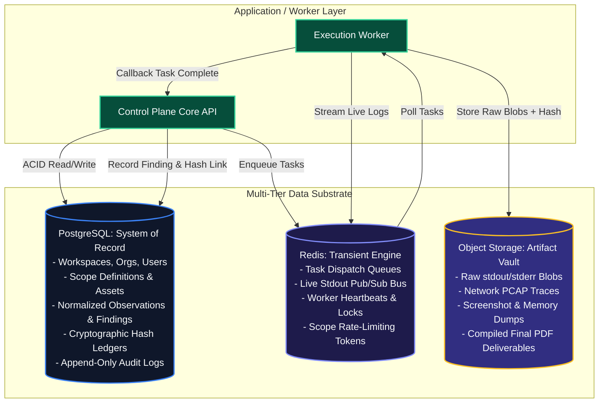
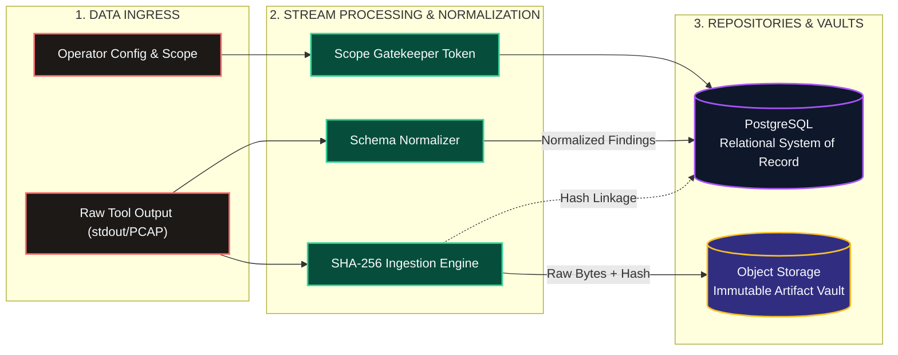
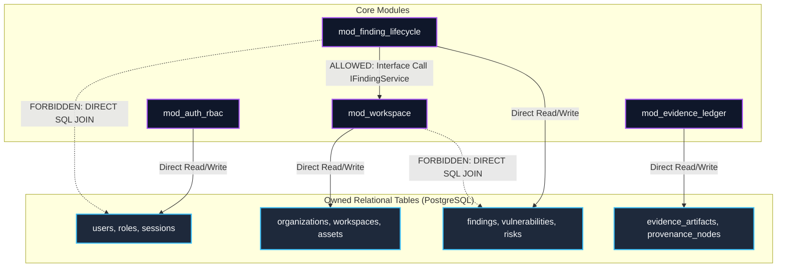
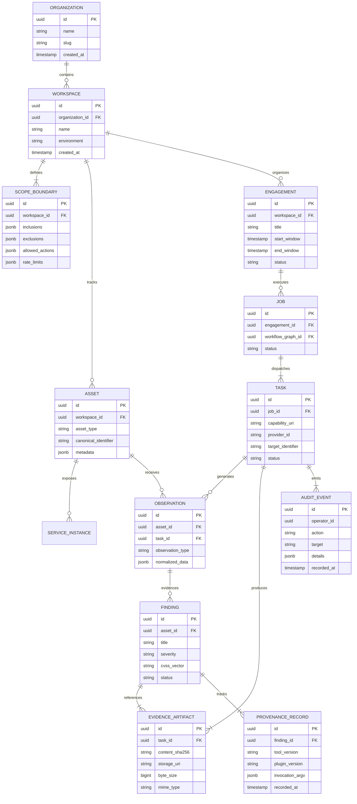
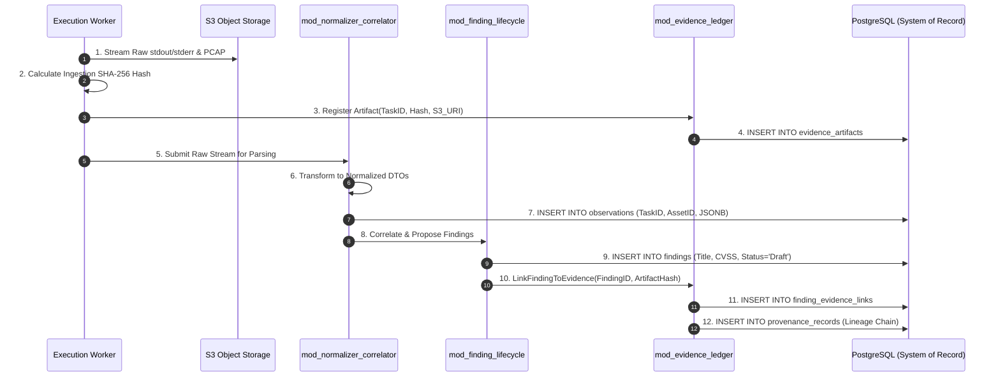
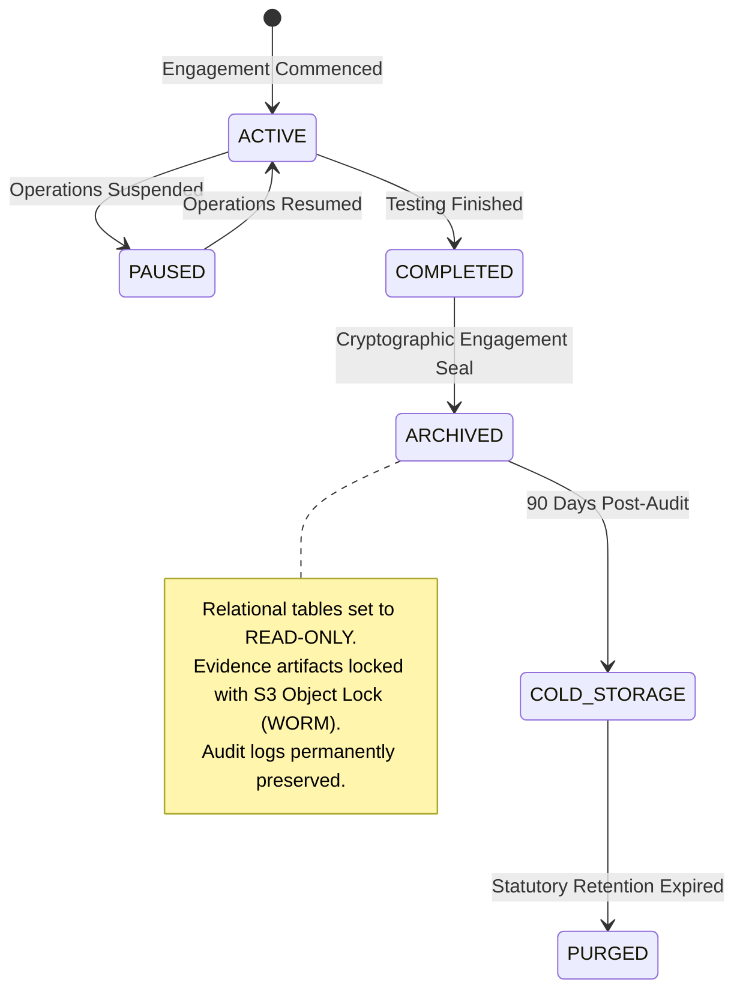

# Shadow : Helix Nebula (SHN)
## Phase 0.10: Data Architecture Specification

> **Authoritative Specification Notice**: This document establishes the canonical logical data architecture, domain entity models, storage tier responsibilities, transaction boundaries, cryptographic integrity mechanisms, lifecycle retention policies, and data isolation perimeters for Shadow : Helix Nebula (SHN). Built directly upon the architectural foundations established in Phases 0.1 through 0.9, this specification establishes the authoritative data contracts that govern all subsequent physical database schema modeling, ORM mappings, migration tooling, and repository implementations. This is an architectural specification, not an implementation codebase.

---

# 1. Data Architecture Objectives & Storage Philosophy

The SHN Data Architecture is engineered around eight foundational objectives:
1. **Canonical System of Record**: Establish PostgreSQL as the single, authoritative, ACID-compliant relational system of record for all state, configuration, findings, and audit trails.
2. **Transient Bounded Messaging**: Restrict Redis strictly to ephemeral caching, rate-limiting counters, and high-throughput task queuing; Redis **SHALL NEVER** serve as an accidental source of truth.
3. **Decoupled Large-Artifact Storage**: Store multi-gigabyte raw outputs, packet captures (PCAPs), and visual evidence in an S3-compatible Object Storage vault, preventing database bloat.
4. **Cryptographic Evidentiary Immutability**: Mandate that all raw evidence artifacts are cryptographically hashed (SHA-256) upon ingestion and permanently sealed against post-execution tampering.
5. **Strict Single-Module Ownership**: Ensure every database entity is owned and mutated by exactly one core module; cross-module data access must occur via exported interface contracts, never direct cross-table SQL joins.
6. **Multi-Tenant Logical Hermeticity**: Isolate operational data, assets, and findings by Organization and Workspace boundaries, enforced at the query planning layer.
7. **Complete Forensic Provenance**: Maintain unbroken relational lineage linking every reported finding to its normalized observation, raw tool output hash, execution task, and authorized scope token.
8. **Envelope Encryption for Secrets**: Guarantee that target credentials, private keys, and API tokens are encrypted at rest using AES-256-GCM envelope encryption with strict key separation.

---

# 2. Multi-Tier Storage Responsibilities

SHN partitions data persistence across three distinct storage tiers, each optimized for specific workload profiles:

```
+---------------------------------------------------------------------------------------+
|                             STORAGE TIER RESPONSIBILITY MATRIX                        |
+---------------------------------------------------------------------------------------+
| STORAGE TIER       | ENGINE               | WORKLOAD PROFILE       | DATA CHARACTERISTICS|
+--------------------+----------------------+------------------------+---------------------+
| 1. System of Record| PostgreSQL           | ACID Transactions,     | Highly structured,  |
|                    | (Relational Store)   | Relational Entities,   | foreign keys, JSONB |
|                    |                      | Audit Trails, Metadata | indexes, durable.   |
+--------------------+----------------------+------------------------+---------------------+
| 2. Transient State | Redis                | High-Speed Queues,     | In-memory, volatile,|
|                    | (In-Memory Broker)   | Pub/Sub Telemetry,     | sub-millisecond TTL,|
|                    |                      | Rate Limits, Leases    | at-least-once queue.|
+--------------------+----------------------+------------------------+---------------------+
| 3. Artifact Vault  | S3-Compatible        | Unstructured Blobs,    | Large binary blobs, |
|                    | (Object Storage)     | PCAP Files, Raw Dumps, | immutable, SHA-256  |
|                    |                      | High-Resolution Images | content-addressed.  |
+---------------------------------------------------------------------------------------+
```



---

# 3. Logical Data Architecture & Component Flow

The logical data architecture ensures that data flows unidirectionally from external stimuli into structured records and immutable evidence:



---

# 4. Data Ownership & Module Access Boundaries

In strict compliance with **Principle 1** (Separation of Concerns) and **MOD-INV-03** (Single State Ownership), database tables are owned by exactly one core module:



### 4.1 Boundary Rules
1. **Zero Cross-Module SQL Joins**: An application service inside `mod_finding_lifecycle` **SHALL NOT** write SQL joins querying tables owned by `mod_auth_rbac` or `mod_workspace`.
2. **Interface Query Contracts**: If finding records require workspace metadata, the data layer must query `IWorkspaceService` via strongly typed DTOs.
3. **Dedicated Schema Namespaces**: Physical tables are partitioned into PostgreSQL schemas matching their owning bounded context (e.g., `iam.*`, `workspace.*`, `findings.*`, `evidence.*`, `audit.*`).

---

# 5. Core Domain Entity Relationship Model

The following entity relationship diagram represents the logical domain model of SHN:



---

# 6. Target & Asset Representation

### 6.1 Canonical Asset Identifiers
Assets are identified through canonical, deduplicated network identifiers:
- `IPv4Address`: Standardized dot-decimal notation (`192.168.1.1`).
- `IPv6Address`: Canonical compressed RFC 5952 representation (`2001:db8::1`).
- `FQDN`: Fully qualified lowercase domain name (`api.internal.corp`).
- `URL`: Normalized URI format with explicit port and path (`https://api.internal.corp:443/v1`).
- `CIDRSubnet`: Validated IP network block (`10.0.0.0/24`).

### 6.2 Deduplication Keys
Assets enforce composite uniqueness constraints within a workspace:
$$\text{AssetKey} = \text{Hash}(\text{workspace\_id} + \text{asset\_type} + \text{canonical\_identifier})$$
When a capability discovers a host already indexed by canonical IP, the existing asset record is enriched rather than duplicated.

---

# 7. Execution, Observation, Finding & Evidence Lifecycle Flow



---

# 8. Workflow State, Plugin Metadata & Capability Schemas

### 8.1 Workflow Graph Representation
- **Graph Topology**: Serialized directed execution graphs stored in PostgreSQL as structured JSONB documents, defining node arrays, transition edge conditions, and variable mappings.
- **Job Execution State**: Discrete node execution states (`PENDING`, `RUNNING`, `PAUSED_APPROVAL`, `COMPLETED`, `FAILED`, `CANCELLED`) tracked with row-level timestamps.

### 8.2 Capability & Plugin Metadata Storage
- **Capability Contracts**: Stored as immutable schemas defining required input arguments and expected normalized output properties.
- **Plugin Manifests**: Stored with digital signature blocks, author identities, SemVer constraints, and sandboxing resource requirements.

---

# 9. Secrets, Credentials & Privacy-Sensitive Data Boundaries

> **Constitutional Rule**: Plaintext credentials, private keys, SSH certificates, and target access tokens **SHALL NEVER** be written to disk, databases, or logs in unencrypted form.

```
+---------------------------------------------------------------------------------------+
|                              SECRETS ENVELOPE ENCRYPTION                              |
+---------------------------------------------------------------------------------------+
|                                                                                       |
|   1. Master Key (Root of Trust)                                                      |
|      - Managed by Hardware Security Module (HSM) or External Cloud KMS.               |
|      - Never stored in PostgreSQL or application filesystems.                         |
|                                                                                       |
|   2. Key Encryption Key (KEK)                                                         |
|      - Rotated periodically; scoped per Organization tenant.                          |
|                                                                                       |
|   3. Data Encryption Key (DEK)                                                        |
|      - Ephemeral AES-256-GCM key generated per secret value.                         |
|      - Encrypts target credential payload into ciphertext + auth tag.                |
|                                                                                       |
|   4. Relational Storage Entity (PostgreSQL `secrets.vault`)                            |
|      - `id`: UUIDv4                                                                   |
|      - `ciphertext`: Encrypted binary blob                                            |
|      - `encrypted_dek`: DEK wrapped by KEK                                            |
|      - `nonce`: Cryptographic IV (12 bytes)                                           |
|      - `auth_tag`: Integrity verification tag (16 bytes)                              |
|                                                                                       |
+---------------------------------------------------------------------------------------+
```

---

# 10. AI & Intelligence Data Boundaries

1. **Zero Training Data Persistence**: Prompts and completions exchanged with external AI model providers **SHALL NOT** be persisted in long-term relational tables.
2. **Ephemeral Context Isolation**: Intelligence request contexts exist strictly in volatile memory during the synthesis lifecycle and are zeroized upon completion.
3. **Mandatory Redaction Layer**: Prompts pass through `mod_scope_gatekeeper` and credential scrubbing filters before transmission; sensitive client tokens are replaced with synthetic placeholders.

---

# 11. Transaction Boundaries, Concurrency & Consistency

### 11.1 Transaction Isolation Levels
- **Default Transaction Isolation**: `READ COMMITTED` for high-throughput operational metadata ingestion.
- **Strict Transaction Isolation**: `REPEATABLE READ` or `SERIALIZABLE` for financial/tenancy modifications, scope boundary activation, and engagement archival locking.

### 11.2 Concurrency & Locking Strategy
- **Optimistic Locking**: Finding state updates and asset tag modifications utilize optimistic concurrency control via PostgreSQL system columns (`xmin`) or explicit version integers (`version_id`).
- **Idempotency Keys**: All API mutating commands and task execution callbacks mandate UUIDv4 `idempotency_key` headers to prevent duplicate processing on network retries.

---

# 12. Data Lifecycle, Archival, Retention & Deletion



### 12.1 Soft Deletion vs. Cryptographic Archival
- **Soft Deletion (`is_deleted = true`)**: Applied to transient assets, draft findings, and operational notes during an active test. Soft-deleted records are filtered out from default queries.
- **Engagement Archival Seal**: When an engagement transitions to `ARCHIVED`, database triggers convert all related rows to read-only state, blocking all `UPDATE` and `DELETE` queries permanently.
- **WORM Object Storage Compliance**: Raw evidence in Object Storage is governed by Write-Once-Read-Many (WORM) retention policies preventing deletion until regulatory compliance windows expire.

---

# 13. Indexing, Partitioning & Performance Strategy

### 13.1 Indexing Architecture
- **B-Tree Indexes**: Applied to all primary keys, foreign keys (`workspace_id`, `engagement_id`, `asset_id`), and status enumerations.
- **Composite Unique Indexes**: Applied to canonical asset deduplication keys (`workspace_id, asset_type, canonical_identifier`).
- **GIN (Generalized Inverted Index)**: Applied to all semi-structured `jsonb` columns (normalized tool observations, capability configuration schemas, asset tags).

### 13.2 Partitioning Strategy
- **Audit Logs Partitioning**: The `audit.events` table is partitioned by range (`recorded_at`) on a monthly schedule, enabling efficient archival and point-in-time pruning.
- **Execution Telemetry Partitioning**: The `tasks.telemetry` table is partitioned by engagement or calendar month.

---

# 14. Backup, Disaster Recovery & Forensic Integrity Verification

1. **Continuous Write-Ahead Logging (WAL)**: PostgreSQL WAL streams are archived continuously to isolated object storage, supporting Point-in-Time Recovery (PITR) to any second within the past 30 days.
2. **Automated Cryptographic Scrubbing**: Background verification daemons periodically re-hash vaulted object storage blobs and compare results against PostgreSQL `content_sha256` ledgers, alerting operators to bit-rot or unauthorized modifications.

---

# 15. Architectural Invariants Specific to Data Architecture

The following twelve invariants are binding across all data persistence layers:

1. **DATA-INV-01 (PostgreSQL Canonical Primacy)**: PostgreSQL is the single canonical relational system of record; Redis and local disks are non-authoritative caches and scratch spaces.
2. **DATA-INV-02 (Zero Direct DB Access for Workers)**: Execution workers and tool adapters **SHALL NOT** hold database connection strings or execute SQL queries directly.
3. **DATA-INV-03 (Large Artifact Storage Separation)**: Unstructured blobs $\ge 1\text{ MB}$, PCAPs, and raw tool streams must reside in Object Storage, referenced in SQL solely by URI and SHA-256 hash.
4. **DATA-INV-04 (Immediate Ingestion Hashing)**: Every evidence artifact **SHALL** have its SHA-256 hash calculated immediately upon capture; modifying an existing evidence blob is prohibited.
5. **DATA-INV-05 (Single Module Table Ownership)**: Every database table is owned by exactly one core module; cross-module direct table manipulation is strictly forbidden.
6. **DATA-INV-06 (Mandatory Envelope Encryption)**: Target credentials and sensitive tokens must be stored as AES-256-GCM ciphertext wrapped by tenant-scoped KEKs.
7. **DATA-INV-07 (Append-Only Audit Ledger)**: Audit tables deny `UPDATE` and `DELETE` permissions to all application roles at the database privileges level.
8. **DATA-INV-08 (Workspace Tenant Hermeticity)**: All operational queries must enforce `workspace_id` filtering; cross-workspace data leaks represent critical defects.
9. **DATA-INV-09 (Immutable Engagement Archival)**: An engagement transitioned to `ARCHIVED` state must become permanently read-only across all related relational tables.
10. **DATA-INV-10 (Unbroken Provenance Linkage)**: Every finding must maintain a valid foreign reference to an observation, task descriptor, and raw evidence hash.
11. **DATA-INV-11 (Zero Plaintext Secrets in Logs)**: Sanitization filters must redact passwords, tokens, and authorization headers prior to database insertion or log emission.
12. **DATA-INV-12 (No Unbounded Data Growth in Redis)**: All keys stored in Redis must declare an explicit Time-to-Live (TTL) or belong to monitored, capped queues.

---

# 16. Architectural Decision Register (ADRs for Data Architecture)

| ADR ID | Decision | Rationale | Consequences & Trade-Offs | Status |
| :--- | :--- | :--- | :--- | :--- |
| **ADR-DATA-01** | **PostgreSQL as Sole Structured Store** | Robust ACID guarantees, mature ecosystem, rich JSONB support, and proven enterprise security controls. | Requires schema migration management and vertical scaling discipline. | **FOUNDATIONAL** |
| **ADR-DATA-02** | **S3-Compatible Object Store for Raw Evidence** | Separating multi-gigabyte PCAPs and tool outputs from PostgreSQL prevents database bloat and preserves performance. | Requires managing two storage systems and handling dual-write consistency. | **FOUNDATIONAL** |
| **ADR-DATA-03** | **Redis Strictly Bound to Ephemeral State** | High-throughput in-memory queues and live streaming; zero long-term state prevents state desynchronization. | Redis crash causes queue loss unless backed by DLQs or persistent leases. | **FOUNDATIONAL** |
| **ADR-DATA-04** | **Content-Addressed Evidence Hashes (SHA-256)** | Cryptographically proves evidence integrity; detects post-assessment tampering or storage corruption. | Requires hashing overhead during stream ingestion. | **FOUNDATIONAL** |
| **ADR-DATA-05** | **Envelope Encryption with AES-256-GCM** | Secures target credentials at rest; supports tenant key revocation without re-encrypting entire databases. | Key management integration overhead; small CPU latency penalty. | **FOUNDATIONAL** |
| **ADR-DATA-06** | **Schema Namespace Partitioning per Bounded Context** | Enforces single-module table ownership physically at the PostgreSQL schema layer. | Cross-module queries must traverse application service APIs. | **FOUNDATIONAL** |

---

# 17. Traceability to Phase 0.1–0.9 Baselines

| Data Architecture Decision | Baseline Traceability Reference | Status |
| :--- | :--- | :--- |
| PostgreSQL Canonical System of Record | Phase 0.1 (Section 10), ADR-07, `INV-11` | **100% TRACEABLE** |
| Redis Ephemeral Queue & Telemetry Boundaries | Phase 0.1 (Section 10), ADR-08, `DAT-QUE-001` | **100% TRACEABLE** |
| S3 Object Storage for Large Artifacts | Phase 0.1 (Section 10), ADR-09, `DAT-OBJ-001` | **100% TRACEABLE** |
| Cryptographic Ingestion Hashing (SHA-256) | Phase 0.1 (Section 19), `EVD-INT-002`, `INV-05` | **100% TRACEABLE** |
| Unbroken Forensic Provenance Chain | Phase 0.1 (Section 20), `EVD-PRV-001`, `INV-05` | **100% TRACEABLE** |
| Worker Database Isolation Boundary | Phase 0.3 (Section 4.3), Phase 0.7 (Section 5.1), `INV-14`| **100% TRACEABLE** |
| Envelope Encryption for Credentials | Phase 0.2 (`SEC-CRY-001`), `INV-15`, ADR-16 | **100% TRACEABLE** |
| Immutable Append-Only Audit Logging | Phase 0.2 (`SEC-AUD-001`), `INV-17`, ADR-07 | **100% TRACEABLE** |
| Engagement Archival Locking | Phase 0.2 (`FR-REP-002`), Phase 0.3 (Section 2.11) | **100% TRACEABLE** |

---

# 18. Explicit Phase 0.10 Non-Goals

In strict compliance with foundational non-goals, Phase 0.10 explicitly **DOES NOT**:
1. Write physical SQL DDL schema scripts (`CREATE TABLE`, `ALTER TABLE`).
2. Implement ORM models or entity mappings in code (e.g., Prisma, Hibernate, GORM, Diesel).
3. Author database migration files or seeding scripts.
4. Deploy PostgreSQL instances, Redis clusters, or MinIO/S3 storage buckets.
5. Implement concrete encryption routines or KMS connector libraries.

---

# 19. Acceptance Criteria & Phase 0.10 Verification

To establish completion of Phase 0.10, this specification must satisfy the following checklist:

- [x] **Data Objectives Formulated**: Eight foundational data architecture objectives codified without generic CRUD fluff.
- [x] **Multi-Tier Storage Responsibilities Defined**: Clear operational boundaries established across PostgreSQL, Redis, and Object Storage.
- [x] **Six Required Mermaid Diagrams Included**:
  1. *Multi-Tier Storage Responsibility Substrate*
  2. *Logical Data Architecture & Component Ingress Flow*
  3. *Single-Module Table Ownership & Interface Boundaries*
  4. *Core Entity Relationship / Domain Map (12 core entities)*
  5. *Execution $\rightarrow$ Observation $\rightarrow$ Finding $\rightarrow$ Evidence Sequence Flow*
  6. *Data Lifecycle, Cryptographic Archival & Retention State Machine*
- [x] **Target & Asset Representations Specified**: Canonical network identifiers, composite deduplication keys, and enrichment rules defined.
- [x] **Envelope Encryption Formulated**: Two-tier key hierarchy (KEK/DEK) using AES-256-GCM and zero plaintext storage specified.
- [x] **AI Data Boundaries Defined**: Zero training data leak, ephemeral context isolation, and pre-prompt redaction codified.
- [x] **Transaction & Concurrency Rules Established**: Transaction isolation levels, optimistic locking (`xmin`), and idempotency keys defined.
- [x] **Data Lifecycle & Archival Codified**: Soft deletion vs. immutable engagement seals and WORM storage compliance detailed.
- [x] **Twelve Data Invariants Formulated**: Binding rules (`DATA-INV-01` through `DATA-INV-12`) declared.
- [x] **Six Formal ADRs Documented**: Architectural decisions (`ADR-DATA-01` through `ADR-DATA-06`) recorded.
- [x] **Traceability Verified**: $100\%$ bidirectional alignment with Phases 0.1 through 0.9; zero contradictions introduced.
- [x] **Zero Speculative Code**: No SQL scripts, ORM models, Dockerfiles, or database migrations created.
