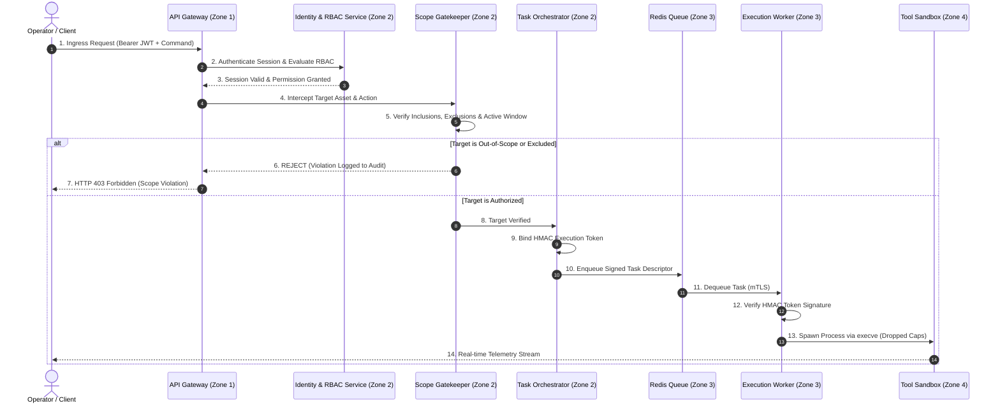
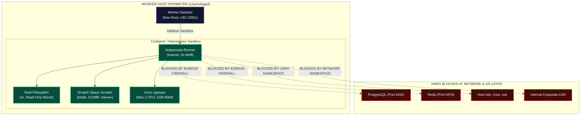
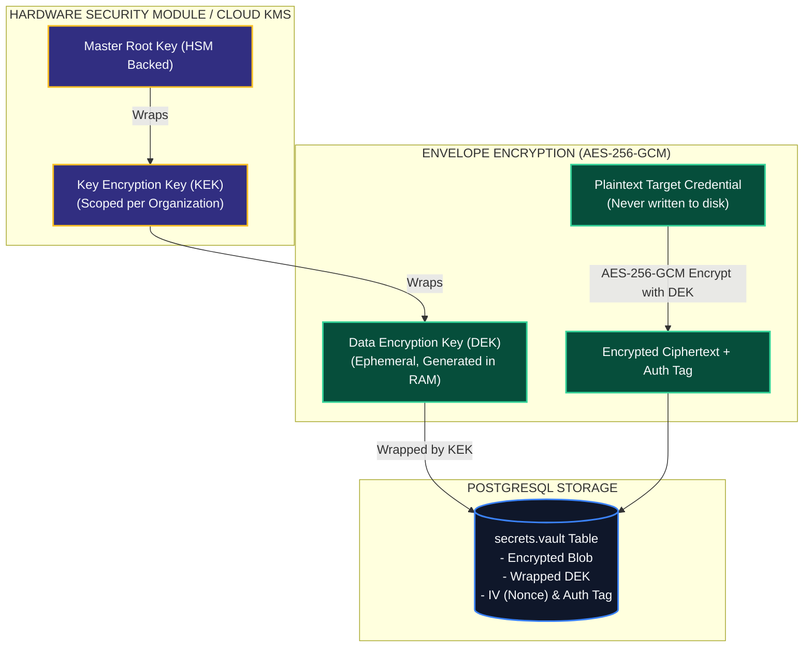
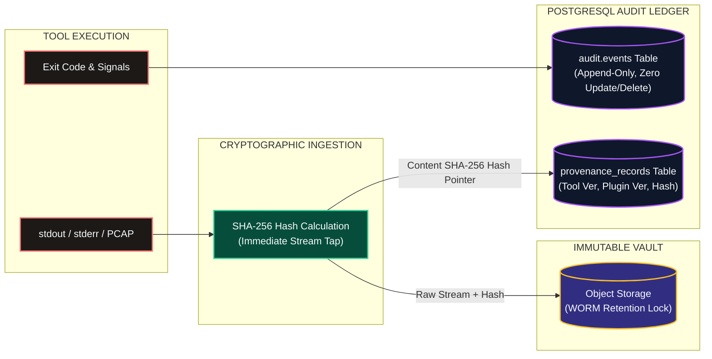
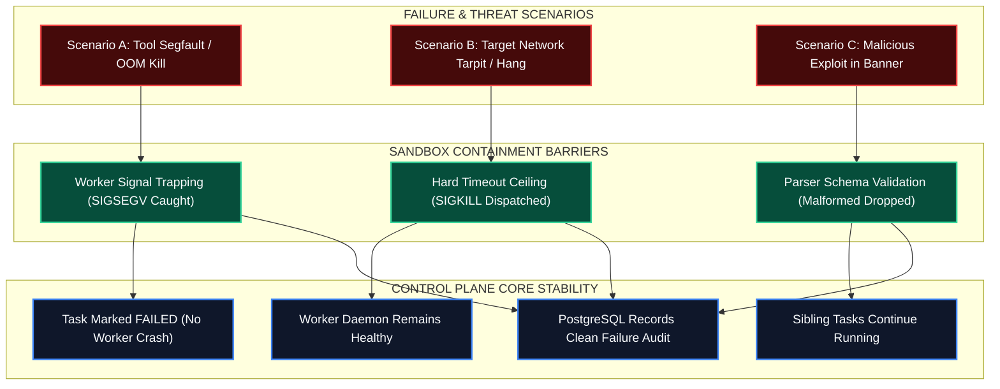

```mermaid
flowchart LR
    %% Styling
    classDef boundaryStyle fill:#0f172a,stroke:#ef4444,stroke-width:2px,stroke-dasharray: 5 5,color:#f8fafc;
    classDef compStyle fill:#1e293b,stroke:#38bdf8,stroke-width:2px,color:#f8fafc;

    subgraph B1["Boundary 1: Ingress Authentication"]
        C1["Client Request"]:::compStyle -->|OIDC / MFA Challenge| G1["Public API Gateway"]:::compStyle
    end

    subgraph B2["Boundary 2: Scope & Authorization Gate"]
        G1 -->|Validate Context| C2["Scope Gatekeeper & RBAC"]:::compStyle
    end

    subgraph B3["Boundary 3: Queue & Worker mTLS"]
        C2 -->|Cryptographic Task Signature| W1["Worker Daemon"]:::compStyle
    end

    subgraph B4["Boundary 4: Sandbox Isolation"]
        W1 -->|Dropped Linux Caps / No Root| T1["Tool Subprocess"]:::compStyle
    end

    subgraph B5["Boundary 5: Network Target Perimeter"]
        T1 -->|Restricted Egress to Target IP| N1["Target Asset"]:::compStyle
    end
```

# Shadow : Helix Nebula (SHN)
## Phase 0.11: Security Architecture & Trust Boundaries Specification

> **Authoritative Specification Notice**: This document establishes the production-grade security architecture, threat model, trust perimeters, cryptographic governance, sandbox isolation perimeters, input defenses, and fail-closed controls for Shadow : Helix Nebula (SHN). Built directly upon the high-level architecture of Phase 0.6, the core module perimeters of Phase 0.7, the plugin sandboxing of Phase 0.8, the tool isolation of Phase 0.9, and the data architecture of Phase 0.10, this specification establishes the binding security invariants that govern all subsequent software engineering, API development, container packaging, and operational deployments. This is an architectural specification, not an implementation codebase.

---

# 1. Security Architecture Objectives & Threat Model

### 1.1 Core Security Objectives
As a platform coordinating offensive, defensive, and diagnostic security workloads, SHN must maintain a hardened, defensible security posture. The platform adheres to six foundational objectives:
1. **Zero-Trust Subordination**: All external inputs, tool binaries, third-party plugins, and target responses are treated as untrusted and potentially hostile.
2. **Fail-Closed Gatekeeping**: Every security gate (scope validation, RBAC evaluation, signature verification) fails closed by default; ambiguous or unverified requests are rejected.
3. **Strict Privilege Minimization**: Core services, worker daemons, and tool child processes run with the absolute minimum operating system privileges and network access required.
4. **Hermetic Multi-Tenant Isolation**: Operational data, target credentials, and findings belonging to Organization $A$ must be cryptographically and logically inaccessible to Organization $B$.
5. **Tamper-Proof Forensic Lineage**: Every observation and report finding must maintain an unbroken, cryptographically hashed (SHA-256) chain of custody back to the authorized task token.
6. **Sovereign Operator Authority**: Automated workflows and AI models operate strictly within pre-authorized boundaries; invasive capabilities mandate explicit human authorization.

### 1.2 Threat Model & Threat Actor Matrix
SHN explicitly designs defenses against four distinct threat actor profiles using STRIDE modeling:

```
+---------------------------------------------------------------------------------------+
|                                SHN THREAT ACTOR MATRIX                                |
+---------------------------------------------------------------------------------------+
| THREAT ACTOR           | ATTACK VECTOR                          | ARCHITECTURAL DEFENSE|
+------------------------+----------------------------------------+---------------------+
| 1. Malicious / Hostile | Malicious payloads in HTTP banners,    | Sandbox isolation,  |
|    Target Network      | network tarpits, exploit payloads,     | timeout ceilings,   |
|                        | DNS rebinding attacks.                 | non-root execution. |
+------------------------+----------------------------------------+---------------------+
| 2. Compromised Tool /  | Supply-chain poisoning, backdoored     | Cryptographic signs,|
|    Malicious Plugin    | plugins, malicious scanner CLI args,   | capability drops,   |
|                        | privilege escalation attempts.         | zero DB access.     |
+------------------------+----------------------------------------+---------------------+
| 3. Rogue / Negligent   | Scanning out-of-scope targets, data    | Scope gatekeeper,   |
|    Operator            | exfiltration, unauthorized credential  | granular RBAC,      |
|                        | access, tampering with audit logs.     | immutable audit log.|
+------------------------+----------------------------------------+---------------------+
| 4. Untrusted Network / | Man-in-the-Middle (MitM) eavesdropping,| Mandatory TLS 1.3,  |
|    Adversary Sniffer   | session hijacking, token replay.       | mTLS on queues,     |
|                        |                                        | signed HMAC tokens. |
+---------------------------------------------------------------------------------------+
```

---

# 2. Trust Zones & Security Boundary Map

SHN partitions all platform infrastructure, networks, and processes into six distinct **Trust Zones**:

```mermaid
flowchart TD
    %% Styling
    classDef z0Style fill:#1e293b,stroke:#64748b,stroke-width:2px,color:#f8fafc;
    classDef z1Style fill:#0f172a,stroke:#38bdf8,stroke-width:2px,color:#f8fafc;
    classDef z2Style fill:#1e1b4b,stroke:#a855f7,stroke-width:3px,color:#f8fafc;
    classDef z3Style fill:#064e3b,stroke:#34d399,stroke-width:2px,color:#f8fafc;
    classDef z4Style fill:#450a0a,stroke:#ef4444,stroke-width:2px,color:#f8fafc;
    classDef z5Style fill:#1c1917,stroke:#fbbf24,stroke-width:2px,color:#f8fafc;

    subgraph TZ0["TRUST ZONE 0: Untrusted External Environment"]
        CLIENT["Web Browser / Headless CLI Client"]:::z0Style
    end

    subgraph TZ1["TRUST ZONE 1: Edge & Public API Gateway"]
        GATEWAY["API Gateway / Reverse Proxy (TLS 1.3 Term)"]:::z1Style
    end

    subgraph TZ2["TRUST ZONE 2: Control Plane Core (Highly Trusted)"]
        AUTH["Identity & RBAC Engine"]:::z2Style
        SCOPE["Scope Gatekeeper"]:::z2Style
        ORCH["Task Orchestrator"]:::z2Style
        SQL[("PostgreSQL System of Record")]:::z2Style
        KMS["Envelope Encryption Vault"]:::z2Style
    end

    subgraph TZ3["TRUST ZONE 3: Execution Worker Host (Moderately Trusted)"]
        QUEUE[("Redis Queue Broker")]:::z3Style
        WORKER["Execution Worker Daemon (UID 10001)"]:::z3Style
    end

    subgraph TZ4["TRUST ZONE 4: Sandboxed Tool Process (Untrusted / Hostile)"]
        SANDBOX["OCI / cgroup Container Sandbox"]:::z4Style
        TOOL["Security Tool Binary (Nmap / Nuclei)"]:::z4Style
    end

    subgraph TZ5["TRUST ZONE 5: Target Network Environment"]
        TARGET["Validated Authorized Target Assets"]:::z5Style
    end

    CLIENT -->|1. TLS 1.3 / JWT / OIDC MFA| GATEWAY
    GATEWAY -->|2. Internal VPC / Strict Context| AUTH
    AUTH --> SCOPE
    SCOPE --> ORCH
    ORCH --> SQL
    ORCH --> KMS
    
    ORCH -->|3. Mutual TLS / HMAC Task Sign| QUEUE
    QUEUE -->|4. Poll Tasks (mTLS)| WORKER
    
    WORKER -->|5. execve / Dropped Caps / ro root| SANDBOX
    SANDBOX --> TOOL
    
    TOOL -->|6. Scoped Probing Packets| TARGET
```



---

# 3. Authentication, Authorization & Policy Enforcement



### 3.1 Authentication Architecture
- **Multi-Factor Authentication (MFA)**: Mandatory for all operator sessions via FIDO2 / WebAuthn hardware tokens or RFC 6238 TOTP.
- **Enterprise Identity Federation**: Seamless integration with enterprise identity providers via OpenID Connect (OIDC) and SAML 2.0.
- **Cryptographic Session Tokens**: Short-lived, asymmetric JWTs (signed with Ed25519 or RS256); tokens declare explicit tenant (`org_id`), workspace (`workspace_id`), and role claims.
- **Immediate Revocation**: Session revocations are broadcast across Redis Pub/Sub; gateways invalidate revoked tokens within $\le 5\text{ seconds}$.

### 3.2 Granular RBAC / ABAC Hybrid Authorization Model
SHN enforces a multi-tiered permission matrix based on user role and operational context:

| Role Title | Scope Admin | Workflow Author | Passive Recon | Active Probing | Invasive Vuln Scan | Report Sign-Off |
| :--- | :--- | :--- | :--- | :--- | :--- | :--- |
| **Org Admin** | **YES** | **YES** | **YES** | **YES** | **YES** (Approval Req) | **YES** |
| **Workspace Admin**| **YES** | **YES** | **YES** | **YES** | **YES** (Approval Req) | **YES** |
| **Operator** | Read-Only | **YES** | **YES** | **YES** | **YES** (Approval Req) | Draft Only |
| **Analyst** | Read-Only | Read-Only | Read-Only | Read-Only | Prohibited | Draft Only |
| **Auditor** | Read-Only | Read-Only | Read-Only | Read-Only | Prohibited | Read-Only |
| **Observer** | Read-Only | Read-Only | Read-Only | Prohibited | Prohibited | Prohibited |

---

# 4. Scope Gatekeeping & Network Interaction Controls

### 4.1 Mechanical Scope Gatekeeper Invariants
1. **Pre-Dispatch Enforcement**: Every target asset (IPv4, IPv6, CIDR, FQDN) is intercepted and evaluated prior to task enqueueing.
2. **Exclusion Precedence**: Exclusions override inclusions unconditionally. If an asset matches both an inclusion rule and an exclusion rule, the exclusion takes absolute priority.
3. **Target Immobility**: Tools receive static, validated target tokens; tool adapters **SHALL NOT** expand targets or probe newly discovered IP addresses without returning them to the Control Plane for scope re-evaluation.

### 4.2 Server-Side Request Forgery (SSRF) & Metadata Defense
To protect hosting infrastructure from accidental or malicious probing, the Scope Gatekeeper permanently excludes:
- **Cloud Metadata Endpoints**: `169.254.169.254` and `fd00:ec2::254` are permanently blacklisted at the kernel routing and gatekeeper level.
- **Loopback Interfaces**: `127.0.0.0/8` and `::1` are barred from all execution task descriptors.
- **Internal Cluster Networks**: Control plane database (`5432`) and Redis (`6379`) subnets are blocked via egress firewall rules.
- **DNS Rebinding Defense**: FQDN targets are resolved to canonical IP addresses at validation time; execution workers pin the resolved IP address in `/etc/hosts` or the command vector, preventing runtime DNS rebinding.

---

# 5. Sandbox, Process & Runtime Isolation Architecture



### 5.1 Linux Capability Drops
When executing tool subprocesses, the runner invokes `capng_clear(3)` and retains only:
- `CAP_NET_RAW`: Granted strictly to raw network discovery tools (e.g., ICMP/SYN scanning).
- **Explicitly Dropped**: `CAP_SYS_ADMIN`, `CAP_SYS_PTRACE`, `CAP_SYS_CHROOT`, `CAP_DAC_OVERRIDE`, `CAP_SETUID`, `CAP_SETGID`.

### 5.2 Filesystem & Resource Limits
- **Root Filesystem**: Mounted strictly read-only (`ro`).
- **Scratch Space**: Mounted as an ephemeral `tmpfs` volume with the `noexec`, `nosuid`, and `nodev` mount flags.
- **Resource Constraints**: Linux cgroups enforce maximum memory ceilings (e.g., $1024\text{ MB}$), CPU quotas (e.g., $2.0\text{ cores}$), and maximum process limits (`pids.max = 128`), preventing fork bombs.

---

# 6. Cryptography, Key Management & Secret Lifecycles



### 6.1 Secret Injection into Execution Sandboxes
1. Target credentials (SSH keys, passwords, API tokens) reside in PostgreSQL strictly as AES-256-GCM ciphertext.
2. When an authorized task is dispatched, the Control Plane unwraps the DEK, decrypts the secret in memory, and passes it to the worker over mTLS.
3. The worker daemon injects the credential into the tool process via **secure memory-mapped pipes or stdin**.
4. Credentials **SHALL NEVER** be passed as command-line arguments (`argv[]`) to prevent leakage in OS process tables (`ps aux`) or audit logs.
5. Upon process exit, memory buffers holding plaintext secrets are immediately zeroized (`memset_s`).

---

# 7. Evidence Integrity, Forensic Lineage & Audit Security



### 7.1 Append-Only Audit Trail Invariants
- The `audit.events` table is configured with database-level permission denials; the application database user holds strictly `SELECT` and `INSERT` privileges. `UPDATE`, `DELETE`, and `TRUNCATE` operations are rejected by the PostgreSQL engine.
- High-severity security events (scope violations, token failures, approval overrides) are simultaneously mirrored to external syslog / SIEM endpoints over TLS.

---

# 8. Threat Containment & Failure Propagation Isolation



---

# 9. Binding Security Architectural Invariants

The following fifteen invariants are binding across all platform engineering:

1. **SEC-INV-01 (Pre-Dispatch Scope Gatekeeping)**: Every execution task **SHALL** be validated against active scope inclusions, exclusions, and active operational windows prior to queue dispatch. Out-of-scope tasks must be rejected deterministically.
2. **SEC-INV-02 (Zero Shell Execution)**: Tool execution **SHALL NEVER** invoke a command shell (`sh`, `bash`, `cmd`); all invocations must execute via direct `execve(argv[])` parameter vectors.
3. **SEC-INV-03 (Zero Direct DB Access for Workers)**: Execution workers, plugin scripts, and tool processes **SHALL NOT** hold database credentials or communicate with PostgreSQL directly.
4. **SEC-INV-04 (Cryptographic Evidence Hashing)**: All raw tool outputs, logs, and PCAPs **SHALL** have their SHA-256 hashes computed immediately upon stream ingestion and recorded in PostgreSQL.
5. **SEC-INV-05 (Mandatory Envelope Encryption)**: Sensitive target credentials, private keys, and API tokens **SHALL** be stored as AES-256-GCM ciphertext wrapped by tenant-scoped KEKs.
6. **SEC-INV-06 (No Secrets in CLI Arguments)**: Sensitive credentials **SHALL NOT** be passed in command-line arguments (`argv`); they must be passed via secure stdin, memory-mapped pipes, or ephemeral tmpfs files.
7. **SEC-INV-07 (Unprivileged Sandbox Execution)**: Tool processes **SHALL** execute under non-root system accounts (`UID 10001`) with dropped Linux capabilities and read-only root filesystems.
8. **SEC-INV-08 (SSRF & Cloud Metadata Defense)**: Egress firewalls and the Scope Gatekeeper **SHALL** permanently block access to cloud metadata services (`169.254.169.254`), loopback subnets, and platform control ports.
9. **SEC-INV-09 (Non-Autonomous AI Containment)**: Artificial intelligence models **SHALL NOT** possess direct execution authority; all AI recommendations require policy validation and human operator approval.
10. **SEC-INV-10 (Mandatory Transit Encryption)**: All internal and external network communication **SHALL** mandate TLS 1.3; task queue polling requires Mutual TLS (mTLS).
11. **SEC-INV-11 (Append-Only Audit Ledger)**: The `audit.events` table **SHALL** deny `UPDATE` and `DELETE` operations at the database privileges level.
12. **SEC-INV-12 (Multi-Tenant Workspace Hermeticity)**: All database queries **SHALL** enforce `workspace_id` filtering; cross-workspace data leakage represents a critical severity defect.
13. **SEC-INV-13 (Mandatory Cryptographic Plugin Signing)**: Plugins installed in production **SHALL** be cryptographically verified against trusted Ed25519 public keys.
14. **SEC-INV-14 (Safe Deserialization Standard)**: Application services **SHALL NOT** utilize unsafe binary deserializers (e.g., Python `pickle`, Java serialization); all structured DTOs must parse via strict schemas.
15. **SEC-INV-15 (Fail-Closed Default)**: Any authorization check, scope resolution, or signature verification that encounters a transient error or timeout **SHALL** fail closed and abort execution.

---

# 10. Architectural Decision Register (ADRs for Security)

| ADR ID | Decision | Rationale | Consequences & Trade-Offs | Status |
| :--- | :--- | :--- | :--- | :--- |
| **ADR-SEC-01** | **Direct `execve` Parameter Vectoring** | Completely eliminates arbitrary shell injection and command concatenation exploits. | Prohibits use of shell built-ins or shell redirection operators (`>`, `\|`). | **FOUNDATIONAL** |
| **ADR-SEC-02** | **Envelope Encryption with AES-256-GCM** | Secures target credentials at rest; enables instant tenant key revocation without database re-encryption. | Requires KMS integration and small in-memory crypto overhead. | **FOUNDATIONAL** |
| **ADR-SEC-03** | **Unprivileged Ephemeral Sandboxing** | Confines malicious tool exploits, dropped files, and memory exhaustion to disposable containers. | Requires container engine or Linux user namespaces on worker nodes. | **FOUNDATIONAL** |
| **ADR-SEC-04** | **Content-Addressed SHA-256 Evidence Ledger** | Provides tamper-proof chain of custody for all raw tool outputs and reports. | Adds streaming hash computation during output ingestion. | **FOUNDATIONAL** |
| **ADR-SEC-05** | **Mutual TLS (mTLS) for Worker Queues** | Authenticates worker daemons and encrypts task descriptors across distributed networks. | Requires internal PKI and certificate lifecycle management. | **FOUNDATIONAL** |
| **ADR-SEC-06** | **Permanent Cloud Metadata Blacklisting** | Defends against Server-Side Request Forgery (SSRF) targeting cloud host credentials. | Prohibits legitimate scanning of `169.254.169.254` even if requested by operator. | **FOUNDATIONAL** |
| **ADR-SEC-07** | **Zero Database Access for Worker Runtimes** | Minimizes blast radius; a compromised worker node cannot query or corrupt the PostgreSQL database. | Worker state transitions must flow via signed queue messages or callbacks. | **FOUNDATIONAL** |

---

# 11. Traceability to Phase 0.1–0.10 Baselines

| Security Architecture Decision | Baseline Traceability Reference | Status |
| :--- | :--- | :--- |
| Mechanical Scope Gatekeeping | Phase 0.1 (Section 18), `SCP-ENF-001`, `INV-06`, ADR-15 | **100% TRACEABLE** |
| Direct `execve` Shell Prohibition | Phase 0.4 (`SEC-04`), Phase 0.9 (Section 5.1), `TOOL-INV-01` | **100% TRACEABLE** |
| Worker Database Isolation Boundary | Phase 0.3 (Section 4.3), Phase 0.7 (Section 5.1), `INV-14`| **100% TRACEABLE** |
| Cryptographic Evidence Hashing (SHA-256) | Phase 0.1 (Section 19), `EVD-INT-002`, `INV-05`, ADR-13 | **100% TRACEABLE** |
| Non-Autonomous AI Containment | Phase 0.1 (Section 11), `AIC-GUA-001`, `INV-07`, ADR-12 | **100% TRACEABLE** |
| Sandboxed Plugin & Tool Execution | Phase 0.8 (Section 8), Phase 0.9 (Section 8), `INV-08` | **100% TRACEABLE** |
| Envelope Encryption for Credentials | Phase 0.2 (`SEC-CRY-001`), Phase 0.10 (Section 9), `INV-15`| **100% TRACEABLE** |
| Append-Only Immutable Audit Trail | Phase 0.2 (`SEC-AUD-001`), Phase 0.10 (Section 15), `INV-17`| **100% TRACEABLE** |
| Workspace Multi-Tenant Hermeticity | Phase 0.1 (Section 16), Phase 0.2 (`WKS-ISO-001`), `INV-19` | **100% TRACEABLE** |

---

# 12. Explicit Phase 0.11 Non-Goals

In strict compliance with foundational non-goals, Phase 0.11 explicitly **DOES NOT**:
1. Implement security middleware code (Go, Rust, Python, TypeScript).
2. Generate concrete TLS certificates or manage private CA keys on disk.
3. Author AppArmor, SELinux, or seccomp JSON policy files.
4. Implement concrete cryptographic hashing or AES encryption functions in code.
5. Create Dockerfiles, container security profiles, or network firewall scripts.
6. Configure enterprise IAM servers (Keycloak, Okta, Authentik).

---

# 13. Acceptance Criteria & Phase 0.11 Verification

To establish completion of Phase 0.11, this specification must satisfy the following checklist:

- [x] **Security Objectives Formulated**: Six foundational security objectives defined without marketing generalities.
- [x] **STRIDE Threat Model Codified**: Comprehensive threat matrix addressing targets, plugins, operators, and networks.
- [x] **Six Trust Zones Defined**: Trust Zones 0 through 5 demarcated with strict boundary ingress controls.
- [x] **Seven Required Mermaid Diagrams Included**:
  1. *SHN Trust-Zone Architecture*
  2. *Security Trust-Boundary Map*
  3. *Authentication $\rightarrow$ Authorization $\rightarrow$ Scoped Execution Sequence Flow*
  4. *Plugin $\rightarrow$ Adapter $\rightarrow$ Sandbox $\rightarrow$ Tool Security Boundary*
  5. *Secret & Credential Envelope Encryption Lifecycle*
  6. *Evidence Integrity, Forensic Lineage & Audit Flow*
  7. *Threat Containment & Failure Propagation Model*
- [x] **Scope Gatekeeper & Anti-SSRF Defenses Codified**: Cloud metadata (`169.254.169.254`) and loopback blacklisting mandated.
- [x] **Process Sandboxing Specified**: Non-root execution (`UID 10001`), capability dropping, and `execve` vectoring detailed.
- [x] **Envelope Encryption Specified**: AES-256-GCM envelope encryption with KEK/DEK separation defined.
- [x] **Fifteen Security Invariants Formulated**: Binding rules (`SEC-INV-01` through `SEC-INV-15`) declared.
- [x] **Seven Formal ADRs Documented**: Architectural decisions (`ADR-SEC-01` through `ADR-SEC-07`) recorded.
- [x] **Traceability Verified**: $100\%$ bidirectional alignment with Phases 0.1 through 0.10; zero contradictions introduced.
- [x] **Zero Speculative Code**: No security middleware, Dockerfiles, scripts, or certificates created.
