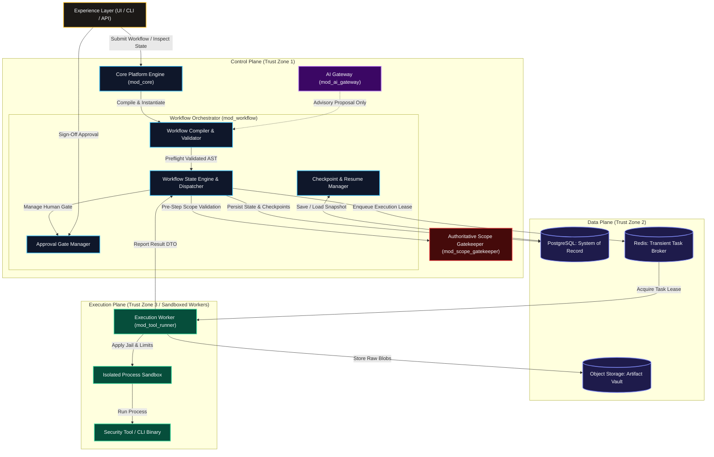
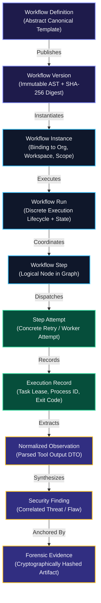
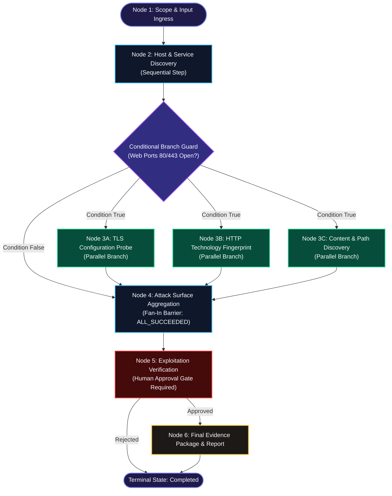
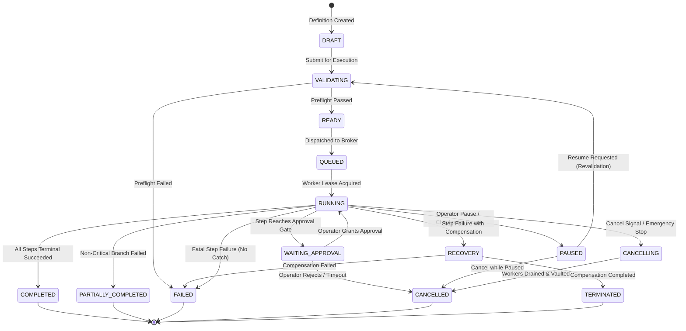
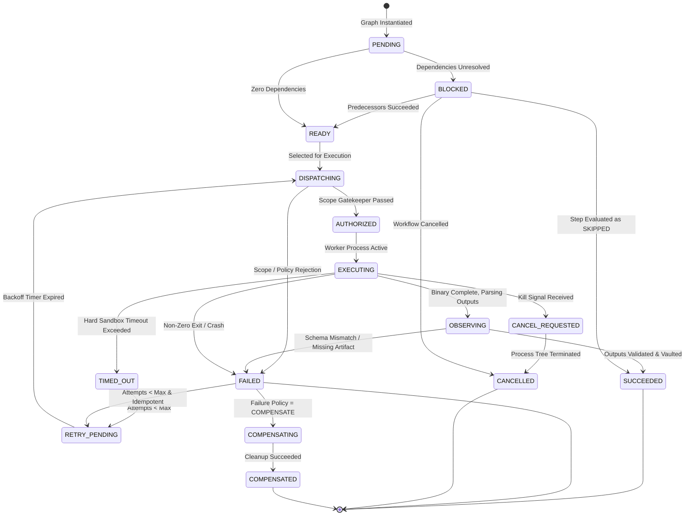
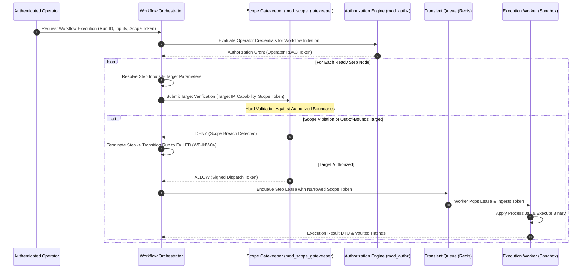
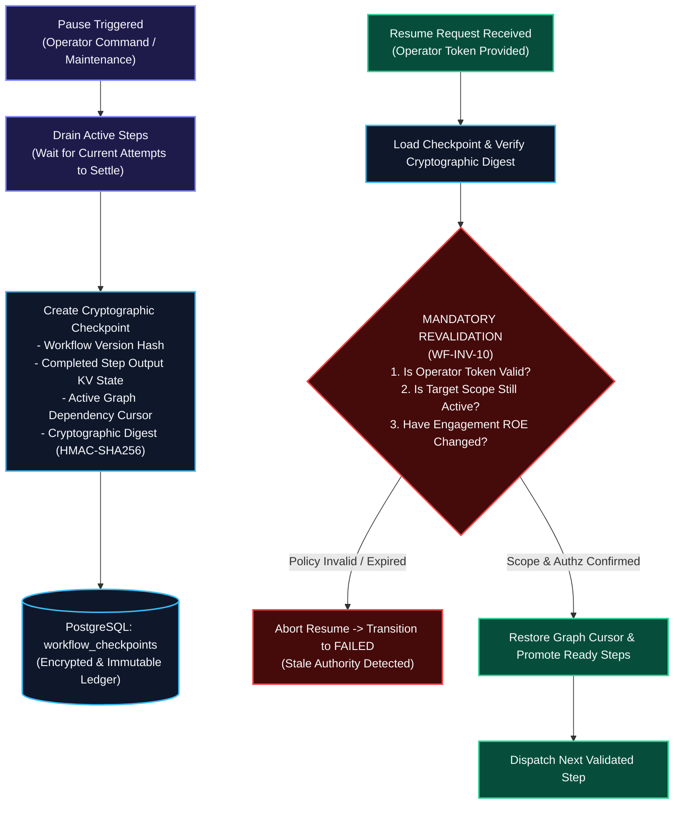
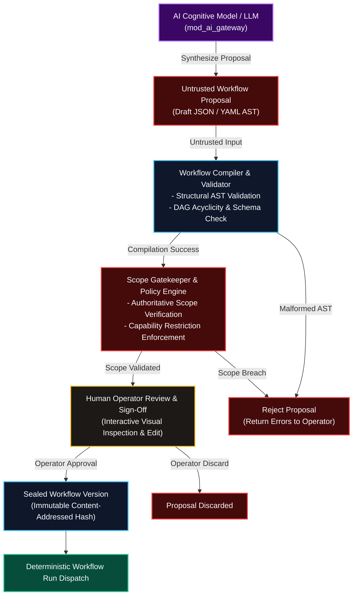

# SHN Phase 0.13 — Workflow & Orchestration Architecture

This document establishes the foundational workflow and orchestration architecture for Shadow : Helix Nebula.

> **Authoritative Specification Notice**: This document establishes the binding Phase 0 architectural specification for the Workflow and Orchestration Subsystem of Shadow : Helix Nebula (SHN). Built directly upon the authoritative baselines of Phase 0.1 through Phase 0.12, this specification establishes the canonical models for workflow definitions, immutable versioning, directed acyclic execution graphs, step contracts, dual lifecycle state machines, preflight validation, immutable target-scope propagation, scheduling and dispatch, failure handling, human-in-the-loop approval gates, durable checkpointing, event causation, and blast-radius containment.
>
> **Core Architectural Invariant**: Workflow orchestration is strictly a **Control-Plane coordination capability**. It **MUST NOT** serve as an independent authorization authority, grant permissions, or bypass security controls. Security policy, authorization, target scope, execution gates, and sandbox controls defined by Phase 0.11 remain supreme and authoritative. AI recommendations defined by Phase 0.12 remain advisory and **MUST NOT** bypass deterministic validation, scope verification, or human sign-off. This document establishes the binding architectural baseline for subsequent design and implementation phases. This is an architectural specification, not an implementation codebase.

---

# 1. Workflow & Orchestration Objectives

### 1.1 Purpose
The SHN Workflow and Orchestration Subsystem coordinates multi-step cybersecurity operations, automated assessments, and engineering workflows across heterogeneous tools, plugins, and core capabilities. Its purpose is to transform disparate manual or ad-hoc security actions into deterministic, repeatable, auditable, and resilient operational pipelines under sovereign human control.

### 1.2 Core Responsibilities
1. **Deterministic Coordination**: Managing topological execution order, data dependencies, and parallel execution paths across modular capabilities.
2. **State Lifecycle Governance**: Maintaining explicit, durable, and observable state transitions at both macro-workflow and micro-step boundaries.
3. **Reproducibility**: Guaranteeing that executing a specific workflow version with identical parameters against identical target states yields consistent operational behavior and evidentiary trails.
4. **Fault Isolation**: Containing tool, plugin, and network failures at the step boundary, preventing corruption of global workflow state or control-plane stability.
5. **Auditable Lineage**: Emitting cryptographically anchored, append-only event streams that capture every state transition, parameter binding, approval decision, and output artifact.
6. **Human Oversight Enforcement**: Enforcing mandatory synchronization barriers (approval gates) for high-risk, invasive, or destructive operations.
7. **Scalability & Extensibility**: Supporting high-throughput concurrent step dispatch across distributed workers while cleanly accommodating new capabilities via standardized contracts.

### 1.3 Non-Responsibilities
- The workflow subsystem **MUST NOT** evaluate, issue, or elevate security authorization tokens.
- The workflow subsystem **MUST NOT** define or expand operational target scopes.
- The workflow subsystem **MUST NOT** spawn raw operating system processes or execute tool binaries directly within its control-plane boundary.
- The workflow subsystem **MUST NOT** own relational data schemas, tenant tables, or evidence vaults.
- The workflow subsystem **MUST NOT** autonomously generate operational targets or prompt-engineering heuristics.

---

# 2. Workflow Domain Boundaries

The workflow orchestrator operates as a coordinator in the Control Plane (Trust Zone 1). It maintains strict boundaries with sibling subsystems:

```
+---------------------------------------------------------------------------------------------------+
|                                 WORKFLOW SUBSYSTEM PERIMETER                                      |
+---------------------------------------------------------------------------------------------------+
| INSIDE WORKFLOW ORCHESTRATION                   | EXPLICITLY OUTSIDE WORKFLOW ORCHESTRATION       |
+-------------------------------------------------+-------------------------------------------------+
| - Workflow definition parsing and AST validation| - Authoritative authorization evaluation (mod_authz)
| - Graph topology validation & cycle detection   | - Target scope definition & gatekeeping (mod_scope)
| - Workflow & step lifecycle state machines      | - Process execution & binary sandboxing (mod_tool_runner)
| - Dependency resolution & step sequencing       | - Relational storage & evidence vaulting (mod_data_repo)
| - Input/output parameter mapping between steps  | - Cognitive inference & prompt routing (mod_ai_gateway)
| - Durable checkpoint & resume coordination      | - Evidence cryptographic signing (mod_evidence)
| - Approval gate lifecycle management            | - Metric aggregation & log export (mod_observability)
| - Task packaging & enqueueing to transient broker| - End-user UI rendering & session management (Experience)
+---------------------------------------------------------------------------------------------------+
```

### 2.1 Subsystem Ownership Matrix
- **Security Subsystem (`mod_authz`, `mod_scope_gatekeeper`)**: Owns authentication, RBAC/ABAC policy, token issuance, and authoritative target-scope boundaries. The orchestrator submits requests; the security subsystem decides admissibility.
- **Plugin Subsystem (`mod_plugin_mgr`)**: Owns plugin discovery, manifest verification, and capability registration. The orchestrator references capabilities; the plugin manager provides them.
- **Tool Integration Subsystem (`mod_tool_runner`)**: Owns worker process execution, Linux sandboxing (`seccomp`, `namespaces`), and raw stream capture. The orchestrator enqueues abstract tasks; workers execute binaries.
- **Data Subsystem (`mod_data_repo`)**: Owns persistence in PostgreSQL, Redis, and Object Storage. The orchestrator persists state via repository contracts.
- **AI Subsystem (`mod_ai_gateway`)**: Owns model routing, context redaction, and inference. AI provides advisory proposals; the orchestrator compiles deterministic definitions.



---

# 3. Workflow Definition Model

A `WorkflowDefinition` is a formal, static specification of an operational workflow graph. It defines:
- **Identity & Metadata**: Unique workflow identifier (`workflow_id`), name, description, author, category, and creation timestamp.
- **Semantic Versioning**: Formally versioned (`MAJOR.MINOR.PATCH`) release string.
- **Content Hash (`definition_hash_sha256`)**: Authoritative cryptographic digest computed across the canonical AST, establishing permanent definition immutability.
- **Declared Inputs & Parameters**: Strongly typed schema defining required and optional parameters, default values, validation constraints, and sensitivity flags.
- **Declared Outputs**: Strongly typed schema of synthesized results, reports, and observations produced upon completion.
- **Internal Variables**: Workspace-level scratchpad variables mapped across intermediate steps.
- **Graph Topology**: An ordered set of step nodes, directed edges, conditional guards, and join barriers.
- **Policy Requirements**: Minimum required operator authorization class, declared target-scope constraints, execution timeout bounds, and maximum retry budgets.

Once published, a `WorkflowVersion` **MUST NOT** be modified in place. Any change requires minting a new semantic version and computing a new content digest.

---

# 4. Workflow Definition → Version → Instance → Run Model

To prevent state contamination and preserve historical integrity, SHN enforces a six-tier operational hierarchy:

```
WorkflowDefinition (Abstract Template: "Perimeter Reconnaissance")
  │
  └── WorkflowVersion (Immutable Release: "v1.4.0" / SHA-256 Digest)
        │
        └── WorkflowInstance (Project/Workspace Binding: "Acme Corp Pentest 2026")
              │
              └── WorkflowRun (Execution Lifecycle: Run #3 on 2026-09-18)
                    │
                    ├── WorkflowStep (Graph Node: "Port Scan Subnet A")
                    │     │
                    │     └── StepAttempt (Physical Worker Attempt: Attempt #1)
                    │           │
                    │           └── ExecutionRecord (Worker Process / Exit Code)
                    │                 │
                    │                 └── Observation (Normalized Finding Candidate)
                    │                       │
                    │                       └── Finding (Verified Vulnerability)
                    │                             │
                    │                             └── Evidence (Vaulted Artifact SHA-256)
```



### 4.1 Tier Responsibilities
- **Definition & Version**: Completely stateless and immutable. Shared across tenants.
- **Instance**: Encapsulates operational configuration, tenant tenancy, and target scope binding.
- **Run**: Represents a single execution attempt from initial preflight to terminal state. Holds runtime state and checkpoint history.
- **Step & Attempt**: Isolates execution of individual graph tasks. Failed attempts trigger retries without losing predecessor state.
- **Execution to Evidence**: Connects physical execution logs directly to verified security findings via cryptographic SHA-256 hashes (`DATA-INV-04`, `SEC-INV-13`).

---

# 5. Directed Workflow Graph Architecture

The workflow topology is modeled as a strict **Directed Acyclic Graph (DAG)**:

$$G = (V, E)$$

Where $V$ represents workflow step nodes and $E$ represents directed dependency edges.



### 5.1 Graph Constraints & Invariants
1. **Acyclicity**: Self-referencing loops, circular dependencies, and unbounded while-loops are **STRICTLY PROHIBITED**. Cycles are rejected at compile-time via Tarjan’s topological sort (`WF-INV-02`).
2. **Fan-Out Semantics**: When a predecessor node connects to multiple successors without mutually exclusive guards, all eligible successors evaluate to `READY` concurrently.
3. **Fan-In Join Barriers**:
   - `ALL_SUCCEEDED`: Successor waits until all incoming branches complete with `SUCCEEDED`.
   - `ANY_SUCCEEDED`: Successor triggers as soon as the first branch succeeds; sibling branches may be gracefully cancelled.
   - `ALL_COMPLETED`: Successor executes when all predecessors reach any terminal state (`SUCCEEDED`, `FAILED`, or `SKIPPED`), facilitating cleanup and aggregation routines.
4. **No Orphan Nodes**: Every node must have a valid directed path from an entry node (`in-degree = 0`) to a terminal node (`out-degree = 0`).

---

# 6. Workflow Step Contract

Every execution node in the workflow graph conforms to an explicit, strongly typed contract:

```
+---------------------------------------------------------------------------------------------------+
| CANONICAL STEP CONTRACT SPECIFICATION                                                             |
+---------------------------------------------------------------------------------------------------+
| FIELD                    | TYPE    | SEMANTICS & BOUNDARY ENFORCEMENT                             |
+--------------------------+---------+--------------------------------------------------------------+
| step_id                  | String  | Unique identifier within the workflow definition.            |
| step_type                | Enum    | TOOL_EXECUTION, PLUGIN_TASK, APPROVAL_GATE, SYNTHESIS, SUB_WF|
| capability_required      | String  | Declared capability token matched via Phase 0.8 Plugin Model.|
| authorization_class      | Enum    | READ_ONLY, ACTIVE_RECON, INVASIVE, EXPLOITATION, ADMIN.       |
| target_scope_ref         | String  | Immutable reference to validated workspace target scope token.|
| input_schema             | JSON/AST| Strongly typed input contract mapped from workflow context.  |
| output_schema            | JSON/AST| Strongly typed output contract validated prior to fan-out.   |
| timeout_seconds          | Integer | Hard execution ceiling enforced by worker sandbox.           |
| max_attempts             | Integer | Maximum retry budget for transient, non-security failures.   |
| backoff_strategy         | Enum    | FIXED, EXPONENTIAL, LINEAR.                                  |
| idempotency_key_strategy | String  | Deterministic hash expression ensuring replay deduplication. |
| failure_behavior         | Enum    | HALT_WORKFLOW, CONTINUE_ON_FAILURE, ROUTE_TO_COMPENSATION.   |
| approval_class           | Enum    | NONE, ADVISORY, PROPOSED, APPROVAL_REQUIRED (Phase 0.12).    |
| compensation_step_id     | String  | Optional declared inverse action for graceful cleanup.       |
| evidence_expectations    | Object  | Flags requiring raw stdout/stderr hashing and vaulting.      |
+---------------------------------------------------------------------------------------------------+
```

---

# 7. Workflow State Machine

Workflow runs transition through an explicit finite state machine. Arbitrary or implicit state mutations are strictly prohibited:



### 7.1 State Definitions & Transition Rules
- **`VALIDATING`**: The compiler evaluates graph topology, schemas, capability availability, operator RBAC, and target scope. Any failure moves directly to `FAILED`.
- **`WAITING_APPROVAL`**: Workflow execution halts at a declared approval barrier. Worker leases are released. Resumes only upon cryptographic signature verification.
- **`PAUSED`**: In-flight steps drain; intermediate variables are snapshotted to a durable checkpoint. Resuming transitions to `VALIDATING` for mandatory scope revalidation.
- **`CANCELLING`**: Cancellation tokens broadcast to active workers; process groups drained or killed via SIGKILL.

---

# 8. Step Lifecycle State Machine

Each step executes an independent lifecycle, communicating state to the parent workflow engine:



---

# 9. Preflight Validation

Before a workflow enters the active queue, it **MUST** pass a rigorous 11-point preflight validation pipeline. If any check fails, the workflow is aborted in the `VALIDATING` state (`WF-INV-03`):

1. **Version Immutability**: Validate `definition_hash_sha256` against published repository state.
2. **Graph Topology**: Perform cycle detection and verify single-component connectivity.
3. **Schema Compliance**: Validate all input payloads against declared JSON schemas.
4. **Capability Resolution**: Confirm all declared `capability_required` tokens exist in the active Plugin Registry (Phase 0.8).
5. **Tool Adapter Health**: Verify underlying tool adapters are installed, healthy, and operational (Phase 0.9).
6. **Resource Bound Check**: Confirm total step count, graph depth, and timeouts fall within platform limits.
7. **Target Scope Verification**: Intercept all target definitions via `mod_scope_gatekeeper` to confirm they fall within authorized bounds (`SEC-INV-06`).
8. **Operator Authorization**: Match required step authorization classes against operator RBAC credentials.
9. **Approval Gate Verification**: Ensure all `APPROVAL_REQUIRED` nodes have designated approver roles.
10. **Dependency Completeness**: Verify all variable mapping sources exist in predecessor outputs.
11. **Idempotency Strategy**: Validate that all retryable steps have deterministic deduplication keys.

---

# 10. Authorization & Immutable Scope Propagation

> **CRITICAL SECURITY BOUNDARY**: The workflow engine is a coordination mechanism, **NOT an authorization authority**.

Authority and operational scope flow strictly downwards in an immutable, narrowing envelope:

$$\text{User Authority} \longrightarrow \text{Workflow Context} \longrightarrow \text{Step Context} \longrightarrow \text{Tool Execution Sandbox}$$



### 10.1 Inviolable Security Rules
- **Scope Immobility**: Under no circumstances can a workflow step or dynamic variable expand target scope beyond the initial grant (`WF-INV-04`).
- **Child Subordination**: Nested child workflows strictly inherit equal or narrower scope ($S_{\text{child}} \subseteq S_{\text{parent}}$).
- **Zero Stale Authority on Resume**: Resuming a paused workflow requires mandatory revalidation of authorization tokens and target scopes against active policy (`WF-INV-10`).
- **Authorization-Safe Retries**: Step retries must verify that authorization has not expired or been revoked before re-executing.

---

# 11. Scheduling & Dispatch Architecture

The scheduling layer manages the distribution of ready steps across execution workers:
- **Scheduler**: Periodically inspects active runs, evaluates graph readiness, and promotes steps from `PENDING` to `READY`.
- **Dispatcher**: Evaluates resource admission policies, acquires concurrency slots, submits pre-step scope checks, and pushes execution leases into Redis priority queues.
- **Priority Queues**: Tasks are partitioned across distinct Redis priority bands (`CRITICAL_CONTROL`, `ACTIVE_SCAN`, `BACKGROUND_ANALYSIS`, `REPORT_BATCH`).
- **Worker Leases**: Workers pop execution tasks by acquiring a distributed lock with a heartbeated lease. If a worker dies without renewing its lease, the dispatcher safely reclaims the task.
- **Backpressure**: When worker pools reach saturation, the dispatcher holds ready steps in the control-plane state store, preventing queue bloat and memory exhaustion.

---

# 12. Concurrency & Parallel Execution

Workflows achieve high performance through safe, controlled branch concurrency:
- **Branch Isolation**: Parallel branches execute in completely isolated worker processes. They **MUST NOT** share in-memory state or scratchpad pointers.
- **Deterministic Namespacing**: Steps write exclusively to an isolated output namespace (`steps[step_id].outputs`). Output collisions are mathematically impossible.
- **Per-Target Concurrency Ceilings**: The dispatcher enforces a strict semaphore limit per target asset (e.g., maximum 5 concurrent connections to `10.0.0.5`), preventing inadvertent denial-of-service.
- **Audit Consistency**: Every concurrent branch emits timestamped events with unique attempt identifiers, ensuring parallel execution traces can be reconstructed chronologically.

---

# 13. Retry, Timeout & Failure Semantics

Robust security automation treats failure as a deterministic operational state:

```
+---------------------------------------------------------------------------------------------------+
| FAILURE CLASSIFICATION MATRIX                                                                     |
+---------------------------------------------------------------------------------------------------+
| CLASS                 | EXAMPLES                      | RETRYABLE? | ORCHESTRATOR BEHAVIOR        |
+-----------------------+-------------------------------+------------+------------------------------+
| Transient Infra       | Redis blip, worker eviction   | YES        | Backoff retry to new worker. |
| Target Unresponsive   | Dropped packets, firewall SYN | YES        | Bounded exponential retry.   |
| Tool Crash            | Segfault, out-of-memory       | CONDITIONAL| Retry if non-deterministic.  |
| Security Rejection    | Target out of scope, authz rev| NEVER      | Immediate hard failure.      |
| Schema Violation      | Missing required output field | NEVER      | Immediate hard failure.      |
+---------------------------------------------------------------------------------------------------+
```

- **Idempotency Mandate**: Automated retries are permitted **ONLY** if the step definition provides a deterministic idempotency strategy (`WF-INV-08`).
- **Absolute Scope Failures**: Security gate rejections are non-retryable; attempts to retry security-rejected steps are blocked to prevent gate brute-forcing.

---

# 14. Cancellation & Emergency Stop

The workflow engine implements multi-tiered, controlled cancellation:
1. **Operator Cancellation**: Initiated via UI or API. The run transitions to `CANCELLING`. Ready steps are purged from queues; active workers receive `SIGTERM` with a 10-second drain window to flush logs.
2. **Emergency Kill Switch (Phase 0.11 Integration)**: Invoked during critical operational compromise. The orchestrator immediately broadcasts an emergency cancellation token. Workers execute immediate `SIGKILL` against all sandboxed process trees and drop all open network sockets (`WF-INV-15`).
3. **State Finalization**: A cancelled run permanently records all partial outputs, completed steps, and cancellation metadata in PostgreSQL before reaching the terminal `CANCELLED` state.

---

# 15. Checkpoint, Pause & Resume Architecture

Long-running security assessments must survive network interruptions, system reboots, and maintenance windows:



- **Revalidation Invariant**: Checkpoints capture runtime data, **NOT permanent execution authority**. Resumption unconditionally triggers preflight authorization revalidation (`WF-INV-10`).

---

# 16. Human Approval Architecture

To maintain sovereign operator authority, SHN classifies operational tasks into explicit action tiers (Phase 0.12):
- **Advisory**: Passive analysis, report compilation, data normalization. Requires zero approval gates.
- **Proposed**: Low-impact service discovery, passive DNS enumeration. May be pre-authorized via workflow configuration.
- **Invasive**: Active vulnerability verification, credential testing, packet fuzzing. **MANDATORILY REQUIRES AN APPROVAL GATE**.

### 16.1 Approval Gate Lifecycle
1. When a run reaches an `APPROVAL_REQUIRED` node, execution halts.
2. An `ApprovalRequest` record is generated, detailing proposed targets, commands, risk assessments, and an expiration TTL.
3. An authorized operator reviews the request and submits a signed `ApprovalDecision` (`APPROVED` or `REJECTED`).
4. The gate manager verifies that the approver's RBAC credentials permit the requested action class.
5. The decision is permanently linked to the execution record via cryptographic digest (`WF-INV-16`).

---

# 17. AI ↔ Workflow Boundary

Phase 0.12 establishes that cognitive AI models operate strictly as advisory components. The workflow engine enforces this boundary unconditionally:



- AI models **MUST NOT** directly instantiate workflows, dispatch execution tasks, or alter security scopes (`WF-INV-06`, `AI-INV-01`).
- AI proposals are treated as untrusted user input until validated, authorized, and approved.

---

# 18. Plugin & Tool Orchestration

The workflow orchestrator invokes capabilities exclusively through standardized contracts established in Phase 0.8 (Plugins) and Phase 0.9 (Tool Integration):
- **Capability Resolution**: Step contracts declare abstract requirements (`network:probe:tcp_syn`). The orchestrator queries `mod_plugin_mgr` to resolve matching, verified plugin adapters.
- **Contract-Only Communication**: The orchestrator dispatches abstract `ToolExecutionRequest` objects. It never constructs raw shell strings or invokes OS processes directly.
- **Evidence Anchoring**: Workers return structured `ToolExecutionResult` DTOs accompanied by SHA-256 digests of raw stdout/stderr blobs stored directly in object storage.

---

# 19. Persistence Architecture

Workflow persistence aligns strictly with the multi-tier data model defined in Phase 0.10:

```
+---------------------------------------------------------------------------------------------------+
| WORKFLOW DATA TIER RESPONSIBILITY MATRIX                                                          |
+---------------------------------------------------------------------------------------------------+
| TIER 1: PostgreSQL (System of Record)                                                             |
| - Tables: workflow_definitions, workflow_versions, workflow_instances,                            |
|           workflow_runs, workflow_steps, step_attempts, workflow_events,                           |
|           workflow_checkpoints, approval_requests                                                 |
| - Role: Authoritative ACID state, relational lineage, append-only event ledgers.                  |
+---------------------------------------------------------------------------------------------------+
| TIER 2: Redis (Transient State & Message Broker)                                                  |
| - Keys: Task priority queues, worker heartbeat leases, active cancellation pub/sub channels,       |
|         target rate-limit semaphores                                                              |
| - Role: Low-latency task buffering and ephemeral coordination. Zero durable source of truth.     |
+---------------------------------------------------------------------------------------------------+
| TIER 3: Object Storage (Artifact Vault)                                                           |
| - Buckets: Raw tool execution logs, packet capture (PCAP) traces, report deliverables             |
| - Role: Immutable, content-addressed large blob storage. Verified via SHA-256 digests.            |
+---------------------------------------------------------------------------------------------------+
```

---

# 20. Event Architecture

The workflow subsystem is fully event-driven. Every state mutation produces an immutable, structured event:

```
{
  "event_id": "0191e4f2-a3b1-7890-8e12-3456789abcde",
  "event_type": "StepAttemptSucceeded",
  "workflow_id": "wf_perimeter_recon_01",
  "workflow_version": "v1.4.0",
  "instance_id": "inst_acme_corp_2026",
  "run_id": "run_0191e4f0-1122-7788-99aa-bbccddeeff00",
  "step_id": "step_port_discovery_01",
  "attempt_id": "att_01",
  "timestamp_utc": "2026-09-18T01:15:30.123456Z",
  "actor": "system:worker:pool-b-node-04",
  "causation_id": "0191e4f2-9988-7766-5544-33221100aabb",
  "correlation_id": "run_0191e4f0-1122-7788-99aa-bbccddeeff00",
  "sequence_no": 42,
  "payload_hash_sha256": "e3b0c44298fc1c149afbf4c8996fb92427ae41e4649b934ca495991b7852b855"
}
```

- Events are persisted via transactional outbox patterns to guarantee at-least-once delivery to downstream telemetry and websocket streams.

---

# 21. Idempotency, Causation & Correlation

Forensic defensibility requires unambiguous lineage tracking:
- **Idempotency**: Guarantees that processing the same task or event multiple times produces identical state. Enforced via composite keys: $\text{SHA256}(\text{run\_id} \mathbin{\Vert} \text{step\_id} \mathbin{\Vert} \text{attempt\_id} \mathbin{\Vert} \text{inputs})$.
- **Causation**: The `causation_id` links an event directly to the exact predecessor event or operator command that caused it, forming a verifiable Merkle tree of operational intent.
- **Correlation**: The `correlation_id` ties all events, logs, metrics, and evidence across distributed workers back to the root `WorkflowRun`.
- **Sequence**: Monotonically increasing sequence numbers per run guarantee strict, chronological event reordering across distributed collectors.

---

# 22. Recovery & Compensation

When unrecoverable failures occur, the orchestrator initiates deterministic recovery:
- **Crash Recovery**: If an orchestrator instance crashes, a replica reads active leases and durable checkpoints from PostgreSQL/Redis to resume execution without data loss.
- **Compensation Semantics**: If a branch fails, optional declared compensation actions execute (e.g., terminating diagnostic cloud hosts, revoking test API keys).
- **No Rollback Illusion**: The architecture explicitly acknowledges that external network packets cannot be "rolled back" or undone. Compensation is strictly limited to cleaning up platform-controlled artifacts and state.

---

# 23. Nested & Composite Workflows

To support modularity, workflows can execute sub-workflows as nested nodes:
- **Explicit Versioning**: Parent workflows invoke specific immutable child versions.
- **Subordinate Authority**: Child workflows **SHALL NOT** inherit broader scope, higher permissions, or longer timeouts than the parent (`WF-INV-12`).
- **Recursive Depth Bounds**: Recursion depth is strictly limited (maximum 5 levels) to prevent runaway execution stacks. Cycles are detected and rejected at compile time.

---

# 24. Resource Governance

To protect platform availability and prevent denial of service:
- **Step Limits**: Maximum 500 steps per workflow definition.
- **Graph Depth**: Maximum dependency depth of 50 levels.
- **Parallel Branches**: Maximum 32 concurrent active branches per workflow run.
- **Execution Timeouts**: Step-level timeout (default 30 minutes; max 8 hours); Run-level timeout (default 4 hours; max 72 hours).
- **Process & Memory Sandboxing**: Workers enforce cgroup memory and CPU quotas defined in Phase 0.9 and Phase 0.11.

---

# 25. Determinism & Reproducibility

Reproducibility is fundamental to evidentiary security operations:
- **Deterministic Record**: Every run captures an immutable record of the `definition_hash_sha256`, input snapshot, resolved plugin versions, tool container digests, and target scope tokens.
- **Reproducibility Limitations**: External network targets change state over time. The orchestrator guarantees **orchestration determinism** (identical tool dispatches, parameters, and evaluation logic), while acknowledging target-side non-determinism.

---

# 26. Observability & Audit

Comprehensive visibility is maintained across the control plane:
- **Structured Metrics**: Prometheus/OpenTelemetry metrics track step execution latency, queue dwell time, worker utilization, and retry frequency.
- **Distributed Tracing**: OpenTelemetry traces propagate `run_id` and `step_id` across control-plane dispatchers, Redis brokers, and worker sandboxes.
- **Forensic Audit Ledger**: State transitions and human approval decisions are written to append-only audit tables. Sensitive credentials and PII are redacted prior to logging (`SEC-INV-05`).

---

# 27. Workflow Security Threat Model

In compliance with Phase 0.11, the workflow subsystem addresses specific operational threats:

```
+---------------------------------------------------------------------------------------------------+
| THREAT MITIGATION MATRIX                                                                         |
+---------------------------------------------------------------------------------------------------+
| THREAT                  | IMPACT                        | ARCHITECTURAL MITIGATION                |
+-------------------------+-------------------------------+-----------------------------------------+
| Workflow Injection      | Malicious graph definition    | Strict JSON Schema AST validation;      |
|                         | executing arbitrary commands  | capability verification (WF-INV-03).    |
+-------------------------+-------------------------------+-----------------------------------------+
| Scope Escalation        | Dynamic parameter targeting   | Mandatory pre-step gatekeeping via      |
|                         | unauthorized IP or subnet     | mod_scope_gatekeeper (WF-INV-04).       |
+-------------------------+-------------------------------+-----------------------------------------+
| Checkpoint Tampering    | Injecting unauthorized scope  | Checkpoints sealed with HMAC-SHA256 and |
|                         | or state during pause/resume  | revalidated on resume (WF-INV-10).      |
+-------------------------+-------------------------------+-----------------------------------------+
| Approval Gate Bypass    | Forging approval decisions to | Verification of cryptographic approver  |
|                         | trigger invasive testing      | signatures and RBAC tokens (WF-INV-16). |
+-------------------------+-------------------------------+-----------------------------------------+
| Retry Bomb / DOS        | Infinite retries overwhelming | Hard retry budgets and mandatory        |
|                         | target or platform resources  | idempotency keys (WF-INV-08).           |
+-------------------------+-------------------------------+-----------------------------------------+
| AI Proposal Poisoning   | Adversary manipulating LLM to | AI outputs treated as untrusted drafts; |
|                         | output dangerous workflow     | mandatory human sign-off (WF-INV-06).   |
+---------------------------------------------------------------------------------------------------+
```

---

# 28. Versioning & Evolution

- **Semantic Versioning**: Definitions use `MAJOR.MINOR.PATCH` versioning.
- **In-Flight Pinning**: Active runs remain bound to their pinned version until completion (`WF-INV-01`). Upgrades apply only to new runs.
- **Deprecation**: Older versions can be marked `DEPRECATED` to block new runs while allowing existing runs to drain cleanly.

---

# 29. Workflow Security Invariants

The following sixteen architectural invariants are binding across all workflow implementations:

1. **`WF-INV-01` (Immutable Version Pinning)**
   - *Rule*: Active workflow runs **SHALL** remain permanently pinned to an immutable `WorkflowVersion` identified by its `definition_hash_sha256`.
   - *Rationale*: Prevents race conditions and forensic invalidation caused by in-flight definition changes.
   - *Enforcement Point*: `mod_workflow::RunManager::instantiate`.
   - *Verification Method*: Automated test attempting in-flight AST modification of active run.

2. **`WF-INV-02` (Acyclic Graph Topology)**
   - *Rule*: Workflow definitions **SHALL** form a strict Directed Acyclic Graph (DAG).
   - *Rationale*: Eliminates infinite loops and non-terminating scanning operations.
   - *Enforcement Point*: `mod_workflow::Compiler::validate_topology`.
   - *Verification Method*: Tarjan's cycle-detection unit tests on complex graph structures.

3. **`WF-INV-03` (Mandatory Preflight Validation)**
   - *Rule*: Workflows **SHALL NOT** transition to `QUEUED` or `RUNNING` if any preflight validation check fails.
   - *Rationale*: Guarantees fail-closed safety before consuming compute or touching targets.
   - *Enforcement Point*: `mod_workflow::PreflightValidator::execute`.
   - *Verification Method*: Test suite verifying rejection of malformed schemas, missing capabilities, or cyclic graphs.

4. **`WF-INV-04` (Target Scope Immobility)**
   - *Rule*: Workflow execution **SHALL NEVER** expand operational target scope beyond the initial authorized grant.
   - *Rationale*: Guarantees adherence to legal Rules of Engagement and prevents out-of-scope hacking.
   - *Enforcement Point*: `mod_scope_gatekeeper::validate_step_target`.
   - *Verification Method*: Automated boundary testing attempting dynamic parameter injection of out-of-scope CIDRs.

5. **`WF-INV-05` (Authoritative Security Gate Interlock)**
   - *Rule*: Every execution-capable step **SHALL** be validated by `mod_scope_gatekeeper` immediately prior to task dispatch.
   - *Rationale*: Ensures the workflow orchestrator cannot serve as an independent authorization authority.
   - *Enforcement Point*: `mod_workflow::Dispatcher::dispatch_step`.
   - *Verification Method*: Mock test ensuring task dispatch fails if gatekeeper returns DENY.

6. **`WF-INV-06` (Zero Autonomous AI Execution)**
   - *Rule*: Cognitive AI models **SHALL NOT** directly execute workflows, dispatch steps, or mutate security policies without deterministic validation and human sign-off.
   - *Rationale*: Mitigates risks of AI hallucinations and prompt-injection attacks.
   - *Enforcement Point*: `mod_ai_gateway` / `mod_workflow` API boundary.
   - *Verification Method*: Test verifying AI-generated definitions require compilation and operator approval.

7. **`WF-INV-07` (Zero Plugin Authorization Authority)**
   - *Rule*: Plugins and tool adapters **SHALL NOT** evaluate permissions or self-authorize operational tasks.
   - *Rationale*: Prevents compromised plugins from subverting platform security policies.
   - *Enforcement Point*: Control-plane dispatch interface.
   - *Verification Method*: Code audit and sandbox isolation validation.

8. **`WF-INV-08` (Idempotency Enforcement for Retries)**
   - *Rule*: Automated retries **SHALL ONLY** be permitted on steps explicitly marked as idempotent and bearing deterministic idempotency keys.
   - *Rationale*: Prevents duplicate execution of non-idempotent or dangerous operational actions.
   - *Enforcement Point*: `mod_workflow::RetryEngine::schedule_retry`.
   - *Verification Method*: Test confirming non-idempotent failed steps transition to FAILED without retrying.

9. **`WF-INV-09` (Unbroken Forensic Provenance)**
   - *Rule*: Every state transition, step attempt, approval decision, and output hash **SHALL** be recorded in an append-only ledger.
   - *Rationale*: Ensures legal defensibility and full auditability of operational engagements.
   - *Enforcement Point*: PostgreSQL `workflow_events` repository layer.
   - *Verification Method*: Forensic replay test verifying complete reconstructability of run lifecycles.

10. **`WF-INV-10` (Checkpoint Authority Revalidation)**
    - *Rule*: Workflows resumed from a checkpoint **SHALL NOT** reuse stored credentials; authority and scope must be revalidated against active policy.
    - *Rationale*: Prevents resuming testing after engagement authorization has expired or changed.
    - *Enforcement Point*: `mod_workflow::CheckpointManager::resume`.
    - *Verification Method*: Test attempting resume with revoked operator credentials, verifying immediate abort.

11. **`WF-INV-11` (Controlled Cancellation Integrity)**
    - *Rule*: Cancellation signals **SHALL** deterministically transition runs through `CANCELLING` to `CANCELLED`, terminating worker processes cleanly.
    - *Rationale*: Guarantees no orphaned background processes continue scanning after cancellation.
    - *Enforcement Point*: Worker lease manager and process supervisor.
    - *Verification Method*: Integration test verifying process tree termination upon run cancellation.

12. **`WF-INV-12` (Child Workflow Authority Subordination)**
    - *Rule*: Nested child workflows **SHALL NEVER** acquire broader target scope, higher privileges, or longer timeouts than their parent.
    - *Rationale*: Preserves hierarchical containment of operational authority.
    - *Enforcement Point*: `mod_workflow::SubWorkflowValidator::evaluate`.
    - *Verification Method*: Test attempting child workflow invocation with expanded CIDR range.

13. **`WF-INV-13` (Multi-Tenant Workspace Hermeticity)**
    - *Rule*: Workflows **SHALL NOT** leak state, variables, or evidence across workspace or tenant boundaries.
    - *Rationale*: Protects tenant confidentiality and prevents cross-client data contamination.
    - *Enforcement Point*: Data repository query filters and Redis key namespacing.
    - *Verification Method*: Multi-tenant cross-query penetration testing.

14. **`WF-INV-14` (Resource Ceiling Enforcement)**
    - *Rule*: Workflows **SHALL** be bounded by platform resource ceilings governing maximum steps, depth, execution time, and concurrency.
    - *Rationale*: Protects platform availability against runaway or resource-exhaustion attacks.
    - *Enforcement Point*: `mod_workflow::PreflightValidator::check_limits`.
    - *Verification Method*: Validation test attempting execution of 501-step workflow definition.

15. **`WF-INV-15` (Fail-Closed Default)**
    - *Rule*: Any unhandled exception, ambiguous condition, or gatekeeper communication failure **SHALL** transition the workflow to `FAILED`.
    - *Rationale*: Guarantees the platform defaults to safety under adverse or unexpected conditions.
    - *Enforcement Point*: Workflow state engine global exception handler.
    - *Verification Method*: Fault injection tests simulating network partition to gatekeeper during dispatch.

16. **`WF-INV-16` (Cryptographic Approval Binding)**
    - *Rule*: Approval decisions **SHALL** be cryptographically bound to the specific action, target scope, step ID, and approver identity.
    - *Rationale*: Prevents replay of approval tokens across different steps, runs, or targets.
    - *Enforcement Point*: `mod_workflow::ApprovalManager::verify_decision`.
    - *Verification Method*: Replay attack test attempting to use an approval token on an alternate step.

---

# 30. Architectural Decision Register (ADRs for Workflow Architecture)

| ADR ID | Decision | Context & Rationale | Consequences & Trade-Offs | Rejected Alternatives |
| :--- | :--- | :--- | :--- | :--- |
| **ADR-WF-01** | **Control-Plane Subordinated Coordinator** | Workflow engines that handle authorization, data storage, and binary execution become monolithic and insecure. Subordinating the engine preserves strict separation of concerns. | Requires explicit contract interfaces between workflow, security, and worker layers. | Monolithic workflow engine owning authz and execution (Rejected: severe security risk). |
| **ADR-WF-02** | **Strict Directed Acyclic Graph (DAG) Model** | Allowing arbitrary cyclic execution or unbounded loops in security scanning risks accidental denial-of-service against targets. | Unbounded while-loops prohibited; dynamic iterations must be modeled via bounded fan-out. | Cyclic graphs with dynamic while-loops (Rejected: prone to infinite execution loops). |
| **ADR-WF-03** | **Immutable Version Pinning (`definition_hash_sha256`)** | Modifying definitions while runs are active causes state corruption and invalidates forensic reproducibility. | Requires publishing a new semantic version for any workflow update; cannot hot-patch active runs. | In-place dynamic definition mutation (Rejected: breaks auditability and determinism). |
| **ADR-WF-04** | **Decoupled Queue Dispatch to Sandboxed Workers** | Running tools directly inside the control-plane orchestrator exposes the engine to tool crashes, memory leaks, and exploits. | Requires transient message broker (Redis) and serializable task contracts. | In-process tool binary execution (Rejected: fatal stability and security hazard). |
| **ADR-WF-05** | **Mandatory Authority Revalidation on Resume** | Operator permissions and engagement scopes change over time. Resuming long-paused workflows without revalidation risks unauthorized scanning. | Adds minor latency during resume operations; requires active connection to authz services. | Caching permissions indefinitely in checkpoints (Rejected: critical security vulnerability). |
| **ADR-WF-06** | **Cryptographic Human Approval Gate Interlocks** | Invasive actions require defensible human sign-off to satisfy legal Rules of Engagement. | Invasive workflows cannot run unattended; introduces human latency into execution. | Fully autonomous heuristic execution (Rejected: reckless and legally hazardous). |
| **ADR-WF-07** | **AI Proposals Treated as Untrusted Drafts** | LLMs hallucinate parameters, misidentify scopes, and are vulnerable to indirect prompt injection. | Requires human inspection and deterministic compiler validation before execution. | Autonomous agentic execution loops (Rejected: catastrophic safety risk). |
| **ADR-WF-08** | **Non-Destructive Compensation Semantics** | In real-world networks, security probes cannot be physically "undone" or rolled back via ACID logic. | Compensation logic is restricted to local platform cleanup and credential revocation. | Attempting active reverse packet rollback (Rejected: technically impossible). |

---

# 31. Traceability to Phase 0.1–0.12 Baselines

### 31.1 Upstream Baseline Mapping
| Prior Phase | Baseline Requirement / Invariant | Phase 0.13 Architectural Response |
| :--- | :--- | :--- |
| **Phase 0.1** | Unified Security Control Plane (`INV-01`, `INV-02`) | Orchestrator operates strictly as a Control Plane coordinator (Section 1, Section 2). |
| **Phase 0.2** | Determinism & Repeatability (`SYS-GOAL-003`) | Strict DAG topology, version pinning, and effectively-once semantics (Section 5, Section 21). |
| **Phase 0.3** | Architectural Layers & Boundaries (Section 2) | Clean domain boundaries separating Core, Workflow, Security, Data, and Execution (Section 2). |
| **Phase 0.4** | Core Invariants (`INV-04`, `INV-06`, `INV-07`) | Bounded scope propagation, human approval gates, and fail-closed defaults (Section 10, Section 16). |
| **Phase 0.6** | High-Level Control/Execution Plane Decoupling | Decoupled queue dispatch to sandboxed workers; zero in-process tool execution (Section 11). |
| **Phase 0.7** | Core Module Contracts (`mod_workflow`) | Definition of orchestrator module interfaces and repository dependencies (Section 2, Section 19). |
| **Phase 0.8** | Plugin Architecture & Capabilities | Capability-based step resolution via `mod_plugin_mgr` contracts (Section 6, Section 18). |
| **Phase 0.9** | Tool Integration & Sandboxed Execution | Task dispatch to isolated workers adhering to process jailing and timeout rules (Section 18). |
| **Phase 0.10**| Multi-Tier Data Architecture (`DATA-INV-01..06`)| Persistence partitioned across PostgreSQL, Redis, and Object Storage (Section 19). |
| **Phase 0.11**| Security Architecture & Trust Boundaries | Mandatory `mod_scope_gatekeeper` interlock and immutable scope propagation (Section 10). |
| **Phase 0.12**| AI & Intelligence Architecture (`AI-INV-01..03`)| AI proposals treated as untrusted drafts requiring compilation and sign-off (Section 17). |

### 31.2 Reverse Mapping
- **`WF-INV-01` .. `WF-INV-03`** $\longleftarrow$ Derived from Phase 0.2 (Determinism), Phase 0.4 (`INV-04`), and Phase 0.7.
- **`WF-INV-04` .. `WF-INV-05`** $\longleftarrow$ Derived from Phase 0.11 (`SEC-INV-01`, `SEC-INV-06`, `SCP-ENF-001`).
- **`WF-INV-06`** $\longleftarrow$ Derived from Phase 0.12 (`AI-INV-01`, `AI-INV-02`).
- **`WF-INV-07`** $\longleftarrow$ Derived from Phase 0.8 (`PLUG-INV-06`).
- **`WF-INV-08` .. `WF-INV-09`** $\longleftarrow$ Derived from Phase 0.10 (`DATA-INV-01`, `DATA-INV-04`).
- **`WF-INV-10` .. `WF-INV-16`** $\longleftarrow$ Derived from Phase 0.11 (`SEC-INV-10`, `SEC-INV-15`).
- **Traceability Coverage**: **100% Comprehensive**. Zero orphaned requirements, zero contradictions.

---

# 32. Explicit Phase 0.13 Non-Goals

In strict accordance with foundational architecture principles, Phase 0.13 explicitly **DOES NOT**:
1. Implement or embed a concrete workflow engine (e.g., Temporal, Cadence, Airflow, Prefect, Camunda).
2. Author concrete task queue or broker connection code (e.g., Celery, BullMQ, Sidekiq, RabbitMQ).
3. Implement concrete worker execution daemons or process pool managers in Go, Rust, or Python.
4. Author SQL DDL migrations or ORM mapping code for workflow state tables.
5. Create Kubernetes Custom Resource Definitions (CRDs) or Argo Workflow manifests.
6. Author runtime workflow definition scripts or concrete operational playbooks.
7. Implement autonomous AI agent execution loops or recursive tool-calling runtimes.
8. Create Dockerfiles or container configuration scripts for worker nodes.

---

# 33. Acceptance Criteria & Verification

To establish formal completion of Phase 0.13, this specification satisfies the following verification criteria:

- [x] **Workflow Objectives & Boundaries Codified**: Coordination role established; non-responsibilities for authorization, data ownership, and binary execution strictly bounded.
- [x] **Canonical Hierarchy Formulated**: Six-tier model (`Definition` $\rightarrow$ `Version` $\rightarrow$ `Instance` $\rightarrow$ `Run` $\rightarrow$ `Step` $\rightarrow$ `Attempt`) established.
- [x] **DAG Topology & Validation Specified**: Cycle prohibition, fan-out/fan-in semantics, and 11-point preflight pipeline defined.
- [x] **Dual Lifecycle State Machines Defined**: 14-state Workflow machine and 15-state Step machine codified with transition guards.
- [x] **Immutable Scope & Security Gates Specified**: Downward-narrowing scope propagation and mandatory `mod_scope_gatekeeper` interlock enforced.
- [x] **Eight Comprehensive Mermaid Diagrams Included**:
  1. *Overall SHN Workflow Orchestration Position*
  2. *Definition $\rightarrow$ Version $\rightarrow$ Instance $\rightarrow$ Run $\rightarrow$ Step Hierarchy*
  3. *Directed Workflow Graph Topology*
  4. *Workflow Lifecycle State Machine*
  5. *Step Execution Lifecycle State Machine*
  6. *Authorization & Scope Propagation Sequence Flow*
  7. *Checkpoint $\rightarrow$ Revalidation $\rightarrow$ Resume Architecture*
  8. *AI Proposal $\rightarrow$ Validation $\rightarrow$ Gate $\rightarrow$ Execution Sequence*
- [x] **Human Approval Gates Codified**: Cryptographic binding of approvals to proposed action tiers established.
- [x] **AI Boundaries Enforced**: Cognitive proposals classified as untrusted drafts requiring deterministic validation and human sign-off.
- [x] **Plugin & Tool Integration Aligned**: Pure contract-based communication adhering to Phase 0.8 and Phase 0.9.
- [x] **Multi-Tier Persistence Aligned**: Storage responsibilities partitioned across PostgreSQL, Redis, and Object Storage per Phase 0.10.
- [x] **Sixteen Binding Workflow Invariants Formulated**: Rules `WF-INV-01` through `WF-INV-16` declared with rationale, enforcement point, and verification method.
- [x] **Eight Formal ADRs Documented**: Decisions `ADR-WF-01` through `ADR-WF-08` recorded with context, trade-offs, and rejected alternatives.
- [x] **Bidirectional Traceability Verified**: Complete mapping to Phase 0.1 through Phase 0.12 with zero contradictions.
- [x] **Zero Speculative Code**: No engine code, task queues, database schemas, or Dockerfiles created.
