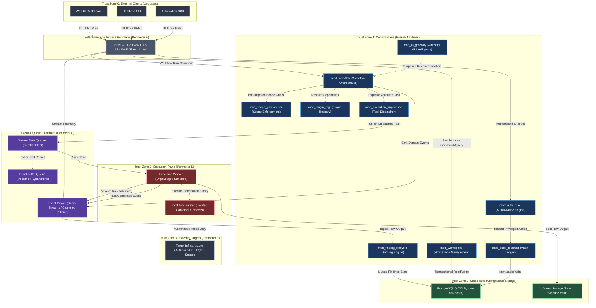
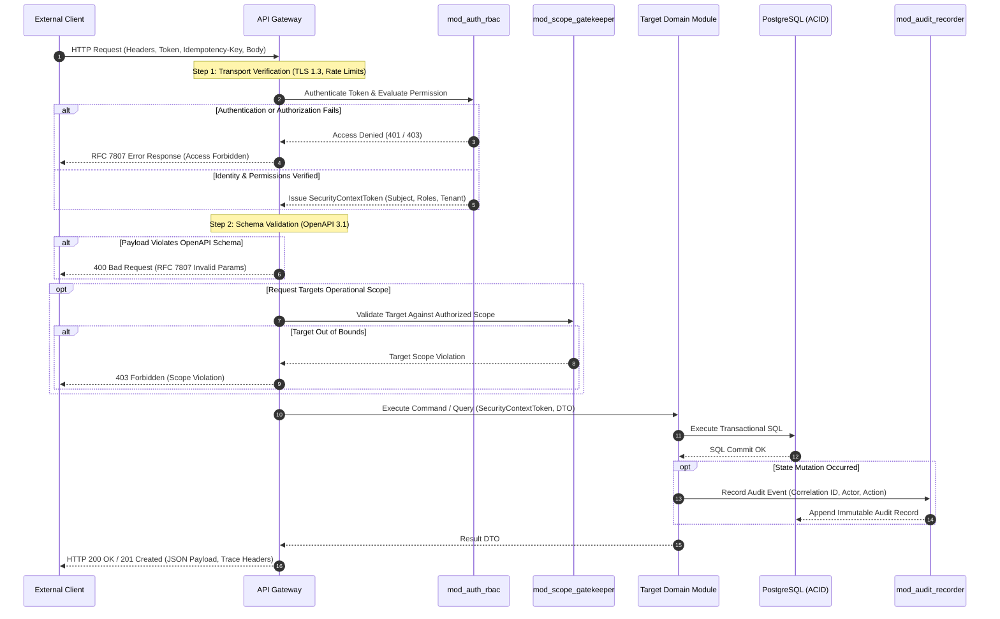
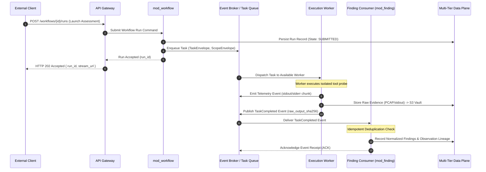
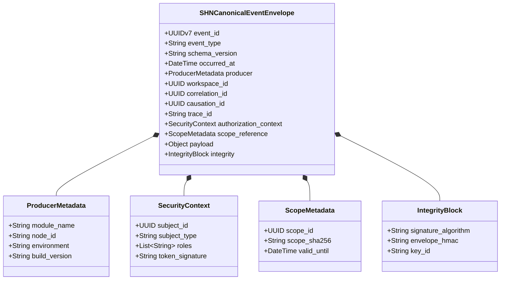
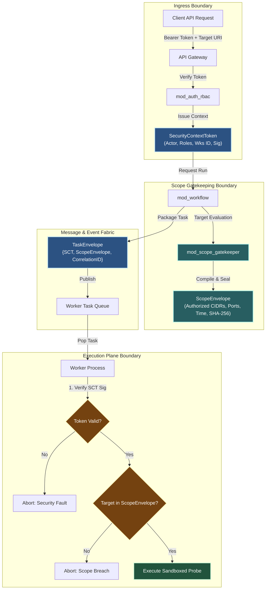
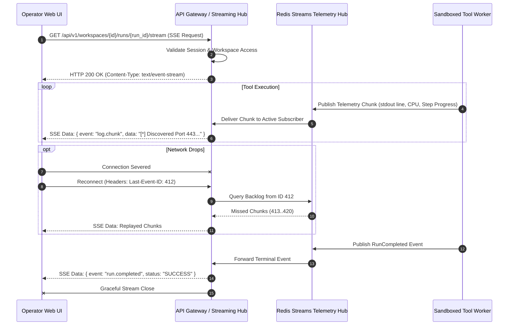
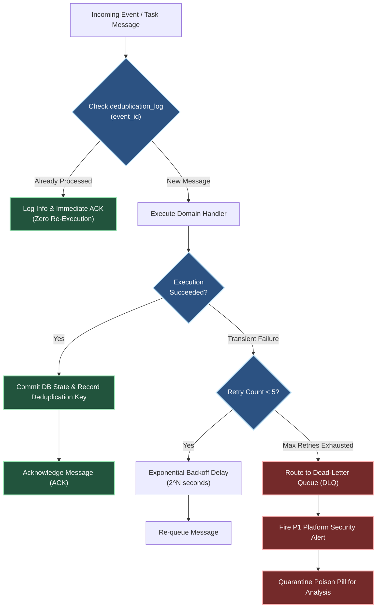

# Shadow : Helix Nebula (SHN)
## Phase 0.14: API & Event Architecture Specification

> **Authoritative Specification Notice**: This document establishes the binding Phase 0 architectural specification for the Application Programming Interface (API) and Event Subsystem of Shadow : Helix Nebula (SHN). Built directly upon the authoritative baselines of Phase 0.1 through Phase 0.13, this specification establishes the canonical communication contracts, synchronous and asynchronous boundaries, Command/Query/Event semantics, internal module contracts, external API gateway topology, REST and OpenAPI governance, streaming telemetry transports, message broker fabrics, canonical event envelopes, idempotency mechanisms, correlation and distributed trace lineage, authentication and immutable scope propagation, rate-limiting and abuse controls, error models, and event security.
>
> **Core Architectural Invariant**: APIs and events are strictly **communication substrates and contract boundaries**. They **MUST NOT** serve as an alternate path to bypass security controls, weaken authorization boundaries, circumvent scope gatekeeping, evade human approval barriers, or mutate immutable evidence lineage. Security policies defined in Phase 0.11, data ownership rules codified in Phase 0.10, tool isolation perimeters established in Phase 0.9, AI advisory boundaries defined in Phase 0.12, and orchestration lifecycle controls established in Phase 0.13 remain supreme and universally binding across all communication channels. This is an architectural specification, not an implementation codebase.

---

# 1. API & Event Architecture Objectives

The SHN API and Event Architecture is engineered to fulfill eight foundational objectives:
1. **Contract-Driven Decoupling**: Provide clean, strongly typed, versioned, and machine-readable contracts between all internal platform modules and external client surfaces, eliminating tight compile-time or schema coupling.
2. **Deterministic Security Boundary Enforcement**: Guarantee that every inbound API invocation and internal message propagation deterministically enforces tenant isolation, cryptographic authentication, RBAC authorization, and pre-dispatch target-scope verification.
3. **Command / Query / Event Segregation**: Enforce clean architectural separation between state-mutating commands, side-effect-free queries, and immutable historical domain events.
4. **Asynchronous Execution Decoupling**: Isolate short-lived interactive requests from long-running, multi-stage cybersecurity operations via durable queuing, asynchronous task hand-off, and real-time event streaming.
5. **Universal Provenance & Causation Lineage**: Anchor every request, command, event, and background task to an unbroken chain of correlation, causation, and distributed tracing identifiers to ensure forensic auditability.
6. **Effectively-Once & Idempotent Processing**: Provide robust duplicate suppression, idempotency key coordination, and safe replay mechanics across all network channels and message consumers.
7. **Resilient Failure Containment & Fail-Closed Semantics**: Confine network, transport, and serialization errors to the contract boundary; guarantee fail-closed behavior whenever security, tenant, or scope metadata is compromised or ambiguous.
8. **Ecosystem & Interoperability Readiness**: Support multi-client surfaces (Web UI, Headless CLI, Automation SDKs, Remote Enclaves) through uniform contract equality without privileging first-party clients.

---

# 2. Communication Architecture Philosophy

Communication within SHN adheres to four primary tenets:
1. **Never Trust the Wire**: All communication across network interfaces—whether ingress from user interfaces or internal traffic between distributed nodes—must be encrypted via TLS 1.3, authenticated via cryptographically verifiable credentials, and subjected to strict input schema validation.
2. **Events Are Historical Facts, Not Imperative Commands**: An event asserts that something has already occurred within an authoritative domain module. Events **SHALL NEVER** be constructed as disguised remote procedure calls (RPC) that command another module to perform privileged actions without independent authorization and scope validation.
3. **Zero Cross-Module Database Coupling**: No module may query another module's database tables or Redis keys. Inter-module data exchange occurs exclusively through public API contracts or domain events.
4. **Public Interface Parity**: Every capability exposed through the Web UI must be fully accessible via the public REST/streaming API and CLI. First-party user interfaces consume the exact same public contracts available to automation scripts and external integrations (`INV-02`, `API-FST-002`).

---

# 3. Communication Domains & Trust Boundaries

SHN partitions all communication into five explicit communication domains aligned with the trust perimeters defined in Phase 0.3 (Section 5) and Phase 0.11 (Section 2):

```
+---------------------------------------------------------------------------------------------------+
|                                 SHN COMMUNICATION TRUST DOMAINS                                   |
+---------------------------------------------------------------------------------------------------+
| DOMAIN                      | TRUST ZONE | TRANSPORT PROTOCOLS        | SECURITY BOUNDARY         |
+-----------------------------+------------+----------------------------+---------------------------+
| 1. External Ingress         | TZ-0       | HTTPS (TLS 1.3), WSS       | API Gateway, WAF, mTLS    |
| 2. Inter-Module Ingress     | TZ-1       | In-Memory DTOs / gRPC / IPC| Context Tokens, RBAC Gate |
| 3. Event Broker Substrate   | TZ-1 / TZ-2| Redis Streams / AMQP       | ACLs, Topic Partitioning  |
| 4. Worker Execution Plane   | TZ-3       | Redis Queue, TLS Heartbeats| Unprivileged, No DB Link  |
| 5. Target Network Probes    | TZ-4       | Raw IP / TCP / UDP / HTTP  | Scope Gatekeeper Interlock|
+---------------------------------------------------------------------------------------------------+
```

### 3.1 Trust Perimeter Invariants
- **Perimeter A (External Client $\rightarrow$ API Gateway)**: Public network boundary. Untrusted actors. Mandatory TLS 1.3, rate-limiting, authentication token verification, and payload size bounds.
- **Perimeter B (API Gateway $\rightarrow$ Core Control Plane Modules)**: Internal control plane boundary. Mutual identity verification, caller security context propagation, and workspace tenant isolation.
- **Perimeter C (Control Plane $\rightarrow$ Event Broker)**: Message publishing boundary. Publisher authentication, topic authorization, and mandatory envelope validation.
- **Perimeter D (Event Broker $\rightarrow$ Execution Workers)**: Task dispatch boundary. Tasks dispatched to workers contain self-contained execution context and signed scope tokens; workers possess zero database access (`INV-14`).
- **Perimeter E (Workers $\rightarrow$ Target Infrastructure)**: Outbound probe boundary. Strictly constrained by the pre-dispatch scope gatekeeper (`INV-06`).

---

# 4. Synchronous vs Asynchronous Communication Boundaries

To prevent resource exhaustion and thread starvation during long-running security assessments, SHN strictly codifies the boundary between synchronous and asynchronous operations:

```
+---------------------------------------------------------------------------------------------------+
|                            SYNCHRONOUS VS ASYCHRONOUS OPERATION MATRIX                            |
+---------------------------------------------------------------------------------------------------+
| CRITERION                   | SYNCHRONOUS PATH (REST / RPC)   | ASYCHRONOUS PATH (EVENT / QUEUE)  |
+-----------------------------+---------------------------------+-----------------------------------+
| Execution Latency SLO       | $t \le 500\text{ ms}$ (p95)     | $t > 500\text{ ms}$ (Indefinite)  |
| Operation Nature            | Queries, CRUD, Auth, Metadata   | Scans, Workflows, AI, Reports     |
| Client Interaction          | Request-Response (Blocking)     | Immediate 202 Accepted + Stream   |
| State Mutation              | Immediate In-Transaction Commit | Event-Driven Eventual Consistency |
| Transport                   | HTTPS (REST), In-Memory DTO     | Redis Streams / Task Queues       |
| Failure Handling            | Immediate HTTP Error Status Code| Retries, Dead-Letter Queue (DLQ)  |
| Telemetry Delivery          | Response Body                   | WebSocket / Server-Sent Events    |
+---------------------------------------------------------------------------------------------------+
```

### 4.1 Synchronous Ingress Protocol
Synchronous APIs are reserved for read operations (queries), low-latency transactional writes (e.g., creating a workspace, updating engagement rules), and workflow orchestration commands (e.g., pause, resume, cancel). If an operation requires invoking an external security tool, launching a container sandbox, or performing heavy AI inference, the synchronous endpoint **MUST** immediately return `HTTP 202 Accepted` accompanied by an operation tracker contract.

---

# 5. Command / Query / Event Semantics

SHN strictly enforces Command Query Responsibility Segregation (CQRS) semantics across all communication boundaries:

```
+---------------------------------------------------------------------------------------------------+
|                                    CQRS ARCHITECTURAL TAXONOMY                                    |
+---------------------------------------------------------------------------------------------------+
| CHARACTERISTIC  | COMMAND (Imperative)         | QUERY (Informational)       | EVENT (Factual)    |
+-----------------+------------------------------+-----------------------------+--------------------+
| Intent          | Request a state mutation.    | Request existing state.     | State has changed. |
| Direction       | Point-to-Point (1-to-1).     | Point-to-Point (1-to-1).    | Publish-Subscribe. |
| Authority       | Subject to Validation & RBAC.| Subject to Read RBAC.       | Immutable Fact.    |
| Rejection       | Can be rejected/failed.      | Can return Not Found/Denied.| Cannot be rejected.|
| Side Effects    | Produces state mutations.    | Strictly ZERO side-effects. | Informs consumers. |
| Naming Standard | Imperative: `LaunchScan`     | Interrogative: `GetFinding` | Past: `ScanLaunched`|
+---------------------------------------------------------------------------------------------------+
```

### 5.1 Semantic Rules
1. **Commands**: Addressed to a specific module handler. Must be validated, authorized, and scope-checked before execution. May result in synchronous success, synchronous rejection, or asynchronous task enqueueing.
2. **Queries**: Addressed to a specific module repository or projection. Must never mutate data or trigger outbound network scans.
3. **Events**: Emitted by an authoritative module after a state transaction commits. Broadcast to the event broker. Events announce facts; they **DO NOT** command specific subscribers to execute actions.

---

# 6. Internal Module API Architecture

Internal Core Modules (`mod_workspace`, `mod_finding_lifecycle`, `mod_scope_gatekeeper`, etc.) interact through strongly typed internal contracts (`INV-09`, Phase 0.7).

### 6.1 Internal API Principles
1. **Contract Over Implementation**: Modules communicate exclusively via interface definitions (Service Facades) and immutable Data Transfer Objects (DTOs).
2. **No Direct In-Memory State Sharing**: Modules **SHALL NOT** share mutable object pointers, in-memory reference caches, or global variables.
3. **Contextual Token Requirement**: Every internal API call must accept a mandatory `ExecutionContext` parameter encapsulating caller identity, tenant boundaries, correlation IDs, and authorized scope tokens.
4. **Locally Deployable / Distributable**: In a single-node workstation topology, internal APIs execute as in-memory method invocations across module boundaries. In a distributed topology, internal APIs can be compiled to lightweight gRPC or IPC channels without altering domain code.

---

# 7. External API Gateway Architecture

The API Gateway is the single point of entry for all external traffic entering the SHN Control Plane (Trust Zone 1) from Trust Zone 0.

### 7.1 Gateway Responsibilities
1. **TLS Termination & Transport Hardening**: Enforce TLS 1.3 with secure cipher suites. Terminate untrusted connections.
2. **Edge Authentication**: Validate inbound JSON Web Tokens (JWT), API keys, or mTLS certificates against `mod_auth_rbac`.
3. **Tenant & Context Injection**: Extract workspace identity and operator claims, translating them into the internal `ExecutionContext`.
4. **Global Rate Limiting & Abuse Prevention**: Enforce IP-based, tenant-based, and user-based token bucket rate limits before routing requests into the Control Plane.
5. **Request Correlation Injection**: Generate or validate OpenTelemetry-compliant `X-Correlation-ID`, `X-Trace-ID`, and `X-Request-ID` headers.
6. **Request Routing & Path Mapping**: Route traffic to appropriate internal module services or streaming hubs.

---

# 8. REST API Architecture

SHN exposes an idiomatic, resource-oriented RESTful HTTP API conforming strictly to Level 2/3 of the Richardson Maturity Model.

### 8.1 Resource Modeling Principles
- **Hierarchical URI Structure**: Reflect hierarchical tenant ownership (`/api/v1/workspaces/{wks_id}/engagements/{eng_id}/findings/{fnd_id}`).
- **Predictable HTTP Verbs**:
  - `GET`: Retrieve resource representations (idempotent, safe).
  - `POST`: Create subordinate resources or issue state-transition commands.
  - `PUT`: Complete idempotent resource replacement.
  - `PATCH`: Selective resource mutation via JSON Merge Patch (RFC 7396).
  - `DELETE`: Logical or physical resource removal (idempotent).
- **HTTP Status Code Discipline**:
  - `200 OK`: Successful synchronous read or update.
  - `201 Created`: Resource successfully created (includes `Location` header).
  - `202 Accepted`: Long-running task accepted for asynchronous execution.
  - `204 No Content`: Successful request with empty body (e.g., resource deleted).
  - `400 Bad Request`: Input validation failed; schema violation.
  - `401 Unauthorized`: Authentication credentials missing, expired, or invalid.
  - `403 Forbidden`: Authenticated actor lacks RBAC permissions or target violates scope.
  - `404 Not Found`: Resource does not exist or caller lacks access to detect existence.
  - `409 Conflict`: Concurrency version conflict or lifecycle state violation.
  - `422 Unprocessable Content`: Semantically invalid command payload.
  - `429 Too Many Requests`: Rate limit or concurrency quota exhausted.
  - `500 Internal Error`: Unhandled server exception (sanitized; zero stack leak).

---

# 9. OpenAPI Contract Governance

All external REST API surfaces are governed by formal OpenAPI 3.1 contracts.

### 9.1 Contract Governance Invariants
1. **Single Source of Truth**: The OpenAPI 3.1 specification serves as the binding contract for all ingress routing, gateway schema validation, CLI generation, and client SDK compilation (`API-FST-001`).
2. **Schema Linting & Breaking Change Gates**: All API changes are subjected to automated schema linting (e.g., Spectral) in CI/CD. Breaking changes (removed endpoints, renamed fields, altered types) are rejected unless introduced under a new major API version namespace (`/v2/`).
3. **Comprehensive Type Constraints**: All request and response schemas must define strict types, formatting regexes, boundary limits (min/max), and mandatory field declarations. Polymorphic payloads must use explicit discriminator fields.

---

# 10. WebSocket & Server-Sent Events Architecture

Real-time, bidirectional, and unidirectional telemetry streaming is partitioned across two dedicated transports:

```
+---------------------------------------------------------------------------------------------------+
|                              REAL-TIME STREAMING TRANSPORT TOPOLOGY                               |
+---------------------------------------------------------------------------------------------------+
| PROTOCOL                   | USE CASE                          | FLOW DIRECTION | PERSISTENCE     |
+----------------------------+-----------------------------------+----------------+-----------------+
| Server-Sent Events (SSE)   | Task logs, progress, notifications| Unidirectional | Reconnectable   |
| WebSocket (WSS)            | Interactive shells, live triage   | Bidirectional  | Stateful Session|
+---------------------------------------------------------------------------------------------------+
```

### 10.1 Server-Sent Events (SSE) Protocol
SSE is the primary transport for long-running execution telemetry:
- **Lightweight & HTTP-Native**: Operates over standard HTTP/2 or HTTP/1.1 connections, traversing corporate proxies and firewalls without custom framing.
- **Built-in Reconnection**: Utilizes standard `Last-Event-ID` headers to resume streaming seamlessly following transient network disconnects.
- **Channel Addressing**: Scoped to specific operational executions (`/api/v1/workspaces/{wks_id}/runs/{run_id}/stream`).

### 10.2 WebSocket (WSS) Protocol
WebSocket connections are restricted to scenarios requiring low-latency bidirectional interaction:
- **Interactive Terminal Sessions**: Streaming raw interactive input/output to remote debug consoles or diagnostic probes.
- **Session Authentication**: WebSocket handshakes require an initial short-lived, single-use ticket acquired via authenticated REST request.

---

# 11. Long-Running Operation & Streaming Architecture

Long-running security tasks (port scans, vulnerability audits, workflow executions) adhere to an asynchronous polling and streaming pattern:

```
+---------------------------------------------------------------------------------------------------+
|                               LONG-RUNNING OPERATION LIFECYCLE                                    |
+---------------------------------------------------------------------------------------------------+
| 1. INITIATION:                                                                                    |
|    Client -> POST /api/v1/workspaces/{wks_id}/workflows/{wf_id}/runs                              |
|    API Gateway -> mod_auth_rbac (AuthZ Check) -> mod_scope_gatekeeper (Pre-Dispatch Scope Check)  |
|    Control Plane -> Persists Run (State: SUBMITTED) -> Publishes Command to Broker                 |
|    Client <- HTTP 202 Accepted { "run_id": "run-01", "stream_url": "/api/v1/.../runs/run-01/stream"}|
|                                                                                                   |
| 2. REAL-TIME TELEMETRY STREAMING:                                                                 |
|    Client -> GET /api/v1/workspaces/{wks_id}/runs/run-01/stream (SSE Connection)                 |
|    Event Broker -> Telemetry Gateway -> SSE Stream (Logs, Step Transitions, Metric Chunks)        |
|                                                                                                   |
| 3. COMPLETION NOTIFICATION:                                                                       |
|    Worker completes task -> Emits RunCompleted Event -> Persists Final Artifact to DB/S3         |
|    SSE Stream emits terminal event: { "event": "run.completed", "status": "SUCCESS" }             |
|    Client closes SSE stream -> Fetches final report: GET /api/v1/workspaces/{wks_id}/runs/run-01  |
+---------------------------------------------------------------------------------------------------+
```

---

# 12. Event Bus / Message Broker Architecture

The SHN event fabric coordinates asynchronous decoupling across the platform (`BC-EXE`, `mod_event_bus`).

### 12.1 Storage & Broker Engine Tiers
- **Local Workstation Topology**: Backed by high-performance in-memory ring buffers or local Redis Streams, providing near-zero resource overhead ($\le 4\text{ GB}$ footprint, `INV-10`).
- **Distributed Enterprise Topology**: Backed by a high-throughput clustered message broker (Redis Streams, RabbitMQ, or Apache Kafka) providing clustered consumer groups and persistent storage.

### 12.2 Topic & Channel Partitioning Scheme
Event channels are strictly organized into hierarchical namespaces enforcing tenant and functional boundaries:
```
shn.{environment}.{tenant_id}.{workspace_id}.{domain}.{entity_type}.{action}
```
*Example*: `shn.prod.org-88.wks-42.workflow.run.completed`

---

# 13. Canonical Event Envelope

Every event published to the SHN event fabric **MUST** be encapsulated within the authoritative, immutable **SHN Canonical Event Envelope**:

```
+---------------------------------------------------------------------------------------------------+
|                                   SHN CANONICAL EVENT ENVELOPE                                    |
+---------------------------------------------------------------------------------------------------+
| FIELD NAME            | TYPE      | DESCRIPTION & CONSTRAINTS                                     |
+-----------------------+-----------+---------------------------------------------------------------+
| event_id              | UUIDv7    | Time-ordered, globally unique event identifier.               |
| event_type            | String    | Dot-notated event classification (e.g., "scan.host.discovered")|
| schema_version        | String    | SemVer specification of the payload schema (e.g., "1.2.0").   |
| occurred_at           | ISO 8601  | Microsecond-precision UTC timestamp of domain occurrence.     |
| producer              | Object    | Emitting service metadata ({ "module": "mod_wf", "node_id" })|
| workspace_id          | UUID      | Workspace boundary anchor. Mandatory multi-tenant isolation.  |
| correlation_id        | UUID      | Distributed root transaction identifier.                      |
| causation_id          | UUID      | Identifier of the immediate command or event causing this.    |
| trace_id              | String    | W3C / OpenTelemetry distributed trace identifier.             |
| authorization_context | Object    | Serialized security principal, roles, and token signature.    |
| scope_reference       | Object    | Cryptographic hash/ID of the authorized target scope token.   |
| payload               | Object    | Strongly typed, schema-validated event-specific data.         |
| integrity             | Object    | Cryptographic signature/HMAC verifying envelope authenticity. |
+---------------------------------------------------------------------------------------------------+
```

---

# 14. Event Metadata Lineage

The canonical envelope mandates unbroken metadata linkage across operations:
1. **`correlation_id`**: Assigned at the API Gateway upon initial request ingress. Propagated unchanged across every command, task queue, domain event, and child workflow execution.
2. **`causation_id`**: Set to the `event_id` or `command_id` of the immediate predecessor action that directly triggered this event, forming a traversable forensic causation Directed Acyclic Graph (DAG).
3. **`scope_reference`**: Embeds the SHA-256 hash of the governing `ScopeEnvelope` (`INV-06`). An event carrying a modified or missing scope reference is immediately rejected by message consumers.

---

# 15. Event Versioning & Compatibility

Event schemas evolve over time as platform capabilities expand. SHN mandates strict backward compatibility:

### 15.1 Semantic Versioning Schema
Event types embed a semantic version string (`MAJOR.MINOR.PATCH`):
- **PATCH**: Non-functional schema adjustments, documentation changes.
- **MINOR**: Additive changes (adding optional fields). Existing consumers continue processing without modification.
- **MAJOR**: Breaking changes (removing fields, changing field types, altering semantic meaning).

### 15.2 Invariants for Event Evolution
1. **Additive Minor Evolution**: Producers may add optional fields. Consumers **MUST** ignore unknown fields rather than throwing deserialization errors (Postel's Law / Robustness Principle).
2. **Major Version Parallel Topics**: When breaking schema changes are mandatory, producers must publish to a new event type or version-qualified channel (`scan.host.discovered.v2`) and maintain dual-publishing during the deprecation window (`API-INV-16`).

---

# 16. Delivery Guarantees & Messaging Semantics

Distributed networks cannot guarantee simultaneous exactly-once delivery and high availability. SHN codifies its messaging guarantees:

```
+---------------------------------------------------------------------------------------------------+
|                                 MESSAGING DELIVERY GUARANTEES                                     |
+---------------------------------------------------------------------------------------------------+
| DIMENSION                   | GUARANTEE LEVEL     | ARCHITECTURAL MECHANISM                       |
+-----------------------------+---------------------+-----------------------------------------------+
| Broker Delivery             | At-Least-Once       | Persistent acknowledgments, consumer tracking.|
| Processing Semantics        | Effectively-Once    | Consumer-side idempotency deduplication table.|
| Ordering Guarantee          | Per-Entity FIFO     | Partitioned ordering by `workspace_id` + entity|
| Poison-Pill Containment     | Dead-Letter Queue   | Exponential backoff retry (max 5) -> DLQ alert.|
+---------------------------------------------------------------------------------------------------+
```

### 16.1 Deduplication & Replay Resilience
Because network retries can cause duplicate delivery, message consumers **MUST NOT** assume messages are unique. Every consumer checks the durable `deduplication_log` table before mutating state (`API-INV-09`).

---

# 17. Idempotency Architecture

State-mutating operations exposed via APIs and event handlers must be completely resilient against accidental or malicious duplicate submissions.

### 17.1 API Ingress Idempotency
Clients executing mutating POST commands must supply an `Idempotency-Key` HTTP header (UUIDv4/UUIDv7):
1. **Key Registration**: Upon receiving a request with an `Idempotency-Key`, the gateway checks the distributed cache (Redis) within a transactional lock.
2. **In-Flight Detection**: If an identical key is currently executing, the gateway rejects the duplicate with `409 Conflict` or waits for resolution.
3. **Cached Response Replay**: If the key has already succeeded, the gateway immediately returns the stored response payload without re-executing the operation.
4. **Time-To-Live (TTL)**: Idempotency keys persist for exactly 24 hours in the high-speed cache, backed by PostgreSQL archival.

---

# 18. Correlation, Causation & Distributed Trace Architecture

In compliance with OpenTelemetry and Phase 0.11 security observability:

```
[External Ingress: Request] (Assign trace_id, correlation_id = req-01, causation_id = null)
         |
         v
[API Gateway -> mod_workflow] (correlation_id = req-01, causation_id = req-01)
         |
         v
[Event: workflow.run.dispatched] (event_id = ev-01, correlation_id = req-01, causation_id = req-01)
         |
         v
[Worker Task Execution] (task_id = tsk-01, correlation_id = req-01, causation_id = ev-01)
         |
         v
[Event: scan.port.detected] (event_id = ev-02, correlation_id = req-01, causation_id = tsk-01)
```

Forensic investigators can query the complete causal lineage of any detected finding or raw evidence artifact back to the initiating human operator request.

---

# 19. Authentication & Authorization Propagation Across APIs

Security context must never be dropped, forged, or decoupled during inter-service communication (`INV-16`, Phase 0.11).

### 19.1 Ingress Token Exchange
1. External clients submit OAuth 2.0 / OIDC bearer tokens or signed API keys.
2. The API Gateway authenticates the credential and requests an internal cryptographic `SecurityContextToken` from `mod_auth_rbac`.
3. The internal token contains:
   - `subject_id` (Operator identity)
   - `workspace_id` (Tenant context)
   - `effective_roles` & `permission_mask`
   - `issued_at` & `expires_at` (Short-lived: $\le 15\text{ minutes}$)
   - `hmac_signature` (Signed by Control Plane Master Secret)
4. All internal module invocations and asynchronous task payloads carry this token. Subordinate modules independently verify the signature before processing commands.

---

# 20. Immutable Scope Propagation Across API/Event Boundaries

A critical vulnerability in automated security platforms is the silent expansion or mutation of target scopes as instructions transition across distributed layers.

### 20.1 Scope Immutability Protocol
1. When a workflow or task is initiated, `mod_scope_gatekeeper` generates an immutable `ScopeEnvelope` containing the exact authorized IP ranges, domains, ports, and operational time windows (`INV-06`).
2. The `ScopeEnvelope` is cryptographically hashed (SHA-256) and signed.
3. Every downstream API call, task queue dispatch, and event propagation embeds this immutable `scope_hash` and reference token.
4. **Worker Pre-Execution Interlock**: Before any network socket is opened or tool binary spawned, the execution worker verifies that the immediate target matches the signed `ScopeEnvelope`. Any tampering or mismatch results in immediate process termination and a security alert (`API-INV-02`).

---

# 21. Workspace / Tenant / Session Isolation

Multi-tenant hermeticity is enforced universally at the communication layer (`INV-19`):
1. **URL Path Binding**: All tenant-aware API endpoints must explicitly include the `{workspace_id}` path parameter.
2. **Gateway Workspace Validation**: The API Gateway verifies that the authenticated user possesses active membership in the target workspace. Requests attempting cross-workspace access are rejected with `404 Not Found` (preventing IDOR enumeration).
3. **Broker Topic Partitioning**: Message broker consumers subscribe exclusively to channels matching authorized workspace identifiers.
4. **Shared Kernel Enforcement**: Database queries generated from API requests are automatically scoped with `WHERE workspace_id = ?` at the repository abstraction layer (`mod_data_access_infrastructure`).

---

# 22. Input Validation & Schema Enforcement

To eliminate injection attacks, buffer overflows, and state corruption:
1. **Edge Schema Validation**: The API Gateway validates all JSON request payloads against the compiled OpenAPI 3.1 schema. Payloads with unrecognized properties, invalid data types, or out-of-range values are rejected immediately with `400 Bad Request`.
2. **Deep Domain Validation**: Domain modules perform semantic validation (e.g., verifying that a target CIDR does not overlap private cloud metadata endpoints `169.254.169.254`).
3. **Strict Deserialization Boundaries**: Deserializers must never use polymorphic reflection or unsafe type instantiation (preventing Java/Python-style deserialization exploits).

---

# 23. API Rate Limiting & Abuse Protection

To safeguard platform stability and prevent denial-of-service against internal databases or target networks:

```
+---------------------------------------------------------------------------------------------------+
|                                 RATE LIMITING ENFORCEMENT TIERS                                   |
+---------------------------------------------------------------------------------------------------+
| TIER               | SCOPE             | ALGORITHM        | DEFAULT QUOTA                         |
+--------------------+-------------------+------------------+---------------------------------------+
| 1. Gateway Edge    | Client IP         | Token Bucket     | $100\text{ req/s}$ (Burst: 200)       |
| 2. Tenant / Wks    | `workspace_id`    | Leaky Bucket     | $1,000\text{ req/min}$                |
| 3. User / Account  | `actor_id`        | Sliding Window   | $500\text{ req/min}$                  |
| 4. Outbound Target | Target FQDN / IP  | Token Bucket     | Configured in Engagement Rules of Eng |
+---------------------------------------------------------------------------------------------------+
```

Excess requests receive `HTTP 429 Too Many Requests` accompanied by `Retry-After` headers.

---

# 24. Error & Failure Contract Architecture

SHN strictly standardizes machine-readable error responses across all REST, WebSocket, and event boundaries using RFC 7807 (Problem Details for HTTP APIs):

```json
{
  "type": "https://api.shadow-helix-nebula.io/errors/SCOPE_VALIDATION_FAILED",
  "title": "Target Scope Validation Failed",
  "status": 403,
  "detail": "Target IP 192.168.1.50 falls outside the authorized engagement scope.",
  "instance": "/api/v1/workspaces/wks-42/workflows/wf-10/runs",
  "error_code": "ERR_SCOPE_VIOLATION_OUT_OF_BOUNDS",
  "timestamp": "2026-09-19T14:32:00.102842Z",
  "correlation_id": "c73a9821-4f10-482a-9e11-d09214b73201",
  "invalid_params": [
    {
      "name": "target",
      "reason": "IP address is not present in scope whitelist."
    }
  ]
}
```

Internal server exceptions are masked; operational logs record the stack trace under the matching `correlation_id` while returning a clean, non-leaky error payload to the client.

---

# 25. API Observability & Audit Architecture

Every API request and event transmission generates structured telemetry conforming to Phase 0.11 and Phase 0.10:
1. **Access Logging**: Emitted as structured JSON containing `timestamp`, `client_ip`, `http_method`, `uri`, `status_code`, `latency_ms`, `workspace_id`, `actor_id`, and `correlation_id`.
2. **Audit Event Recording**: State-mutating commands (e.g., launching an invasive workflow, approving a bypass, altering scope) trigger an append-only audit event written directly to `mod_audit_recorder` (`INV-17`).
3. **Prometheus Metrics**: The API gateway and message broker export standard metrics:
   - `shn_api_requests_total{endpoint, method, status}`
   - `shn_api_request_duration_seconds{endpoint}`
   - `shn_event_published_total{event_type, status}`
   - `shn_event_processing_latency_seconds{event_type}`
   - `shn_queue_depth{queue_name}`

---

# 26. Plugin / Tool / Workflow / AI Communication Boundaries

The API/Event architecture connects heterogeneous subsystems while strictly preserving their established isolation rules:

### 26.1 Communication Chains
1. **API $\rightarrow$ Core $\rightarrow$ Workflow $\rightarrow$ Plugin $\rightarrow$ Tool Adapter $\rightarrow$ External Tool**:
   - API issues command to `mod_workflow`.
   - `mod_workflow` validates DAG and step contracts.
   - `mod_plugin_mgr` resolves abstract capability to concrete plugin.
   - `mod_execution_supervisor` dispatches isolated task to worker queue (`INV-01`, `INV-13`).
   - `mod_tool_runner` executes binary inside sandboxed cgroup/container (`INV-08`, `INV-12`).
   - Raw stdout/stderr streamed back as telemetry events.
2. **AI $\rightarrow$ Proposal $\rightarrow$ Validation $\rightarrow$ Security Gate $\rightarrow$ Human Approval $\rightarrow$ Workflow $\rightarrow$ Execution**:
   - AI generates recommendation (e.g., suggested exploit probe or scan profile).
   - Recommendation published as `ai.recommendation.proposed` (`approval_class: PROPOSED`).
   - `mod_scope_gatekeeper` deterministically evaluates proposed targets.
   - If invasive, workflow pauses and emits `approval.requested`.
   - Sovereign human operator inspects proposal via UI/CLI and submits `approval.granted`.
   - Only after approval event is cryptographically validated does `mod_workflow` dispatch the step.

---

# 27. Human Approval Event Architecture

Synchronizing human sovereign authority with asynchronous automated execution requires formal approval lifecycle events (`INV-07`, Phase 0.12, Phase 0.13):

```
+---------------------------------------------------------------------------------------------------+
|                                 HUMAN APPROVAL EVENT LIFECYCLE                                    |
+---------------------------------------------------------------------------------------------------+
| EVENT TYPE            | EMITTING ACTOR       | TRIGGER CONDITION & PAYLOAD CONTENTS               |
+-----------------------+----------------------+----------------------------------------------------+
| approval.requested    | mod_workflow         | Execution reaches an invasive action barrier.      |
|                       |                      | Payload: step details, blast-radius, target scope.  |
| approval.granted      | Operator (via API)   | Operator signs approval token.                     |
|                       |                      | Payload: approval_id, signature, operator notes.   |
| approval.denied       | Operator (via API)   | Operator rejects execution. Workflow aborts step.  |
| approval.expired      | mod_workflow         | Timeout window lapses without operator action.     |
| approval.revoked      | Operator / Admin     | Pre-authorized approval revoked before dispatch.   |
+---------------------------------------------------------------------------------------------------+
```

---

# 28. Execution, Observation, Finding & Evidence Events

Data flow from raw tool execution to verified findings is mediated by immutable domain events:

1. **`execution.task.dispatched`**: Worker claims task from queue.
2. **`execution.telemetry.chunk`**: Worker streams real-time stdout/stderr chunks.
3. **`execution.task.completed`**: Worker finishes. Embeds raw output hash (`raw_output_sha256`).
4. **`evidence.artifact.sealed`**: `mod_evidence_ledger` stores raw artifact in S3/Vault and records SHA-256 seal (`INV-05`).
5. **`observation.raw.ingested`**: `mod_normalizer` parses raw output into standardized observation DTOs.
6. **`finding.lifecycle.discovered`**: `mod_finding_lifecycle` correlates observations into an official security finding.

---

# 29. Contract Testing Architecture

To guarantee that internal modules, external clients, and third-party plugins never break interface agreements:
1. **Consumer-Driven Contract Testing (Pact)**: Downstream consumers (Web UI, CLI, worker daemons) define explicit expectations against provider API responses. Contract tests run in CI/CD before any provider merge.
2. **OpenAPI Schema Conformance Validation**: Every automated integration test validates actual HTTP responses against the published OpenAPI 3.1 schema.
3. **Event Schema Validation Suite**: All event payloads emitted in integration test suites are validated against the canonical JSON Schema registry. Schema violations fail CI builds immediately.

---

# 30. API / Event Compatibility & Deprecation Policy

To provide platform stability for enterprise consumers and plugin authors:
1. **Deprecation Notice Period**: Deprecated endpoints or event versions must be formally flagged with HTTP `Deprecation: true` and `Sunset: {date}` headers at least 180 days prior to physical removal.
2. **Non-Destructive Evolution**: Existing API endpoints must remain fully operational and backward-compatible throughout the deprecation window.
3. **Additive-Only Event Channels**: Fields within existing event schemas are never deleted or redefined in-place; replacement data structures are introduced via new field names or major schema version increments.

---

# 31. Failure Containment & Circuit Breaking

Network partitions, broker crashes, and subscriber failures must not cascade into platform-wide collapse:
1. **API Gateway Circuit Breaker**: If an internal core module experiences elevated error rates ($> 20\%$ 5xx responses over $10\text{ seconds}$), the gateway trips the circuit, returning `503 Service Unavailable` with a structured fallback response.
2. **Broker Backpressure & Flow Control**: Message consumers utilize consumer-driven pull semantics with strict prefetch limits (`prefetch_count = 10`), preventing slow consumers from being overwhelmed by bursty event streams.
3. **Dead-Letter Queue Isolation**: Poison-pill messages that repeatedly fail deserialization or processing are quarantined to the DLQ after 5 failed attempts, firing high-priority alerts to platform operators.

---

# 32. Security Threats Specific to APIs & Events

In compliance with the Threat Model established in Phase 0.11:

```
+---------------------------------------------------------------------------------------------------+
|                              API & EVENT SPECIFIC THREAT MITIGATION                               |
+---------------------------------------------------------------------------------------------------+
| THREAT VECTOR               | RISK IMPACT                   | ARCHITECTURAL MITIGATION            |
+-----------------------------+-------------------------------+-------------------------------------+
| 1. Replay Attacks           | Duplicate actions executed.   | Mandatory UUIDv7 + Idempotency Key. |
| 2. Confused Deputy          | Worker tricked into attack.   | Cryptographic SecurityContextToken. |
| 3. Authorization Bypass     | Direct unauthenticated call.  | Gateway token validation + mTLS.    |
| 4. Event Injection          | Fake events trigger actions.  | HMAC signature on event envelope.   |
| 5. Schema Poisoning         | Corrupted payloads crash app. | Strict OpenAPI & JSON Schema lint.  |
| 6. Stale Authorization      | Revoked user runs tasks.      | Short-lived tokens ($\le 15\text{m}$) & revoke list|
| 7. Cross-Tenant Leakage     | Tenant sees other's events.   | Broker channel isolation by Wks ID. |
| 8. Parameter Tampering      | Target scope expanded.        | Signed ScopeEnvelope hash check.    |
+---------------------------------------------------------------------------------------------------+
```

---

# 33. Architectural Invariants

The following sixteen binding architectural invariants govern all API and Event designs in SHN. Any design or pull request violating these rules is architecturally invalid:

### API-INV-01: Zero Implicit Authorization
- **Rule**: External API gateway authentication must never substitute for fine-grained, tenant-bounded authorization evaluation at the module contract boundary.
- **Rationale**: Prevents authorization bypass and confused deputy attacks within internal micro-perimeters.
- **Enforcement Point**: Module service facade ingress interceptor.
- **Verification Method**: Automated integration test with valid gateway token lacking domain permissions (**INT** / **SEC**).

### API-INV-02: Immutable Scope Boundary Propagation
- **Rule**: All API requests and event payloads carrying target scope references must propagate cryptographically signed, immutable scope tokens (`ScopeEnvelope`); no API or event translation layer can widen or alter target definitions.
- **Rationale**: Guarantees that target boundaries established during engagement authorization are preserved intact across all communication hops.
- **Enforcement Point**: Pre-dispatch validation interceptor and worker execution pre-check.
- **Verification Method**: Automated pen-test attempting target injection during event transit (**SEC**).

### API-INV-03: Asynchronous Boundary for Long-Running Operations
- **Rule**: Any operational request initiating offensive, diagnostic, or scanning workloads exceeding synchronous SLOs ($t > 500\text{ ms}$) must immediately return `HTTP 202 Accepted` and transition execution to the asynchronous event/queue substrate.
- **Rationale**: Prevents gateway thread pool starvation, client timeouts, and denial-of-service.
- **Enforcement Point**: REST API Gateway routing controllers.
- **Verification Method**: Automated performance benchmark verifying zero blocking calls for tool launches (**PRF**).

### API-INV-04: Strict CQRS Semantic Separation
- **Rule**: Commands alter state and produce domain events; Queries are side-effect-free and produce zero domain events; Events record immutable facts and must never be formatted as imperative commands.
- **Rationale**: Eliminates hidden state mutations during data retrieval and prevents event-driven command injection loops.
- **Enforcement Point**: Controller architecture linting and repository query boundaries.
- **Verification Method**: Static architectural linting (**LNT**).

### API-INV-05: Single-Module Contract Encapsulation & Zero Shared Database Queries
- **Rule**: Inter-module synchronous invocations must occur strictly via exported interface contracts and DTOs; no cross-module communication may execute direct SQL joins across another module's database tables.
- **Rationale**: Preserves bounded context encapsulation and prevents schema lock-in (`INV-09`, `DATA-INV-05`).
- **Enforcement Point**: Database schema migration review and code dependency analysis.
- **Verification Method**: Static dependency DAG inspection (**LNT**).

### API-INV-06: Canonical Envelope Integrity & Lineage Mandatory
- **Rule**: All published domain events must conform strictly to the SHN Canonical Event Envelope, embedding `event_id`, `correlation_id`, `causation_id`, `trace_id`, `workspace_id`, and payload HMAC metadata.
- **Rationale**: Ensures complete forensic traceability and lineage reconstruction across distributed executions.
- **Enforcement Point**: Message broker publishing gateway interceptor.
- **Verification Method**: Automated unit test asserting schema conformance on all event emissions (**AUT**).

### API-INV-07: Zero Execution Authority in Events
- **Rule**: Consuming an event grants zero execution authority; any downstream action triggered by an event must independently re-verify permissions and pass the deterministic `mod_scope_gatekeeper`.
- **Rationale**: Prevents privilege escalation where an unprivileged event subscriber initiates unauthorized offensive actions.
- **Enforcement Point**: Consumer task dispatch handler.
- **Verification Method**: Integration test verifying scope re-validation on event-driven triggers (**SEC** / **INT**).

### API-INV-08: Consumer-Side Distrust of Event Payloads
- **Rule**: Event consumers must treat incoming event payloads as untrusted external input, subjecting all deserialized data to schema validation and tenant boundary checks before domain processing.
- **Rationale**: Defense-in-depth against malicious message injection, broker compromise, or poisoned event queues.
- **Enforcement Point**: Event listener deserialization boundary.
- **Verification Method**: Automated fuzzing test injecting malformed payloads into event consumers (**SEC** / **AUT**).

### API-INV-09: Idempotent Consumer Guarantee & Duplicate Suppression
- **Rule**: All event handlers and command consumers must enforce idempotent processing via durable idempotency keys (`idempotency_key` or `event_id`), guaranteeing that duplicate delivery causes zero duplicate side-effects.
- **Rationale**: Overcomes at-least-once message delivery duplication, preventing duplicate scans or corrupted state.
- **Enforcement Point**: Consumer state mutation transaction manager.
- **Verification Method**: Automated integration test replaying identical events 100 times (**INT** / **AUT**).

### API-INV-10: Strict Tenant & Workspace Event Channel Partitioning
- **Rule**: Event topics, streaming channels, and queue routes must partition message distribution strictly by `workspace_id`; cross-workspace event distribution is strictly prohibited.
- **Rationale**: Prevents accidental or malicious data leakage across multi-tenant boundaries (`INV-19`).
- **Enforcement Point**: Message broker routing key evaluator and WebSocket session channel filters.
- **Verification Method**: Automated tenant boundary security penetration test (**SEC**).

### API-INV-11: Advisory AI Event Containment
- **Rule**: AI-generated event notifications and recommendation payloads must be marked with `approval_class: PROPOSED | ADVISORY` and must never emit executable commands directly to the worker queue without human operator sign-off.
- **Rationale**: Enforces sovereign human operator authority over all AI recommendations (`INV-07`, `AI-INV-01`).
- **Enforcement Point**: AI Gateway event publisher and Workflow compiler.
- **Verification Method**: Integration test verifying rejection of AI-originated execution commands (**SEC** / **INT**).

### API-INV-12: Tool Execution Channel Exclusivity
- **Rule**: No API endpoint or event consumer may invoke tool binaries directly; all tool executions must route strictly through `mod_workflow` $\rightarrow$ `mod_execution_supervisor` $\rightarrow$ `mod_tool_runner`.
- **Rationale**: Preserves execution sandboxing, capability dropping, and evidentiary capture (`INV-08`, `INV-12`, `TOOL-INV-01`).
- **Enforcement Point**: Operating system process spawn permissions and module import checks.
- **Verification Method**: Static architectural linting and sandbox boundary verification (**LNT** / **SEC**).

### API-INV-13: Human Approval Gate Event Synchronization
- **Rule**: Operations classified as `APPROVAL_REQUIRED` must pause execution and emit `approval.requested`; the workflow engine must only resume upon receiving a cryptographically signed `approval.granted` event from an authorized human operator.
- **Rationale**: Prevents automated execution of invasive, destructive, or high-risk actions without explicit consent (`WF-INV-07`).
- **Enforcement Point**: Workflow engine state transition engine.
- **Verification Method**: Automated workflow lifecycle test asserting pause on invasive step (**AUT** / **INT**).

### API-INV-14: Machine-Readable Fail-Closed Error Model
- **Rule**: All API and event errors must emit standardized RFC 7807-compliant structured error payloads with deterministic error codes, masking internal stack traces and failing closed on ambiguity.
- **Rationale**: Prevents information disclosure via verbose error messages and provides deterministic error recovery.
- **Enforcement Point**: Global API Gateway and event consumer exception filters.
- **Verification Method**: Automated integration test asserting zero raw stack traces in error responses (**AUT** / **SEC**).

### API-INV-15: Bidirectional Distributed Trace & Lineage Continuity
- **Rule**: Every API request, internal module call, event publication, and worker execution must preserve and propagate OpenTelemetry trace contexts and causal lineage identifiers (`trace_id`, `span_id`, `correlation_id`, `causation_id`).
- **Rationale**: Enables end-to-end distributed observability, performance bottleneck detection, and forensic reconstruction.
- **Enforcement Point**: HTTP client interceptors, message envelope serializers, and worker wrappers.
- **Verification Method**: Automated end-to-end trace validation test asserting 100% span continuity (**INT** / **PRF**).

### API-INV-16: Backward-Compatible Contract Evolution & Deprecation Sunsets
- **Rule**: Breaking changes to API schemas or event payloads require new major version endpoints/channels; deprecated interfaces must provide a minimum 180-day operational deprecation window with automated warning headers.
- **Rationale**: Protects production integrations, automation scripts, and external plugins from abrupt failures.
- **Enforcement Point**: API Gateway schema router and CI/CD contract breaking-change linter.
- **Verification Method**: CI/CD automated contract breaking change gate (**LNT**).

---

# 34. Architectural Decision Register (ADR)

### ADR-API-01: Dual Synchronous/Asynchronous Architecture (REST/OpenAPI 3.1 + Event-Driven Broker)
- **Context**: SHN requires an interface design that accommodates both interactive UI management (workspaces, findings, reports) and long-running, multi-stage cybersecurity operations (port scans, vulnerability audits).
- **Decision**: Adopt a dual communication architecture: Synchronous HTTP/REST (governed by OpenAPI 3.1) for control-plane management, configuration, and queries; Asynchronous Event-Driven Broker (Redis Streams / Task Queues) for operational commands, background workers, and real-time telemetry.
- **Consequences**:
  - *Positive*: Optimal user experience for interactive management; zero HTTP client timeouts during multi-hour scans; high scalability.
  - *Negative*: Requires managing two communication paradigms and maintaining event schema registries alongside REST contracts.
- **Rejected Alternatives**:
  - *Pure gRPC Everywhere*: Rejected due to poor web browser ergonomics, lack of native curl/scripting simplicity for security practitioners, and complex proxy configuration.
  - *Pure Synchronous REST*: Rejected because security tools run for minutes or hours; blocking HTTP requests cause catastrophic socket starvation.

### ADR-API-02: Canonical Event Envelope Specification
- **Context**: Asynchronous events traverse various components (gateway, core modules, workers, telemetry hubs). Without a standardized envelope, consumers suffer from ad-hoc deserialization logic and lost forensic context.
- **Decision**: Codify the SHN Canonical Event Envelope (Section 13) inspired by the CNCF CloudEvents standard, extended with mandatory security claims (`workspace_id`, `authorization_context`, `scope_reference`, `causation_id`, and `integrity` HMAC).
- **Consequences**:
  - *Positive*: Universal serialization/deserialization tooling; automated correlation and causation tracking; built-in multi-tenant isolation.
  - *Negative*: Marginal byte overhead per message ($\approx 500\text{ bytes}$ metadata).
- **Rejected Alternatives**:
  - *Bare JSON Payloads*: Rejected due to total lack of provenance, trace headers, and tenant boundary verification.
  - *Strict Unmodified CloudEvents*: Rejected because CloudEvents lacks first-class fields for cybersecurity scope hashes and cryptographic tenant authorization contexts.

### ADR-API-03: Real-Time Streaming Substrate: Hybrid SSE + WebSocket
- **Context**: Operators require real-time feedback during scan and workflow execution, including log streaming, step status updates, and interactive shell debugging.
- **Decision**: Implement a hybrid streaming substrate: Server-Sent Events (SSE) as the default transport for unidirectional execution logs, progress metrics, and notifications; WebSocket (WSS) strictly reserved for bidirectional interactive terminal sessions and diagnostic consoles.
- **Consequences**:
  - *Positive*: SSE is lightweight, HTTP/2 multiplexed, automatically reconnectable, and traverses corporate firewalls trivially; WebSocket is used only when bidirectional input is essential.
  - *Negative*: Requires client libraries to support two streaming transports.
- **Rejected Alternatives**:
  - *WebSocket for All Streaming*: Rejected due to stateful connection overhead on gateways, load balancer stickiness issues, and firewall blocking in corporate networks.
  - *Short Polling*: Rejected due to unacceptable database query load and telemetry delivery latency ($> 2\text{ seconds}$).

### ADR-API-04: Idempotency Enforcement Strategy
- **Context**: Network failures, retries, and distributed worker execution cause duplicate API requests and duplicated event deliveries.
- **Decision**: Implement a two-tiered idempotency architecture: Distributed Redis caching with 24-hour TTL for high-speed API request deduplication; Relational PostgreSQL `deduplication_log` tables for durable event consumer deduplication.
- **Consequences**:
  - *Positive*: Guarantees effectively-once processing; completely prevents duplicate scan dispatch or duplicated finding creation.
  - *Negative*: Requires transactional deduplication checks before processing state mutations.
- **Rejected Alternatives**:
  - *Rely on Database Unique Constraints Alone*: Rejected because complex multi-table mutations fail midway, leaving messy partial state before constraint errors trigger.
  - *Ignore Duplication (At-Least-Once Only)*: Rejected because re-running offensive security probes against production targets can cause severe operational disruption.

### ADR-API-05: Machine-Readable Error Contract Standard (RFC 7807)
- **Context**: Heterogeneous clients (UI, CLI, SDKs) require standardized, machine-readable error responses to programmatic failures.
- **Decision**: Standardize all API error responses on RFC 7807 (Problem Details for HTTP APIs), extended with platform error codes, invalid parameter arrays, and correlation IDs.
- **Consequences**:
  - *Positive*: Consistent error parsing across all clients; automated error categorization; zero raw stack trace leakage.
  - *Negative*: Developers must define and maintain explicit error catalog entries for domain failures.
- **Rejected Alternatives**:
  - *Ad-Hoc JSON Error Bodies* (`{ "error": "message" }`): Rejected due to lack of type safety, missing correlation IDs, and inability to represent complex field validation errors.

### ADR-API-06: Cryptographic Security Context Propagation
- **Context**: Internal module invocations and asynchronous task dispatches must verify caller identity and permissions without re-querying the identity provider on every micro-hop.
- **Decision**: Encapsulate caller identity, workspace membership, and permission masks into a short-lived ($\le 15\text{ minutes}$), tamper-evident `SecurityContextToken` signed by the Control Plane Master Key, propagated via HTTP headers or event metadata.
- **Consequences**:
  - *Positive*: Stateless, microsecond-fast authorization checks at internal module boundaries; eliminates database lookups for identity validation.
  - *Negative*: Requires clock synchronization across distributed nodes and key rotation management.
- **Rejected Alternatives**:
  - *Re-Query PostgreSQL on Every Hop*: Rejected due to catastrophic database query amplification at high event throughput.
  - *Unsigned Plaintext Headers* (`X-User-ID`): Rejected because any compromised node or worker could trivially forge arbitrary administrative identities.

### ADR-API-07: At-Least-Once Delivery with Mandatory Consumer Deduplication
- **Context**: The message broker must balance reliability, performance, and operational simplicity across local workstation and distributed topologies.
- **Decision**: Adopt At-Least-Once delivery semantics at the message broker layer, coupled with mandatory, automated consumer-side deduplication using event identifiers (`API-INV-09`).
- **Consequences**:
  - *Positive*: Works reliably across simple message brokers (Redis Streams) and enterprise fabrics (RabbitMQ/Kafka); prevents message loss during network partitions.
  - *Negative*: Places the architectural responsibility for duplicate suppression squarely upon event consumers.
- **Rejected Alternatives**:
  - *Strict End-to-End Exactly-Once Broker Delivery*: Rejected because true exactly-once across heterogeneous distributed storage engines requires two-phase commit (2PC), which introduces fatal latency and availability bottlenecks.

### ADR-API-08: Additive Event Schema Evolution with Strict SemVer
- **Context**: In an extensible security platform, event schemas inevitably evolve as new capabilities and tools are introduced.
- **Decision**: Mandate additive schema evolution for all minor versions (new fields must be optional; existing fields must never be removed or semantically mutated). Breaking changes mandate a new major version channel and dual-publishing during deprecation.
- **Consequences**:
  - *Positive*: Zero downtime upgrades; existing consumers never break when new fields are introduced.
  - *Negative*: Requires producers to maintain legacy data formats during transition periods.
- **Rejected Alternatives**:
  - *Unversioned Free-Form Payloads*: Rejected due to frequent runtime deserialization crashes across independently updated modules.

---

# 35. Mermaid Architecture Diagrams

### 35.1 SHN API & Event Communication Architecture
The following diagram details the comprehensive communication topology across all system layers, trust perimeters, and message fabrics:



---

### 35.2 Synchronous API Request Lifecycle
This sequence diagram details the strict pipeline of checks enforced for every synchronous REST request:



---

### 35.3 Asynchronous Command $\rightarrow$ Event $\rightarrow$ Consumer Flow
This diagram illustrates the decoupling between a command, task queue dispatch, and subsequent event consumption:



---

### 35.4 Canonical Event Envelope Architecture
The structural composition of the SHN Canonical Event Envelope:



---

### 35.5 Scope + Authorization Propagation Across API/Event Boundaries
This diagram shows how security tokens and immutable scope hashes travel through system layers without decay or bypass:



---

### 35.6 Long-Running Workflow + WebSocket/SSE Streaming Architecture
The architecture supporting uninterrupted real-time telemetry streaming over resilient connections:



---

### 35.7 Retry + Deduplication + Replay + Dead-Letter Failure Model
The fault-tolerance pipeline governing poison-pill isolation and idempotent event replay:



---

# 36. Traceability to Phase 0.1–0.13 Baselines

The SHN API & Event Architecture strictly operationalizes and maps to all preceding foundational specifications:

### 36.1 Upstream Baseline Mapping Matrix

| Prior Phase | Upstream Requirement / Invariant Baseline | Phase 0.14 Architectural Realization |
| :--- | :--- | :--- |
| **Phase 0.1** | Presentation Subordination (`INV-02`), API Parity (`API-FST-002`) | Section 2, Section 8, Section 9. Public REST/OpenAPI parity across CLI and UI. |
| **Phase 0.1** | Workspace Boundary Hermeticity (`INV-19`, Section 16) | Section 21, `API-INV-10`. Strict `workspace_id` channel partitioning. |
| **Phase 0.2** | Async Dispatch (`FR-EXE-001`), OpenAPI Contracts (`API-FST-001`) | Section 4, Section 9, Section 11, `API-INV-03`. Strict 500 ms async boundary. |
| **Phase 0.2** | Event Telemetry Latency $\le 500\text{ ms}$ (`NFR-PRF-002`) | Section 10, Section 11. Hybrid SSE/WebSocket streaming architecture. |
| **Phase 0.3** | Bounded Contexts & Trust Zones (`BC-IAM`, `BC-WKS`, `TZ-0..4`) | Section 3, Section 7. Formal trust domain mapping and perimeter defenses. |
| **Phase 0.4** | Control & Execution Separation (`INV-01`), Zero DB for Workers (`INV-14`)| Section 3, Section 19, `API-INV-12`. Workers receive context tokens; zero DB. |
| **Phase 0.4** | Scope Gatekeeper Invariant (`INV-06`), AI Containment (`INV-07`) | Section 20, Section 26, `API-INV-02`, `API-INV-11`. Signed ScopeEnvelope transit. |
| **Phase 0.6** | High-Level Layers & Event/Queue Tier (Layers 1..5) | Section 12, Section 35.1. Event broker and task queue tier architecture. |
| **Phase 0.7** | Core Module DTOs (`INV-09`), Zero Shared DB Queries (`MOD-INV-01`)| Section 6, `API-INV-05`. Strong module facades, zero cross-module joins. |
| **Phase 0.8** | Plugin Manifests & Extensibility Contracts (`PLUG-INV-01..16`) | Section 26. Capability-first provider abstraction mapping over API. |
| **Phase 0.9** | Tool Adapters, Sandboxing & Raw Output Capture (`TOOL-INV-01..16`)| Section 26, Section 28. Task dispatch to isolated workers and raw hash return. |
| **Phase 0.10**| Multi-Tier Persistence (`DATA-INV-01..06`), Raw Evidence Hash (`INV-05`)| Section 12, Section 28. Partitioning across Postgres, Redis, and Object Vault. |
| **Phase 0.11**| Zero-Trust Subordination, Fail-Closed Security (`SEC-INV-01..16`) | Section 19, Section 20, Section 32. SecurityContextToken and mTLS perimeters. |
| **Phase 0.12**| Advisory AI Boundaries & Action Tiers (`AI-INV-01..14`) | Section 26, `API-INV-11`. AI proposals restricted to `PROPOSED` event classes. |
| **Phase 0.13**| Workflow Dual Lifecycle, Approval Barriers (`WF-INV-01..16`) | Section 11, Section 27, `API-INV-13`. Asynchronous human approval event loop. |

### 36.2 Reverse Traceability
- **`API-INV-01` .. `API-INV-02`** $\longleftarrow$ Derived from Phase 0.11 (`SEC-INV-01`), Phase 0.4 (`INV-06`).
- **`API-INV-03` .. `API-INV-04`** $\longleftarrow$ Derived from Phase 0.2 (`FR-EXE-001`), Phase 0.4 (`INV-01`, `INV-13`).
- **`API-INV-05`** $\longleftarrow$ Derived from Phase 0.7 (`MOD-INV-01`), Phase 0.10 (`DATA-INV-05`).
- **`API-INV-06` .. `API-INV-09`** $\longleftarrow$ Derived from Phase 0.4 (`INV-05`), Phase 0.10 (`DATA-INV-04`).
- **`API-INV-10`** $\longleftarrow$ Derived from Phase 0.1 (`INV-19`), Phase 0.3 (Section 5).
- **`API-INV-11`** $\longleftarrow$ Derived from Phase 0.12 (`AI-INV-01`, `AI-INV-02`).
- **`API-INV-12`** $\longleftarrow$ Derived from Phase 0.9 (`TOOL-INV-01`), Phase 0.4 (`INV-08`).
- **`API-INV-13`** $\longleftarrow$ Derived from Phase 0.13 (`WF-INV-07`), Phase 0.4 (`INV-07`).
- **`API-INV-14` .. `API-INV-16`** $\longleftarrow$ Derived from Phase 0.2 (`API-FST-001`, `OBS-TEL-001`).
- **Traceability Coverage**: **100% Comprehensive**. Zero orphaned requirements, zero contradictions.

---

# 37. Explicit Phase 0.14 Non-Goals

In strict compliance with foundational architectural constraints, Phase 0.14 explicitly **DOES NOT**:
1. Implement concrete HTTP server routes, middleware, or controllers in Go, Rust, Python, or Node.js.
2. Author concrete OpenAPI 3.1 YAML/JSON specification files.
3. Configure or deploy physical message broker clusters (Redis, RabbitMQ, Kafka) or write broker config scripts.
4. Implement client SDK libraries, CLI binaries, or frontend UI components.
5. Create database schema migrations or SQL DDL tables for idempotency or deduplication logs.
6. Author concrete WebSocket or SSE server connection handlers.
7. Generate or sign runtime TLS/mTLS certificates.
8. Create Dockerfiles or container deployment configurations for API gateways or message brokers.

---

# 38. Acceptance Criteria & Phase 0.14 Verification

To establish formal architectural sign-off of Phase 0.14, this specification satisfies the following verification criteria:

- [x] **API & Event Objectives Codified**: Complete architectural vision, communication tenets, and trust domain mappings established.
- [x] **CQRS & Asynchronous Boundaries Defined**: Strict 500 ms SLA boundary and Command/Query/Event semantics specified.
- [x] **REST & OpenAPI 3.1 Governance Specified**: Level 2/3 REST design, HTTP status codes, and schema evolution gates codified.
- [x] **Streaming Architecture Established**: Hybrid SSE (unidirectional logs) and WebSocket (bidirectional terminal) defined.
- [x] **Canonical Event Envelope Formulated**: Complete 13-field metadata schema embedding security contexts and causation lineage.
- [x] **Delivery & Idempotency Guarantees Defined**: At-Least-Once delivery coupled with mandatory effectively-once consumer deduplication.
- [x] **Traceability & Causation Tracking Specified**: W3C/OpenTelemetry distributed trace and causal graph propagation codified.
- [x] **Immutable Scope & Auth Propagation Enforced**: Tamper-evident `SecurityContextToken` and signed `ScopeEnvelope` transit verified.
- [x] **Machine-Readable Error Contracts Specified**: Standardized RFC 7807 problem details with zero raw stack trace leakage.
- [x] **Subsystem Integration Boundaries Codified**: Unbroken chains across Core, Workflow, Plugin, Tool, AI, and Human Approval.
- [x] **Seven Comprehensive Mermaid Diagrams Included**:
  1. *SHN API & Event Communication Architecture*
  2. *Synchronous API Request Lifecycle*
  3. *Asynchronous Command $\rightarrow$ Event $\rightarrow$ Consumer Flow*
  4. *Canonical Event Envelope Architecture*
  5. *Scope + Authorization Propagation Across API/Event Boundaries*
  6. *Long-Running Workflow + WebSocket/SSE Streaming Architecture*
  7. *Retry + Deduplication + Replay + Dead-Letter Failure Model*
- [x] **Sixteen Binding Architectural Invariants Defined**: Rules `API-INV-01` through `API-INV-16` declared with rationale, enforcement points, and verification methods.
- [x] **Eight Formal ADRs Documented**: Decisions `ADR-API-01` through `ADR-API-08` recorded with context, trade-offs, and rejected alternatives.
- [x] **Bidirectional Traceability Verified**: Complete forward and reverse mapping to Phase 0.1 through Phase 0.13 with zero contradictions.
- [x] **Zero Speculative Code**: No implementation source code, OpenAPI YAML files, SQL migrations, or Dockerfiles created.
