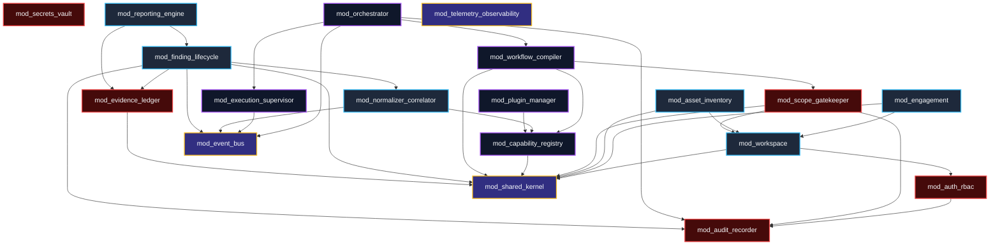

# Shadow : Helix Nebula (SHN)
## Phase 0.7: Core Module Architecture Specification

> **Authoritative Specification Notice**: This document establishes the canonical internal module architecture for Shadow : Helix Nebula (SHN). Formulated directly upon the foundational baselines of Phases 0.1 through 0.6, this specification defines the modular anatomy, structural boundaries, internal encapsulation rules, dependency graphs, interface contracts, lifecycle management, and failure domains across all internal platform modules. It is an architectural specification, not an implementation codebase, and governs the construction of subsequent domain modeling, data architecture, and software packages.

---

# 1. Module Architecture Objectives

The internal module architecture of SHN is designed to achieve eight primary engineering objectives:
1. **Strict Encapsulation**: Prevent internal implementation details, database queries, and private state machines from leaking outside module perimeters.
2. **Deterministic Dependency Topology**: Eliminate circular dependencies, ensuring that the internal module graph forms a strict Directed Acyclic Graph (DAG).
3. **Decoupled Evolvability**: Allow internal modules (e.g., Scope Engine, Workflow Compiler, Normalizer) to be refactored, upgraded, or extracted into standalone services without destabilizing sibling modules.
4. **Security & Boundary Enforcement**: Enforce principle of least privilege between modules; prevent unauthorized domain modules from bypassing governance or mutating audit streams.
5. **Universal Portability**: Maintain total separation between domain logic and underlying infrastructure abstractions, enabling single-node local execution and distributed cluster scale-out.
6. **Explicit Public Contracts**: Mandate that all inter-module collaboration occurs strictly via strongly typed Data Transfer Objects (DTOs) and formal interface contracts.
7. **Failure Containment**: Confine faults, memory leaks, and runtime errors to their module of origin, preventing cascading systemic failures.
8. **Pluggable Extensibility**: Establish rigid extension points where third-party or organizational plugins integrate without modifying core platform code.

---

# 2. Definition of an SHN Core Module

An **SHN Core Module** is a self-contained, cohesive architectural package that owns a single cohesive sub-domain, encapsulates its persistent state, enforces its business rules, and exposes a strict public boundary.

```
+---------------------------------------------------------------------------------------+
|                                ANATOMY OF AN SHN CORE MODULE                          |
+---------------------------------------------------------------------------------------+
|                                                                                       |
|   +-------------------------------------------------------------------------------+   |
|   |                           PUBLIC MODULE BOUNDARY                              |   |
|   |  - Public Service Contracts (Interfaces / Facades)                            |   |
|   |  - Immutable Data Transfer Objects (DTOs & Value Objects)                     |   |
|   |  - Strongly Typed Domain Events (Published to Event Bus)                      |   |
|   |  - Typed Fault & Error Definitions                                            |   |
|   +-------------------------------------------------------------------------------+   |
|                                          |                                            |
|                                          v (Internal Invocations Only)                |
|   +-------------------------------------------------------------------------------+   |
|   |                       INTERNAL ENCAPSULATION BOUNDARY                         |   |
|   |  - Private Domain Entities, Aggregates & Business Invariants                  |   |
|   |  - Private Command & Query Handlers                                           |   |
|   |  - Abstract Repository & Storage Ports                                        |   |
|   |  - Internal State Machines & Mutators                                         |   |
|   +-------------------------------------------------------------------------------+   |
|                                          |                                            |
|                                          v (Port Implementations)                     |
|   +-------------------------------------------------------------------------------+   |
|   |                     INFRASTRUCTURE ADAPTER BOUNDARY                           |   |
|   |  - SQL Query Builders & Relational Mappings (Private to Module)               |   |
|   |  - Cache & Ephemeral State Accessors                                          |   |
|   |  - Message Broker Publishers / Consumers                                      |   |
|   +-------------------------------------------------------------------------------+   |
|                                                                                       |
+---------------------------------------------------------------------------------------+
```

### 2.1 Core Module Invariants
- **No Shared Private State**: Modules never share relational database tables, cache keys, or memory pointers with sibling modules.
- **Contract-Only Ingress**: External callers may only interact with a module through its exported public interface contracts.
- **Explicit Lifecycle**: Every module exposes formal initialization, health verification, and graceful shutdown lifecycles.

---

# 3. Core Module Taxonomy & Classification

SHN partitions all internal platform code into four distinct module classifications based on operational criticality and architectural role:

```
+---------------------------------------------------------------------------------------+
|                           CORE MODULE TAXONOMY MATRIX                                 |
+---------------------------------------------------------------------------------------+
| 1. CORE PLATFORM MODULES              | 2. DOMAIN MODULES                             |
| - mod_orchestrator                    | - mod_workspace                               |
| - mod_capability_registry             | - mod_engagement                              |
| - mod_workflow_compiler               | - mod_asset_inventory                         |
| - mod_execution_supervisor            | - mod_finding_lifecycle                       |
| - mod_plugin_manager                  | - mod_reporting_engine                        |
+---------------------------------------+-----------------------------------------------+
| 3. SECURITY-SENSITIVE MODULES         | 4. CROSS-CUTTING & SHARED MODULES             |
| - mod_scope_gatekeeper (CRITICAL)     | - mod_telemetry_observability                 |
| - mod_auth_rbac (CRITICAL)            | - mod_event_bus                               |
| - mod_secrets_vault (CRITICAL)        | - mod_data_access_infrastructure              |
| - mod_evidence_ledger (CRITICAL)      | - mod_shared_kernel                           |
| - mod_audit_recorder (CRITICAL)       | - mod_error_catalog                           |
+---------------------------------------------------------------------------------------+
```

---

# 4. Detailed Module Catalog & Responsibilities

### 4.1 Security-Sensitive Modules (Zero-Tolerance Perimeters)

#### 4.1.1 `mod_scope_gatekeeper`
- **Architectural Role**: The mechanical gatekeeper enforcing operational boundaries (Inclusions, Exclusions, Action Whitelists, Time Windows, Rate Limits).
- **Core Invariant**: Every execution task **SHALL** be validated by `mod_scope_gatekeeper` before leaving the Control Plane. It has zero external dependencies on execution or AI layers.
- **Exported Interface**: `IScopeGatekeeper` (`ValidateTarget()`, `EvaluateAction()`, `ResolveCidr()`, `CheckActiveWindow()`).

#### 4.1.2 `mod_auth_rbac`
- **Architectural Role**: Identity verification, session lifecycle management, token signing/verification, and granular permission evaluation across organizations and workspaces.
- **Exported Interface**: `IAuthorizationService` (`AuthenticateSession()`, `EvaluatePermission()`, `RevokeToken()`, `EnforceTenantIsolation()`).

#### 4.1.3 `mod_secrets_vault`
- **Architectural Role**: Cryptographic envelope encryption (AES-256-GCM) for sensitive credentials, target authentication tokens, and API keys.
- **Exported Interface**: `ISecretsVault` (`EncryptSecret()`, `DecryptSecret()`, `RotateMasterKey()`, `ZeroizeMemory()`).

#### 4.1.4 `mod_evidence_ledger`
- **Architectural Role**: Ingestion hashing (SHA-256), immutable storage binding, and unbroken cryptographic lineage graph management.
- **Exported Interface**: `IEvidenceLedger` (`IngestArtifact()`, `VerifyArtifactIntegrity()`, `AppendProvenanceNode()`, `TraverseLineageGraph()`).

#### 4.1.5 `mod_audit_recorder`
- **Architectural Role**: Append-only operational audit logging capturing operator identity, timestamp, IP, action, target, and outcome.
- **Exported Interface**: `IAuditRecorder` (`RecordAuditEvent()`, `QueryAuditTrail()`). Denies update and delete operations.

### 4.2 Core Platform Modules

#### 4.2.1 `mod_orchestrator`
- **Architectural Role**: Manages asynchronous task scheduling, queue dispatch, distributed worker lease tracking, and task state transitions.
- **Exported Interface**: `ITaskOrchestrator` (`ScheduleTask()`, `DispatchTask()`, `CancelTask()`, `AcknowledgeHeartbeat()`).

#### 4.2.2 `mod_workflow_compiler`
- **Architectural Role**: Compiles declarative directed execution graphs, validates cyclic loop bounds, resolves context variables, and injects mandatory human approval gates.
- **Exported Interface**: `IWorkflowCompiler` (`CompileGraph()`, `ValidateGraphSyntax()`, `EvaluateNodeDependencies()`).

#### 4.2.3 `mod_capability_registry`
- **Architectural Role**: Indexes abstract security capability contracts, maps capabilities to registered providers, and handles dynamic provider resolution.
- **Exported Interface**: `ICapabilityRegistry` (`RegisterCapability()`, `ResolveProvider()`, `GetCapabilityContract()`).

#### 4.2.4 `mod_plugin_manager`
- **Architectural Role**: Verifies cryptographic plugin signatures, inspects manifests, validates SemVer compatibility, and coordinates sandboxed isolation profiles.
- **Exported Interface**: `IPluginManager` (`InstallPlugin()`, `VerifySignature()`, `GetPluginManifest()`, `RevokePlugin()`).

#### 4.2.5 `mod_execution_supervisor`
- **Architectural Role**: Worker pool lifecycle management, heartbeat timeout detection, process crash recovery, and dead-letter queue routing.
- **Exported Interface**: `IWorkerSupervisor` (`RegisterWorker()`, `MonitorHeartbeats()`, `HandleWorkerCrash()`, `EvictDeadWorkers()`).

### 4.3 Domain Modules

#### 4.3.1 `mod_workspace`
- **Architectural Role**: Manages workspace lifecycle, organizational tenancy, user memberships, and logical boundary isolation.
- **Exported Interface**: `IWorkspaceService` (`CreateWorkspace()`, `GetWorkspaceContext()`, `EnforceWorkspaceQuotas()`).

#### 4.3.2 `mod_engagement`
- **Architectural Role**: Defines time-bounded operational campaigns, Rules of Engagement (RoE), emergency stop contacts, and client agreements.
- **Exported Interface**: `IEngagementService` (`CreateEngagement()`, `LockEngagement()`, `VerifyEngagementWindow()`).

#### 4.3.3 `mod_asset_inventory`
- **Architectural Role**: Target ingestion, IP/FQDN canonicalization, asset deduplication, service mapping, and contextual tagging.
- **Exported Interface**: `IAssetInventory` (`IngestAsset()`, `LookupAsset()`, `TagAsset()`, `QueryAssetGraph()`).

#### 4.3.4 `mod_normalizer_correlator`
- **Architectural Role**: Parses raw tool outputs into canonical domain models; correlates cross-tool findings against common asset keys.
- **Exported Interface**: `INormalizerService` (`ParseRawOutput()`, `CorrelateObservations()`, `DeduplicateRecords()`).

#### 4.3.5 `mod_finding_lifecycle`
- **Architectural Role**: Manages vulnerability findings through their formal state machine (Draft $\rightarrow$ Under Review $\rightarrow$ Confirmed $\rightarrow$ Remediated), risk scoring (CVSS/CWE), and evidence bindings.
- **Exported Interface**: `IFindingService` (`CreateFinding()`, `TransitionState()`, `OverrideRiskScore()`, `BindEvidence()`).

#### 4.3.6 `mod_reporting_engine`
- **Architectural Role**: Compiles normalized findings, executive summaries, and cryptographic evidence into structured deliverables (PDF, HTML, JSON).
- **Exported Interface**: `IReportingEngine` (`RenderReport()`, `RegisterTemplate()`, `CompileDeliverable()`).

### 4.4 Cross-Cutting Modules

#### 4.4.1 `mod_telemetry_observability`
- **Architectural Role**: Structured JSON logging, OpenTelemetry distributed trace propagation, Prometheus metrics scraping, and service health/readiness probes.
- **Exported Interface**: `ITelemetryService` (`GetTracer()`, `GetMeter()`, `LogStructured()`, `RecordHealth()`).

#### 4.4.2 `mod_event_bus`
- **Architectural Role**: In-process and distributed asynchronous event publishing and subscription using strongly typed domain events.
- **Exported Interface**: `IEventBus` (`Publish()`, `Subscribe()`, `Unsubscribe()`).

#### 4.4.3 `mod_shared_kernel`
- **Architectural Role**: Common domain primitives, base value objects (UUIDs, Timestamps, NetworkCIDRs, IPAddresses), and universal validation utilities.
- **Dependencies**: Zero external dependencies; leaf node of the dependency graph.

---

# 5. Module Dependency Topology & Invariant Rules

SHN enforces strict, unidirectional dependency rules across modules. The internal module graph must form a strict Directed Acyclic Graph (DAG):



### 5.1 Strict Dependency Invariants
1. **Forbidden Upward Dependencies**: Lower-level foundational modules (e.g., `mod_shared_kernel`, `mod_scope_gatekeeper`, `mod_auth_rbac`) **SHALL NEVER** import or depend upon higher-level orchestrators, UI layers, or reporting modules.
2. **Forbidden Circular Dependencies**: Any circular import (`mod_A` $\rightarrow$ `mod_B` $\rightarrow$ `mod_A`) is an architectural violation that causes immediate build failure.
3. **Execution Worker DB Isolation**: `mod_execution_supervisor` and worker daemons **SHALL NOT** depend upon relational data access models. Communication occurs strictly via task queue DTOs and callback interfaces.
4. **Scope Gatekeeper Independence**: `mod_scope_gatekeeper` **SHALL NOT** depend on `mod_orchestrator`, `mod_workflow_compiler`, or `mod_execution_supervisor`. It evaluates pure target tokens and actions against scope rules.

---

# 6. Inter-Module Communication Model

Modules interact through two distinct communication models, selected based on transactionality and execution coupling:

```
+---------------------------------------------------------------------------------------+
|                         INTER-MODULE COMMUNICATION PATTERNS                           |
+---------------------------------------------------------------------------------------+
| 1. SYNCHRONOUS IN-PROCESS (Direct Facade Calls)                                       |
|    - Used for: Scope gatekeeping, permission checks, entity queries, graph validation.|
|    - Transport: Strongly typed interface methods returning Result<T, E> types.       |
|    - Constraint: Execution must be sub-millisecond; zero blocking I/O on external nets.|
+---------------------------------------------------------------------------------------+
| 2. ASYNCHRONOUS EVENT-DRIVEN (Domain Events & Queues)                                 |
|    - Used for: Task dispatch, live log streaming, finding creation, audit recording.  |
|    - Transport: Strongly typed domain events dispatched via `mod_event_bus`.          |
|    - Semantics: At-least-once delivery, decoupled execution, non-blocking.           |
+---------------------------------------------------------------------------------------+
```

### 6.1 Synchronous vs. Asynchronous Demarcation
- **Synchronous Call Rule**: Synchronous inter-module calls are permitted only for operations that execute within the local process boundary and complete deterministically within milliseconds (e.g., `IScopeGatekeeper.ValidateTarget(target)`).
- **Asynchronous Event Rule**: Any operation involving distributed execution, heavy parsing, report rendering, external network communication, or long-running computations **MUST** execute asynchronously via domain events or job queues.

---

# 7. Module Lifecycle, Initialization & Shutdown

Every SHN module implements a strict lifecycle contract (`IModuleLifecycle`):

```
+---------------+     Initialize()     +--------------+      Start()       +--------------+
| UNINITIALIZED | -------------------> | INITIALIZED  | -----------------> |   RUNNING    |
+---------------+                      +--------------+                    +--------------+
                                              |                                   |
                                              | (Error)                           | Stop()
                                              v                                   v
                                       +--------------+                    +--------------+
                                       |    FAULTED   |                    |   STOPPED    |
                                       +--------------+                    +--------------+
```

### 7.1 Lifecycle Phases
1. **Construction**: Instantiate module classes and inject configuration parameters. No network connections or storage I/O permitted.
2. **Initialize()**: Register service interfaces in the Dependency Injection container, compile internal schemas, verify database migrations, and establish connection pools.
3. **Start()**: Activate background worker threads, subscribe to event bus topics, and begin listening for incoming requests.
4. **Stop()**: Cease accepting new requests, pause queue consumers, flush in-flight telemetry buffers, commit audit trails, and release network sockets.
5. **Deterministic Shutdown Order**: Modules shut down in the strict reverse order of their initialization dependency graph:
   $$\text{Experience/API} \longrightarrow \text{Orchestrators} \longrightarrow \text{Domain Services} \longrightarrow \text{Security/Gatekeeper} \longrightarrow \text{Data Stores}$$

---

# 8. Error Propagation & Failure Containment

To maintain high availability and prevent cascading failures across the platform, SHN enforces formal error boundaries:

### 8.1 Typed Result Pattern
- Core module interfaces **SHALL NOT** throw raw, untyped runtime exceptions across module boundaries.
- All public interface methods return explicit, strongly typed `Result<T, ModuleError>` structures.

### 8.2 Error Classification & Fault Boundaries
- **Validation Faults**: Target syntax errors, invalid graph definitions, or malformed JSON payloads. Returned synchronously to the caller without triggering retries.
- **Security Faults**: Scope violations, permission denials, or invalid cryptographic signatures. Returned synchronously to the caller and dispatched immediately to `mod_audit_recorder`.
- **Transient Operational Faults**: Network timeouts or temporary worker disconnections. Handled via exponential backoff retries within `mod_orchestrator`.
- **Fatal Process Faults**: Worker crashes, segmentation faults, or memory exhaustion. Trapped by `mod_execution_supervisor`, logged to the audit trail, and isolated from sibling tasks.

---

# 9. Extensibility & The Plugin Boundary

### 9.1 Core Module vs. Plugin Distinction
It is an essential architectural rule that **Plugins are not Core Modules**.

| Dimension | SHN Core Module | SHN Plugin |
| :--- | :--- | :--- |
| **Trust Level** | Highly Trusted / Internal | Untrusted / Sandboxed |
| **Execution Perimeter** | Inside Control Plane Process | Ephemeral Sandboxed Process/Container |
| **Database Access** | Direct Relational Storage Access | Zero Database Access |
| **Scope Enforcement** | Enforces Scope (`mod_scope_gatekeeper`)| Subordinated to Scope Gatekeeper |
| **Lifecycle** | Statically compiled or bound at boot | Dynamically loaded, inspected, and revoked |

### 9.2 Allowed Plugin Extension Points
Plugins attach exclusively to designated extension interfaces exposed by core modules:
- `ICapabilityProvider`: Exposing a security scanning tool (wrapped by `mod_capability_registry`).
- `IRawOutputParser`: Providing custom parsing logic (consumed by `mod_normalizer_correlator`).
- `IReportTemplateRenderer`: Supplying custom document styles (consumed by `mod_reporting_engine`).
- `IIntelligenceModelConnector`: Integrating custom LLM providers (consumed by `mod_intelligence_router`).

---

# 10. Architectural Invariants Specific to Modules

The following module-specific invariants are binding on all future codebases:

1. **MOD-INV-01 (Strict Contract Compliance)**: Modules communicate exclusively through documented public interfaces and immutable DTOs; direct private class instantiation across module boundaries is prohibited.
2. **MOD-INV-02 (Zero Circular Imports)**: The module dependency graph must remain a strict DAG at all times.
3. **MOD-INV-03 (Single State Ownership)**: Each database table, entity schema, and cache namespace is owned by exactly one module; direct cross-module table mutations are prohibited.
4. **MOD-INV-04 (Mandatory Audit Trapping)**: Security-critical actions (scope modifications, task dispatch, finding state changes, user logins) must emit synchronous or transactional audit records via `mod_audit_recorder`.
5. **MOD-INV-05 (Scope Gatekeeper Primacy)**: `mod_scope_gatekeeper` must evaluate every target asset and action prior to task queue enqueueing; no module may bypass the gatekeeper.
6. **MOD-INV-06 (Execution Plane DB Isolation)**: Execution workers and tool runners must never hold direct database connection credentials.
7. **MOD-INV-07 (Human Oversight Interlock)**: `mod_workflow_compiler` must automatically inject mandatory human approval gates before invasive capability execution.
8. **MOD-INV-08 (Infrastructure Neutrality)**: Domain modules must depend upon abstract repository interfaces, not concrete SQL or cloud SDK packages.

---

# 11. Traceability to Phase 0.1–0.6 Baseline

| Module Architecture Decision | Phase 0.1 / 0.2 / 0.3 / 0.4 / 0.6 Baseline | Traceability Status |
| :--- | :--- | :--- |
| Core Module Definition & Encapsulation | Principle 1 (Modularity), `NFR-MOD-001`, Boundary 2 | **100% TRACEABLE** |
| Zero Circular Dependency DAG | Phase 0.3 (Section 6.1), `INV-09` | **100% TRACEABLE** |
| Scope Gatekeeper Isolation (`mod_scope_gatekeeper`)| Principle 8, `SCP-ENF-001`, `INV-06`, Section 4.2 | **100% TRACEABLE** |
| Capability vs Provider Separation (`mod_capability_registry`)| Principle 4, `FR-CAP-001`, `INV-03`, ADR-03 | **100% TRACEABLE** |
| Workflow Compilation & Cycles (`mod_workflow_compiler`)| Principle 5, `WF-TOP-001`, `INV-18`, ADR-05 | **100% TRACEABLE** |
| Worker Database Isolation (`mod_execution_supervisor`)| Boundary 3, `INV-14`, Section 4.3 | **100% TRACEABLE** |
| Evidence Lineage Ledger (`mod_evidence_ledger`)| Principle 6 & 7, `EVD-INT-001`, `INV-05`, ADR-14 | **100% TRACEABLE** |
| Plugin Sandboxing Boundary (`mod_plugin_manager`)| Principle 2, `PLG-SEC-002`, `INV-08`, ADR-10 | **100% TRACEABLE** |
| Full-Stack Telemetry (`mod_telemetry_observability`)| Principle 10, `OBS-TEL-001`, `INV-13`, ADR-17 | **100% TRACEABLE** |

---

# 12. Non-Goals for Phase 0.7

In strict compliance with foundational non-goals, Phase 0.7 explicitly **DOES NOT**:
1. Create concrete application code (Go, Rust, Python, TypeScript).
2. Create package manifests (`go.mod`, `Cargo.toml`, `package.json`).
3. Define SQL DDL tables or database migration files.
4. Implement concrete cryptographic hashing routines or encryption algorithms.
5. Create Dockerfiles, container configurations, or infrastructure scripts.
6. Implement concrete tool wrappers for Nmap, Burp, or Nuclei.

---

# 13. Acceptance Criteria & Phase 0.7 Verification

To establish completion of Phase 0.7, this specification must satisfy the following verification checklist:

- [x] **Module Objectives Defined**: Eight core architectural objectives codified without marketing language.
- [x] **Core Module Definition Formulated**: Precise three-tier anatomy (Public Boundary, Internal Domain, Infrastructure Adapter) established.
- [x] **Module Taxonomy Codified**: Four categories (Platform, Domain, Security-Sensitive, Cross-Cutting) classified.
- [x] **Module Catalog Detailed**: Responsibilities, invariants, and exported interfaces specified for all 18 core modules.
- [x] **Dependency Topology Formulated**: Strict DAG dependency rules, forbidden directions, and Mermaid topology diagram included.
- [x] **Communication Model Specified**: Synchronous interface calls vs. asynchronous domain event boundaries demarcated.
- [x] **Module Lifecycle Formulated**: Deterministic state transitions, startup sequences, and reverse shutdown order defined.
- [x] **Error & Failure Boundaries Defined**: Typed `Result` patterns, fault boundaries, and blast radius containment codified.
- [x] **Plugin vs. Module Boundary Established**: Strict security, database, and lifecycle distinctions codified between core code and plugins.
- [x] **Module Invariants Codified**: Eight binding module-specific invariants (`MOD-INV-01` through `MOD-INV-08`) declared.
- [x] **Full Bidirectional Traceability**: $100\%$ alignment with Phases 0.1 through 0.6; zero contradictions introduced.
- [x] **Zero Speculative Code**: No implementation code, Dockerfiles, migrations, or dependencies created.
