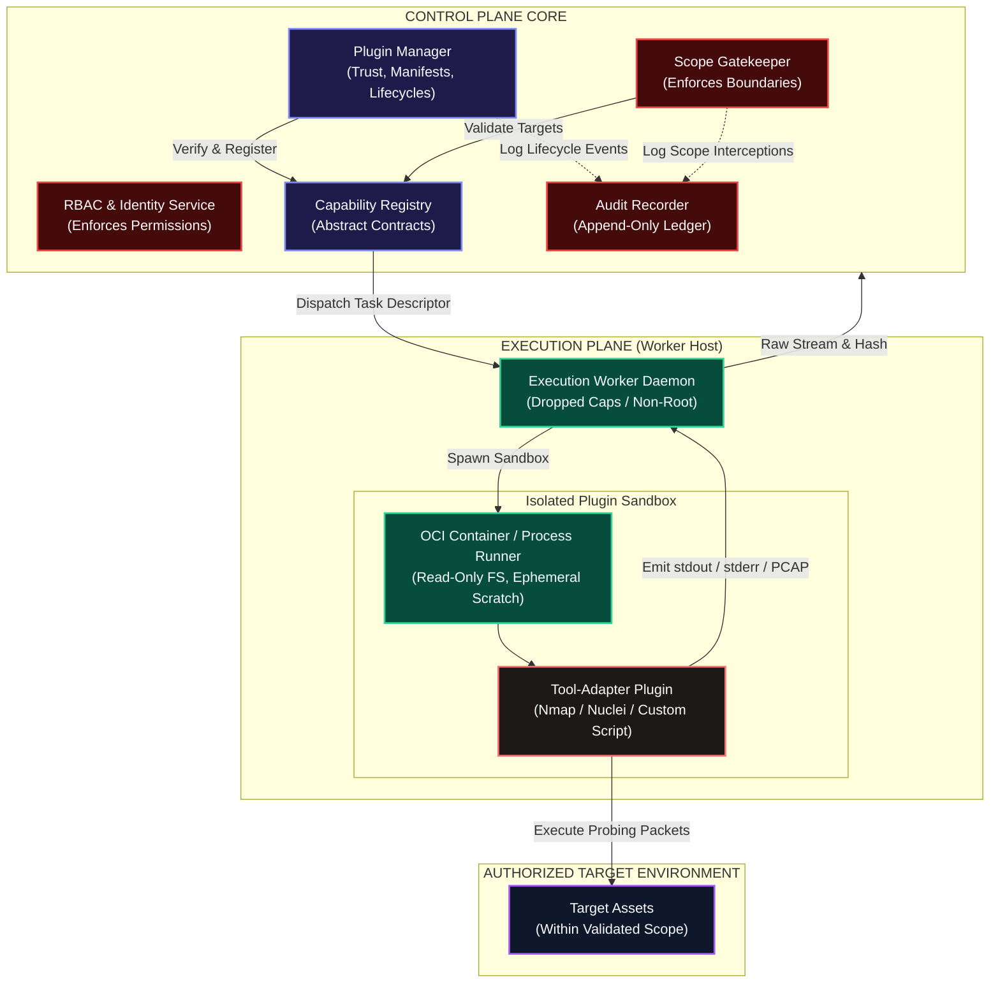
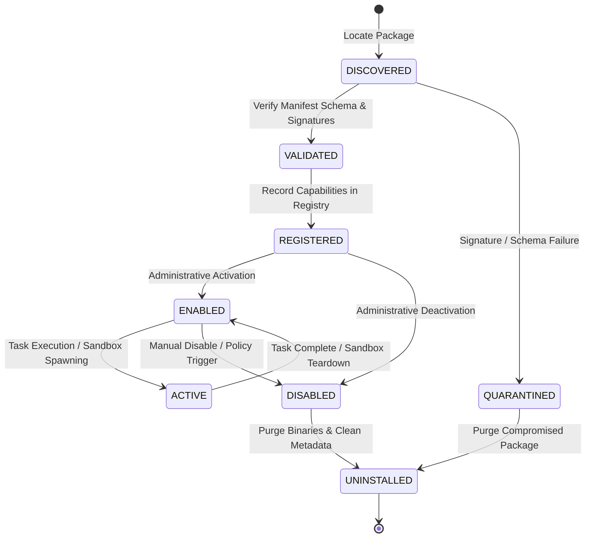
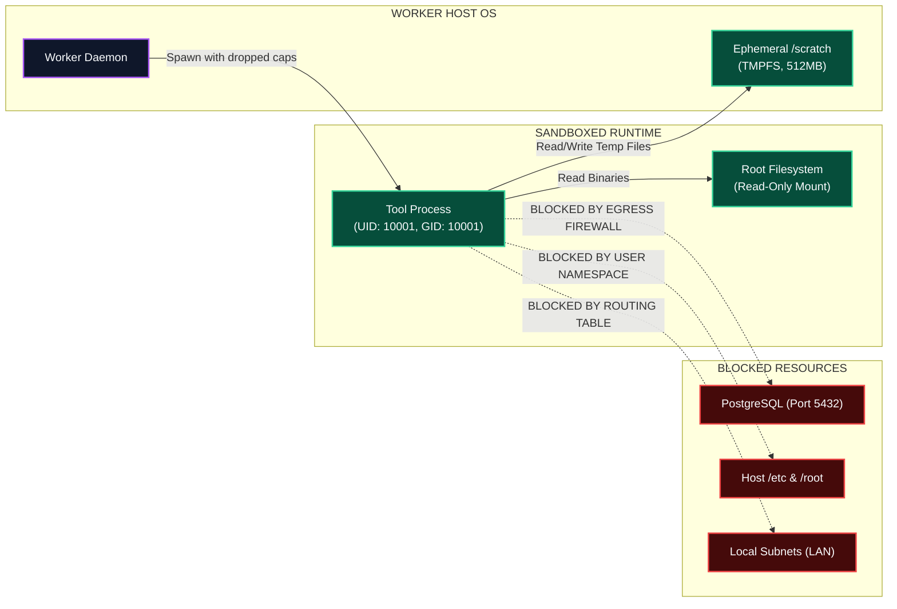

# Shadow : Helix Nebula (SHN)
## Phase 0.8: Plugin Architecture Specification

> **Authoritative Specification Notice**: This document establishes the canonical architectural model, lifecycle state machines, manifest schemas, security perimeters, sandboxed execution models, and governance boundaries for the Shadow : Helix Nebula (SHN) plugin ecosystem. Built upon the core module boundaries of Phase 0.7 and the system architecture of Phase 0.6, this specification defines how third-party tools, custom capabilities, automated workflows, intelligence models, and enterprise connectors integrate into SHN without compromising core governance, scope gatekeeping, or platform stability. This is an architectural specification, not an implementation codebase.

---

# 1. Plugin Architecture Objectives

The SHN plugin architecture is engineered to satisfy seven core architectural objectives:
1. **Core Decoupling**: Isolate tool-specific CLI arguments, proprietary parsing quirks, and vendor dependencies from the core Control Plane.
2. **Strict Governance Subordination**: Mandate that plugins operate strictly as capability providers subordinated to platform RBAC, scope enforcement, and audit recording.
3. **Zero-Trust Sandboxing**: Treat all plugin code as potentially untrusted; execute tools within hardened sandboxes with dropped OS privileges and zero direct database access.
4. **Declarative Contracts**: Enforce machine-readable manifest contracts declaring exact capability inputs, normalized outputs, resource requirements, and requested permissions.
5. **Deterministic Lineage**: Capture plugin identity, version, and execution arguments within every generated evidence artifact to maintain forensic provenance.
6. **Controlled Composition**: Enable complex workflows to compose multi-vendor capabilities without permitting direct, uncontrolled plugin-to-plugin coupling.
7. **Supply-Chain Defensibility**: Provide cryptographic signature verification, manifest validation, and administrative revocation across all installed plugins.

---

# 2. Definition of an SHN Plugin & Core Distinction

An **SHN Plugin** is an independently versioned, distributable package that provides concrete implementations of abstract security capabilities, data normalizers, workflow templates, intelligence connectors, or UI components.

### 2.1 Plugin vs. Core Module Distinction
> **Constitutional Rule**: A Plugin is an unprivileged extension; it **SHALL NEVER** replace, alter, or bypass core platform governance, authorization, or persistence models.

| Architectural Dimension | SHN Core Module (Phase 0.7) | SHN Plugin (Phase 0.8) |
| :--- | :--- | :--- |
| **Trust Level** | Highly Trusted (Constitutional) | Untrusted / Verified Extension |
| **Execution Boundary** | Inside Control Plane Process Boundary | Sandboxed Child Process / OCI Container |
| **Database Access** | Direct Relational Storage Access | **Zero Database Access** (Direct SQL Prohibited) |
| **Scope Enforcement** | Owns & Enforces Scope (`mod_scope_gatekeeper`) | Subordinated to Scope Gatekeeper Validation |
| **Identity & Access** | Evaluates RBAC Permissions | Operates under Delegated Execution Tokens |
| **State Ownership** | Authoritative System of Record | Ephemeral Scratch Space / Ingress DTOs Only |
| **Lifecycle** | Statically linked / Initialized on boot | Dynamically discovered, installed, and revoked |

---

# 3. Plugin Taxonomy & Category Matrix

SHN defines six formal plugin categories based on operational role and interface boundary:

```
+---------------------------------------------------------------------------------------+
|                              SHN PLUGIN CATEGORY MATRIX                               |
+---------------------------------------------------------------------------------------+
| CATEGORY               | PRIMARY FUNCTION                   | INTERFACE CONTRACT      |
+------------------------+------------------------------------+-------------------------+
| 1. Tool-Adapter        | Wraps CLI binaries / scanners      | `ICapabilityProvider`   |
| 2. Normalizer/Parser   | Parses raw tool outputs to schemas | `IRawOutputParser`      |
| 3. Workflow Template   | Pre-packaged execution graphs      | `IWorkflowTemplate`     |
| 4. Intelligence/AI     | Interfaces with external/local LLMs| `IModelConnector`       |
| 5. Integration/SIEM    | Connectors for Jira, Splunk, SOAR  | `IEnterpriseConnector`  |
| 6. UI / Visualization  | Custom dashboard panels & widgets  | `IExperienceWidget`     |
+---------------------------------------------------------------------------------------+
```

### 3.1 Detailed Category Responsibilities
1. **Tool-Adapter Plugins**: Translate abstract capability parameters into concrete tool invocations (e.g., mapping `capability:network.port-scan` to Nmap, Masscan, or RustScan).
2. **Normalizer / Parser Plugins**: Consume raw stdout/stderr/XML/JSON output from specific tools and transform them into canonical domain entities (Assets, Services, Findings).
3. **Workflow Template Plugins**: Distribute codifications of industry methodologies (e.g., OWASP WSTG, PTES External Reconnaissance) as declarative directed graphs.
4. **Intelligence / AI Plugins**: Provide advisory cognitive acceleration (summarization, triage assistance) while remaining strictly isolated from direct execution.
5. **Integration / Connector Plugins**: Export normalized findings and alerts to enterprise platforms (Jira, ServiceNow, DefectDojo, Splunk).
6. **UI / Experience Plugins**: Register custom visualization charts, graph layouts, or finding inspection panels within the Experience Layer.

---

# 4. Plugin Ecosystem Conceptual Architecture



---

# 5. Plugin Lifecycle Architecture

The lifecycle of an SHN plugin is managed deterministically through nine distinct states:



### 5.1 Lifecycle Phase Descriptions
1. **DISCOVERED**: The plugin bundle is detected in the local repository or staging directory.
2. **VALIDATED**: The manifest schema is parsed, SemVer compatibility is evaluated, and cryptographic signatures are checked against trusted public keys.
3. **QUARANTINED**: Any bundle with an invalid signature, corrupted archive, or forbidden capability request is immediately locked and barred from execution.
4. **REGISTERED**: The plugin metadata and capability declarations are indexed in the `mod_capability_registry`.
5. **ENABLED**: The workspace administrator authorizes the plugin for operational use.
6. **ACTIVE**: An execution worker instantiates an ephemeral sandbox and executes the plugin against an authorized target.
7. **DISABLED**: The plugin is administratively deactivated; active tasks finish or abort, and no new tasks can be scheduled.
8. **UPGRADED**: A newer semantic version is validated; capabilities are atomically pointed to the updated provider.
9. **UNINSTALLED**: Plugin archives are purged from disk; historical provenance records remain preserved in the audit ledger.

---

# 6. Plugin Identity, Manifest & Metadata Contract

Every SHN plugin is defined by an immutable, machine-readable manifest (`plugin.yaml` or `plugin.json`):

```yaml
# Canonical SHN Plugin Manifest Specification (Conceptual Schema)
plugin_id: "shn.plugins.discovery.nmap"
name: "Nmap Network Discovery Provider"
version: "1.4.2"
author: "SHN Security Engineering Team"
license: "Apache-2.0"
signature: "ed25519:3a8f9c1b7e..."

compatibility:
  platform_min: "0.8.0"
  platform_max: "1.x.x"

capabilities_provided:
  - capability_id: "shn://capabilities/network/port-scan"
    version: "2.1.0"
    role: "primary_provider"
    risk_rating: "active_probing"

execution:
  runtime_type: "oci_container"
  image: "shn-plugins/nmap:7.94"
  entrypoint: ["/usr/bin/nmap"]
  resource_limits:
    max_memory_mb: 1024
    max_cpu_cores: 2.0
    timeout_seconds: 3600

permissions_requested:
  network_access: "target_scope_only"
  raw_sockets: true
  filesystem_scratch_mb: 512
  host_filesystem_access: "none"
```

---

# 7. Plugin Trust Model & Supply-Chain Security

SHN enforces a strict **Three-Tier Trust Model** to manage supply-chain risk:

```
+---------------------------------------------------------------------------------------+
|                              THREE-TIER PLUGIN TRUST MODEL                            |
+---------------------------------------------------------------------------------------+
| TRUST LEVEL          | SIGNATURE REQUIREMENT           | EXECUTION PERMISSIONS        |
+----------------------+---------------------------------+------------------------------+
| TIER 1: Core / Native| Signed by Official SHN Root Key | Local Process or Container;  |
|                      |                                 | Standard Capability Grants.  |
+----------------------+---------------------------------+------------------------------+
| TIER 2: Verified Org | Signed by Verified Enterprise Key| OCI Container Sandbox;       |
|                      |                                 | Target Network Access Only.  |
+----------------------+---------------------------------+------------------------------+
| TIER 3: Community    | Signed by Public Developer Key  | Hardened MicroVM / Sandbox;  |
| (Untrusted)          | or Explicit Admin Override      | Strict CPU/Memory Ceilings.  |
+---------------------------------------------------------------------------------------+
```

### 7.1 Cryptographic Verification Invariant
Before any plugin is transitioned from `DISCOVERED` to `VALIDATED`:
1. The manifest signature block is evaluated using Ed25519 / RSA-4096 public keys.
2. The key fingerprint is cross-referenced against the platform's trusted key store and Certificate Revocation List (CRL).
3. Unsigned or invalidly signed plugins are immediately rejected and flagged as `QUARANTINED`.

---

# 8. Plugin Execution, Isolation & Sandboxing

> **Fundamental Invariant**: Plugins execute inside unprivileged, ephemeral sandboxes. Plugins **SHALL NOT** run as root and **SHALL NOT** communicate directly with the primary database.



### 8.1 Sandbox Constraints
- **Unprivileged User**: All processes run under a dedicated non-root UID/GID (`10001:10001`).
- **Capability Dropping**: Mandatory drop of all Linux capabilities (`CAP_SYS_ADMIN`, `CAP_SYS_PTRACE`, `CAP_DAC_OVERRIDE` disabled). Raw packet scanners receive only `CAP_NET_RAW`.
- **Filesystem Isolation**: Root filesystem is mounted read-only (`ro`). Ephemeral writes are restricted to an isolated `tmpfs` scratch mount with strict storage quotas.
- **Network Egress Confinement**: Egress traffic is constrained strictly to resolved target IP addresses; loopback access to Control Plane database ports (`5432`, `6379`) is blocked via network namespace firewall rules.

---

# 9. Plugin-to-Core & Inter-Plugin Communication

### 9.1 The Mediated Ingress/Egress Rule
- **No Direct Core Invocations**: Plugins do not call Control Plane APIs directly. Communication occurs exclusively via standard POSIX streams (stdin, stdout, stderr), environment variables, and task descriptor files injected by the worker daemon.
- **No Direct Plugin-to-Plugin Coupling**: Plugin $A$ **SHALL NEVER** directly import, execute, or invoke Plugin $B$. All inter-tool collaboration is orchestrated by the Control Plane using abstract capability graphs.

```
[Plugin A: Nmap] 
      | (Emits Raw Output)
      v
[Worker Daemon] ---> [Evidence Vault & Normalizer] ---> [Canonical Port Entity]
                                                                |
                                    +---------------------------+
                                    v
                            [Workflow Compiler]
                                    |
                                    v
                    [Task Descriptor: Discovered Endpoints]
                                    |
                                    v
                    [Worker Daemon] ---> [Plugin B: Nuclei]
```

---

# 10. AI & Intelligence Plugin Guardrails

Intelligence plugins provide cognitive acceleration (summarization, anomaly detection, report drafting), but operate under strict architectural containment:
1. **Advisory Authority Only**: Intelligence plugins emit `AdvisoryRecommendations`, never executable tasks.
2. **Zero Direct Network Probing**: Intelligence plugins are barred from generating raw network probing packets.
3. **Mandatory Scope & Policy Gate**: Any recommendation emitted by an AI plugin targeting an asset must pass through `mod_scope_gatekeeper` and require explicit human operator approval before execution.

---

# 11. Architectural Invariants Specific to Plugins

The following ten invariants are binding on all plugin architecture:

1. **PLG-INV-01 (Governance Subordination)**: Plugins are unprivileged extensions subordinated to the Control Plane; no plugin may bypass authentication, RBAC, scope validation, or audit logging.
2. **PLG-INV-02 (Zero Direct DB Access)**: Plugins and their underlying tools **SHALL NEVER** hold database credentials or establish direct SQL connections.
3. **PLG-INV-03 (Mandatory Cryptographic Verification)**: Plugins must have their digital signatures verified prior to installation and registration in production environments.
4. **PLG-INV-04 (Abstract Capability Primacy)**: Plugins implement abstract capability contracts; workflows consume capabilities, not concrete plugin packages.
5. **PLG-INV-05 (Sandboxed Least Privilege Execution)**: Plugins execute within dropped-privilege namespaces with read-only root filesystems and bounded scratch space.
6. **PLG-INV-06 (No Direct Plugin-to-Plugin Coupling)**: Plugins must not depend directly on sibling plugins; all data interchange is mediated by the Control Plane.
7. **PLG-INV-07 (Deterministic Lineage Capture)**: Execution tasks must record the exact `plugin_id` and `version` in the provenance ledger for every generated artifact.
8. **PLG-INV-08 (Non-Autonomous AI Containment)**: Intelligence plugins possess zero execution authority and require human-in-the-loop approval for all operational suggestions.
9. **PLG-INV-09 (Scope Gatekeeper Primacy)**: Tasks dispatched to tool plugins must be validated by `mod_scope_gatekeeper` prior to execution.
10. **PLG-INV-10 (Failure Blast Radius Containment)**: A crashing or timed-out plugin must be isolated by the worker daemon without destabilizing sibling tasks or the Control Plane.

---

# 12. Architectural Decision Register (ADRs for Plugins)

| ADR ID | Decision | Rationale | Consequences & Trade-Offs | Status |
| :--- | :--- | :--- | :--- | :--- |
| **ADR-PLG-01** | **Declarative Manifest Contracts** | Eliminates custom initialization code; allows platform to validate permissions and compatibility statically. | Manifests must be strictly versioned and validated. | **FOUNDATIONAL** |
| **ADR-PLG-02** | **OCI Containers as Primary Sandbox Runtime** | OCI images package complex tool dependencies cleanly and provide standard kernel namespace isolation. | Requires container engine availability on worker hosts. | **DIRECTIONAL** |
| **ADR-PLG-03** | **Ed25519 Cryptographic Signatures** | High-performance, modern asymmetric signatures defend against supply-chain tampering. | Requires PKI key distribution and signing tooling. | **FOUNDATIONAL** |
| **ADR-PLG-04** | **Prohibition of Direct Plugin-to-Plugin IPC** | Prevents spaghetti dependencies and uncontrolled cascading failures between third-party extensions. | All data passing must flow through normalized Control Plane schemas. | **FOUNDATIONAL** |
| **ADR-PLG-05** | **POSIX Stream Normalization Boundary** | Tools emit stdout/stderr; dedicated parser plugins normalize data into canonical domain entities. | Decouples binary execution from data parsing logic. | **FOUNDATIONAL** |

---

# 13. Traceability to Phase 0.1–0.7 Baselines

| Plugin Architecture Decision | Baseline Traceability Reference | Status |
| :--- | :--- | :--- |
| Plugin vs Core Module Distinction | Phase 0.1 (Section 13), Phase 0.7 (Section 9) | **100% TRACEABLE** |
| Capability-First Provider Resolution | Phase 0.1 (Section 12), `FR-CAP-001`, `INV-03` | **100% TRACEABLE** |
| Manifest Schema & SemVer Compatibility | Phase 0.2 (`PLG-MAN-001`, `PLG-MAN-002`) | **100% TRACEABLE** |
| Cryptographic Signing & Sandboxed Execution | Phase 0.2 (`PLG-SEC-001`, `PLG-SEC-002`), `INV-08` | **100% TRACEABLE** |
| Scope Gatekeeper Subordination | Phase 0.1 (Section 18), `SCP-ENF-001`, `INV-06` | **100% TRACEABLE** |
| Provenance Lineage Recording | Phase 0.1 (Section 20), `EVD-PRV-001`, `INV-05` | **100% TRACEABLE** |
| Non-Autonomous AI Containment | Phase 0.1 (Section 11), `AIC-GUA-001`, `INV-07` | **100% TRACEABLE** |

---

# 14. Explicit Phase 0.8 Non-Goals

In strict accordance with foundational non-goals, Phase 0.8 explicitly **DOES NOT**:
1. Implement a concrete plugin loader or runtime engine (Python, Go, Node.js).
2. Create concrete plugin packages (e.g., actual Nmap, Burp, or Nuclei wrappers).
3. Create container registries, Helm charts, or Dockerfiles for plugins.
4. Implement public web marketplaces or billing engines for third-party plugins.
5. Implement concrete cryptographic key management infrastructure or HSM connectors.

---

# 15. Acceptance Criteria & Phase 0.8 Verification

To establish completion of Phase 0.8, this specification must satisfy the following verification checklist:

- [x] **Plugin Objectives Codified**: Seven architectural objectives established without marketing language.
- [x] **Core vs. Plugin Distinction Defined**: Comprehensive comparison table contrasting privilege, database access, and governance.
- [x] **Category Matrix Established**: Six plugin categories defined with formal interface contracts.
- [x] **Ecosystem Diagram Included**: Mermaid diagram illustrating Control Plane, Worker, Sandbox, and Target boundaries.
- [x] **Lifecycle State Machine Formulated**: Complete nine-state lifecycle with state transitions and quarantine triggers.
- [x] **Manifest Schema Specified**: Canonical declarative schema covering identity, capabilities, execution, and permissions.
- [x] **Trust Model Codified**: Three-tier trust model defined with cryptographic signature requirements.
- [x] **Sandboxing Architecture Formulated**: Dropped capabilities, read-only filesystems, and network egress rules detailed.
- [x] **Communication Model Restricted**: Mediated ingress/egress enforced; direct plugin-to-plugin coupling prohibited.
- [x] **Plugin Invariants Formulated**: Ten binding invariants (`PLG-INV-01` through `PLG-INV-10`) declared.
- [x] **Formal ADRs Documented**: Five architectural decisions (`ADR-PLG-01` through `ADR-PLG-05`) recorded.
- [x] **Traceability Verified**: $100\%$ continuity with Phases 0.1 through 0.7; zero contradictions introduced.
- [x] **Zero Speculative Code**: No implementation code, Dockerfiles, package manifests, or migrations created.
