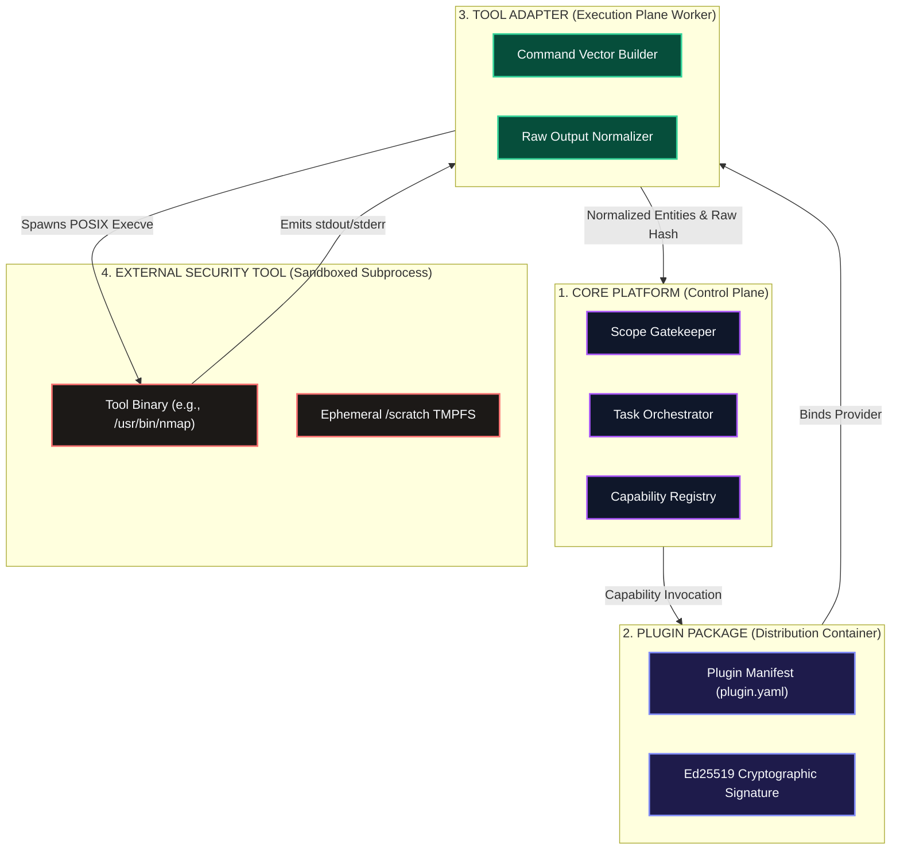
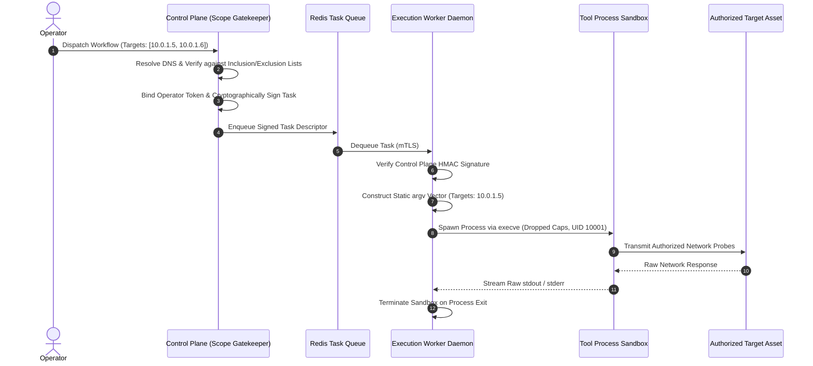
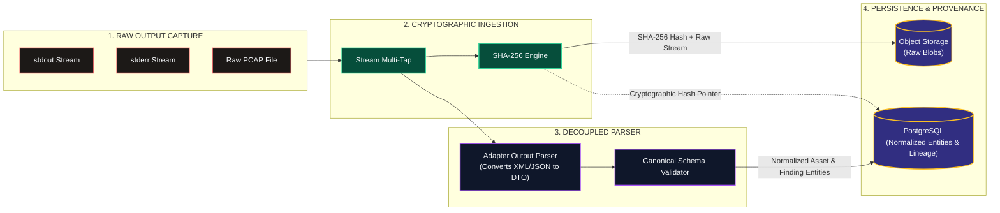
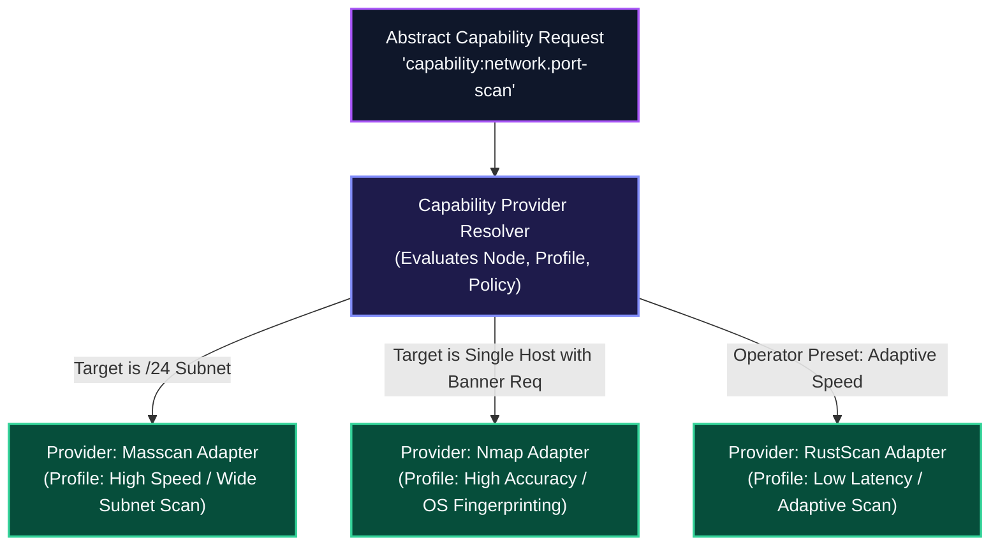

# Shadow : Helix Nebula (SHN)
## Phase 0.9: Tool Integration Architecture Specification

> **Authoritative Specification Notice**: This document establishes the canonical architectural model by which Shadow : Helix Nebula (SHN) integrates external security tools, command-line utilities, vulnerability scanners, network analyzers, reconnaissance frameworks, and custom scripts. Integrating the high-level architecture of Phase 0.6, the core module boundaries of Phase 0.7, and the plugin ecosystem of Phase 0.8, this specification defines how heterogeneous security software is adapted, scoped, invoked, isolated, normalized, and bound to cryptographic evidence without coupling the core platform to individual tool implementations or weakening governance perimeters. This is an architectural specification, not an implementation codebase.

---

# 1. Tool Integration Objectives & Architecture

The SHN Tool Integration Architecture fulfills eight foundational engineering objectives:
1. **Tool-Agnostic Abstraction**: Prevent core domain logic, workflow graphs, and relational schemas from binding to specific CLI binaries, flags, or syntax quirks.
2. **Defensive Command Construction**: Eliminate arbitrary command injection, shell escaping vulnerabilities, and parameter pollution through structured, typed argument vectors.
3. **Strict Scope & Policy Invariant**: Ensure that no tool execution can ever target an unverified, out-of-scope, or excluded asset, preventing unauthorized network probing.
4. **Forensic Output Preservation**: Capture 100% of raw unmodified stdout, stderr, process exit codes, and network packet dumps before any normalization occurs.
5. **Decoupled Normalization**: Parse vendor-specific formats (XML, JSON, plaintext) into unified domain schemas strictly at explicit adapter boundaries.
6. **Execution Sandboxing & Privilege Drop**: Confine tool subprocesses to unprivileged system accounts (`UID 10001`), read-only root filesystems, and dropped OS capabilities.
7. **Predictable Fault Containment**: Isolate crashing tools, segmentation faults, network tarpits, and memory leaks from destabilizing worker nodes or the Control Plane.
8. **Multi-Provider Interchangeability**: Enable transparent substitution of tool providers (e.g., Nmap vs. Masscan vs. RustScan) fulfilling the same abstract capability contract.

---

# 2. Structural Relationships: Core vs. Plugin vs. Tool Adapter vs. Tool

To prevent confusion between architectural layers, SHN defines a strict four-tier hierarchy:

```
+---------------------------------------------------------------------------------------+
|                    STRUCTURAL HIERARCHY: CORE TO EXTERNAL TOOL                        |
+---------------------------------------------------------------------------------------+
| LAYER                    | RESPONSIBILITY                     | TRUST LEVEL           |
+--------------------------+------------------------------------+-----------------------+
| 1. Core Platform         | Governance, Scope, State, Dispatch | Highly Trusted        |
| 2. Plugin Package        | Distribution, Manifests, Sandboxes | Verified Extension    |
| 3. Tool Adapter          | Command Translation, Output Parse  | Sandboxed Adapter     |
| 4. External Tool Binary  | Concrete Network Probing & Exec    | Untrusted Subprocess  |
+---------------------------------------------------------------------------------------+
```



---

# 3. Canonical Tool Integration Architecture

The following diagram illustrates the complete end-to-end integration architecture spanning Control Plane validation, Worker dispatch, Sandboxed process execution, and Evidence capture:

```mermaid
flowchart TD
    %% Styling
    classDef ctrlStyle fill:#0f172a,stroke:#a855f7,stroke-width:2px,color:#f8fafc;
    classDef gateStyle fill:#450a0a,stroke:#ef4444,stroke-width:2px,color:#f8fafc;
    classDef workStyle fill:#064e3b,stroke:#34d399,stroke-width:2px,color:#f8fafc;
    classDef procStyle fill:#1c1917,stroke:#f87171,stroke-width:2px,color:#f8fafc;
    classDef dataStyle fill:#312e81,stroke:#fbbf24,stroke-width:2px,color:#f8fafc;

    subgraph CONTROL_PLANE["CONTROL PLANE (Governance Perimeter)"]
        TASK_DEF["Abstract Task Request\n(Capability URI + Targets)"]:::ctrlStyle
        SCOPE_GATE["Mechanical Scope Gatekeeper\n(Validates IP/CIDR/Action)"]:::gateStyle
        TASK_SIGNER["Task Token Signer\n(Generates HMAC Execution Token)"]:::ctrlStyle
    end

    subgraph EVENT_QUEUE["TASK DISPATCH QUEUE"]
        QUEUE["Redis Task Queue (mTLS)"]:::dataStyle
    end

    subgraph WORKER_HOST["EXECUTION WORKER (Isolated Node)"]
        WORKER_DAEMON["Execution Worker Daemon\n(Unprivileged, UID 10001)"]:::workStyle
        CMD_BUILDER["Structured Command Vector Builder\n(Zero Shell Interpolation)"]:::workStyle
        
        subgraph SANDBOX_RUNTIME["OCI Container / Linux cgroup Sandbox"]
            SUBPROCESS["Tool Process\n(execve, dropped caps, ro root)"]:::procStyle
            TMPFS["Isolated /scratch (tmpfs)"]:::workStyle
        end
        
        STREAM_TAP["I/O Stream Tap\n(Splits stdout/stderr to disk & bus)"]:::workStyle
        HASH_ENGINE["SHA-256 Ingestion Engine"]:::workStyle
        NORMALIZER["Adapter Output Parser"]:::workStyle
    end

    subgraph PERSISTENCE["DATA PLANE PERSISTENCE"]
        S3_VAULT[("Object Storage: Artifact Vault\n(Raw Outputs, PCAPs, Logs)")]:::dataStyle
        PG_SQL[("PostgreSQL: System of Record\n(Normalized Entities, Hashes, Findings)")]:::dataStyle
    end

    %% Execution Flow
    TASK_DEF --> SCOPE_GATE
    SCOPE_GATE -->|Validated Targets Only| TASK_SIGNER
    TASK_SIGNER -->|Signed Task Descriptor| QUEUE
    QUEUE -->|Poll Task (mTLS)| WORKER_DAEMON
    
    WORKER_DAEMON --> CMD_BUILDER
    CMD_BUILDER -->|Arg Array [argv]| SUBPROCESS
    
    SUBPROCESS -->|stdout / stderr stream| STREAM_TAP
    STREAM_TAP --> HASH_ENGINE
    STREAM_TAP --> NORMALIZER
    
    HASH_ENGINE -->|Store Raw Blob + Hash| S3_VAULT
    NORMALIZER -->|Emit Normalized Findings| PG_SQL
    HASH_ENGINE -->|Record Provenance Link| PG_SQL
```

---

# 4. The Conceptual Tool Execution Pipeline

Every tool execution within SHN traverses a mandatory, deterministic 14-stage pipeline:

```
[01] Tool Definition Ingestion (Manifest registration in Capability Registry)
  --> [02] Discovery & Availability Check (Binary presence, version verification, health probe)
  --> [03] Capability Binding (Resolving abstract capability URI to active provider adapter)
  --> [04] Scope Validation (Gatekeeper checks IP/CIDR/FQDN and rules of engagement)
  --> [05] Authorization Context Binding (Signing task token with operator ID & workspace ID)
  --> [06] Invocation Vector Preparation (Building argv array; sanitizing environment variables)
  --> [07] Sandbox Initialization (Spawning container/process namespace, dropping capabilities)
  --> [08] Process Spawning via execve (Zero shell invocation; strict timeout ceiling armed)
  --> [09] Real-Time Stream Tapping (Emitting live chunks to Pub/Sub; capturing raw disk stream)
  --> [10] Process Termination & Exit Code Capture (Harvesting exit status, resource metrics)
  --> [11] Cryptographic Ingestion Hashing (Immediate SHA-256 computation over raw stdout/stderr)
  --> [12] Raw Evidence Vaulting (Streaming raw artifacts to S3-compatible object storage)
  --> [13] Schema Normalization (Parsing tool outputs into canonical SHN domain entities)
  --> [14] Provenance Ledger Recording (Appending tool version, argv, and hashes to PostgreSQL)
```

---

# 5. Command Construction, Invocation & Process Lifecycle

### 5.1 Command Vector Abstraction (Eliminating Shell Injections)
> **Constitutional Invariant**: Tool execution **SHALL NEVER** invoke a system shell (`/bin/sh`, `/bin/bash`, `cmd.exe`, `powershell.exe`) to interpret command strings. All tool invocations must execute via direct `execve(2)` system calls using structured, typed argument vectors (`argv[]`).

```
FORBIDDEN (Vulnerable to Command Injection):
system("/usr/bin/nmap -sV -p " + user_port_input + " " + target_ip);

MANDATORY SHN ARCHITECTURAL PATTERN:
execve("/usr/bin/nmap", [
    "-sV",
    "-p", SanitizedPortString(target.ports),
    "-oX", "-",
    ValidatedTargetIpString(target.ip)
], sanitized_env_vector);
```

### 5.2 Environment & Working Directory Isolation
- **Environment Scrubbing**: Tool processes execute with a completely sanitized environment vector (`envp[]`). Host variables (`PATH`, `USER`, `HOME`, `AWS_SECRET_ACCESS_KEY`, `DATABASE_URL`) are stripped.
- **Injected Variables**: Only explicit, safe configuration values declared in the plugin manifest (e.g., `LC_ALL=C`, `SCAN_TIMEOUT=300`) are injected.
- **Dedicated Working Directory**: Each tool execution is assigned a newly created, isolated temporary directory (`/scratch/{job_id}/`) mounted on a non-executable `tmpfs` volume with strict storage quotas (default $\le 512\text{ MB}$).

### 5.3 Process Lifecycle & Signal Handling
- **Process Group Isolation**: Every spawned tool process is assigned its own process group (`setpgid(2)`), preventing orphaned background subprocesses.
- **Timeout Ceilings**: Workers enforce a strict deadline timer. When expired:
  1. Worker sends `SIGTERM` to the entire process group.
  2. Worker allows a graceful termination grace period (default 5 seconds).
  3. Worker issues `SIGKILL` to forcefully terminate lingering child processes.
  4. Task is marked as `FAILED_TIMEOUT` and logged to the audit ledger.

---

# 6. Authorization & Scope Propagation into Tool Execution



### 6.1 Scope Immobility Rule
A tool adapter **SHALL NOT** expand, modify, or pivot the target scope received from the Control Plane. If a tool discovers auxiliary IP addresses, domain names, or endpoints during execution:
1. The tool adapter cannot probe the newly discovered assets automatically.
2. Discovered assets are emitted strictly as `DiscoveredCandidateAssets` to the Control Plane.
3. The Control Plane evaluates candidates against the active scope policy before scheduling any downstream tasks.

---

# 7. Tool Output, Normalization & Evidence Vaulting Pipeline



### 7.1 Evidentiary Invariants
- **Unmodified Capture**: Raw tool output streams are stored exactly as emitted by the binary, preserving all whitespace, encoding anomalies, and error banners.
- **Dual Destination**: Outputs are tapped simultaneously to the cryptographic hashing engine and the normalization parser; normalization errors can never prevent the raw evidence from being vaulted.
- **Forensic Hash Linkage**: In PostgreSQL, every finding entity contains a mandatory `raw_evidence_sha256` foreign reference linking directly to the immutable object storage blob.

---

# 8. Tool Security, Sandboxing & Supply-Chain Defense

SHN implements active architectural defenses against thirteen specific operational security risks:

| Security Threat / Risk | Architectural Defense Mechanism | Enforcing Component |
| :--- | :--- | :--- |
| **Command Injection** | Mandatory `execve(argv[])` parameter vectoring; zero system shell invocation. | `CMD_BUILDER`, Worker Daemon |
| **Scope Expansion / Pivoting**| Tools receive fixed targets; discovered assets must be reported to Control Plane for scope check. | `mod_scope_gatekeeper` |
| **Accidental Out-of-Scope Scan**| Pre-dispatch mechanical gatekeeper blocking excluded IPs and private cloud metadata endpoints. | `mod_scope_gatekeeper` |
| **Silent Loss of Raw Evidence**| Cryptographic SHA-256 hashing on ingestion; dual-stream tap directly to Object Storage. | `HASH_ENGINE`, Evidence Vault |
| **Privilege Escalation via Tool**| Worker daemon and child tools run under non-root UID (`10001`); all Linux caps dropped. | OCI Container / Sandbox |
| **Authorization Bypass** | Task descriptors must carry valid HMAC signatures issued by the Control Plane. | Task Token Verifier |
| **Untrusted Output Injection** | Tool outputs are parsed via strict schemas into typed DTOs; unvalidated strings rejected. | `NORMALIZER`, Schema Validator |
| **Compromised Tool Binaries** | Cryptographic verification of container/binary hashes against trusted manifests. | `mod_plugin_manager` |
| **Indefinite Tool Execution** | Process group deadline timers enforcing hard `SIGTERM` $\rightarrow$ `SIGKILL` termination. | Worker Supervisor Daemon |
| **Resource Exhaustion (DoS)** | Hard cgroup limits on memory (e.g., 1GB) and CPU cores (e.g., 2.0); tmpfs size limits. | Linux cgroups / OCI Runtime |
| **Cross-Tool Contamination** | Isolated ephemeral scratch directories per job; destroyed immediately upon process exit. | Worker Daemon Scratch Pool |
| **Secret Leakage in CLI Args** | Credentials injected via memory-mapped pipes or stdin; credentials never passed in `argv`. | Command Vector Builder |
| **Network Egress Escape** | Container network namespace firewall rules blocking LAN and database ports. | Network Sandbox Manager |

---

# 9. Multi-Provider Capability Resolution & Tool Selection

SHN allows multiple tool adapters to implement the same abstract capability (e.g., `capability:network.port-scan` implemented by Nmap, Masscan, and RustScan):



### 9.1 Selection Heuristics
1. **Operator / Workflow Explicit Selection**: The workflow graph specifies the preferred provider ID directly.
2. **Environmental Availability**: The resolver selects the provider whose binary is verified and available on the target worker node.
3. **Target Density Heuristic**: Wide CIDRs (/16, /24) route to high-speed stateless scanners (Masscan); single IP deep audits route to stateful scanners (Nmap).
4. **Consensus Validation Mode**: High-assurance workflows invoke two providers in parallel and compare normalized outputs, flagging discrepancies for operator review.

---

# 10. Architectural Invariants Specific to Tool Integration

The following ten invariants are binding on all tool integration architecture:

1. **TOOL-INV-01 (Zero Shell Invocation)**: Tools **SHALL ALWAYS** be executed via direct `execve` using structured argument arrays; system shells (`sh`, `bash`, `cmd`, `powershell`) are strictly prohibited.
2. **TOOL-INV-02 (Scope Immutability)**: A tool **SHALL NEVER** probe assets beyond the targets explicitly passed in its task descriptor. Discovered assets must be returned to the Control Plane for scope verification.
3. **TOOL-INV-03 (Raw Output Preservation)**: 100% of stdout and stderr must be captured and vaulted with an immediate cryptographic SHA-256 hash prior to or concurrently with normalization.
4. **TOOL-INV-04 (Zero Direct DB Access)**: Tool processes, adapters, and worker scripts **SHALL NEVER** hold database credentials or connect to PostgreSQL directly.
5. **TOOL-INV-05 (Unprivileged Sandboxed Execution)**: Tool binaries **SHALL** execute under non-root system accounts with dropped Linux capabilities and isolated ephemeral filesystems.
6. **TOOL-INV-06 (Mandatory Timeout Ceilings)**: Every tool invocation **SHALL** enforce an immutable execution timeout ceiling backed by process-group `SIGKILL` termination.
7. **TOOL-INV-07 (Secrets Redaction in Arguments)**: Target credentials and API tokens **SHALL NOT** be passed in plaintext command-line arguments (`argv`); they must be passed via secure stdin or ephemeral pipes.
8. **TOOL-INV-08 (Decoupled Normalization)**: Tool output parsing must reside in decoupled parser adapters; failure of a parser must never discard or corrupt vaulted raw evidence.
9. **TOOL-INV-09 (Process Group Containment)**: Tools must spawn inside dedicated process groups or container namespaces; orphaned background processes are strictly prohibited.
10. **TOOL-INV-10 (Deterministic Error Veracity)**: Non-zero exit codes, segmentation faults, and stderr output must be captured, typed, and recorded in the audit trail without being silently suppressed.

---

# 11. Architectural Decision Register (ADRs for Tool Integration)

| ADR ID | Decision | Rationale | Consequences & Trade-Offs | Status |
| :--- | :--- | :--- | :--- | :--- |
| **ADR-TOOL-01** | **Direct `execve` Parameter Vectoring** | Completely eliminates shell injection vulnerabilities and parameter escaping exploits. | Cannot use shell builtins or shell redirection operators (`>`, `\|`). | **FOUNDATIONAL** |
| **ADR-TOOL-02** | **Multi-Tap Stream Ingestion Engine** | Concurrently vaults raw bytes to object storage and pipes streams to parsers and live telemetry. | Requires in-memory buffer management and dual I/O pipelines. | **FOUNDATIONAL** |
| **ADR-TOOL-03** | **Process Group Timeout Enforcement (`SIGTERM` $\rightarrow$ `SIGKILL`)** | Prevents zombie subprocesses, hanging network sockets, and worker starvation. | Requires OS-level process group management (`setpgid`). | **FOUNDATIONAL** |
| **ADR-TOOL-04** | **Credential Delivery via Stdin / Pipes** | Prevents credential exposure in OS process tables (`ps aux`, `/proc`). | Tool must support reading credentials from stdin or configuration files. | **FOUNDATIONAL** |
| **ADR-TOOL-05** | **Decoupled Normalization Pipeline** | Ensures raw evidence is safely vaulted even if a tool parser encounters corrupted output. | Normalization runs as an asynchronous post-processing step. | **FOUNDATIONAL** |

---

# 12. Traceability to Phase 0.1–0.8 Baselines

| Tool Integration Decision | Baseline Traceability Reference | Status |
| :--- | :--- | :--- |
| Capability-First Provider Decoupling | Phase 0.1 (Section 12), `FR-CAP-001`, `INV-03` | **100% TRACEABLE** |
| Mechanical Scope Enforcement | Phase 0.1 (Section 18), `SCP-ENF-001`, `INV-06` | **100% TRACEABLE** |
| Raw Output Capture & Provenance | Phase 0.1 (Section 19 & 20), `EVD-INT-001`, `INV-05` | **100% TRACEABLE** |
| Worker Database Isolation | Phase 0.3 (Section 4.3), Phase 0.7 (Section 5.1), `INV-14`| **100% TRACEABLE** |
| Dropped Capabilities & Sandboxing | Phase 0.2 (`SEC-RBC-002`), Phase 0.8 (Section 8), `INV-08`| **100% TRACEABLE** |
| Asynchronous Execution Dispatch | Phase 0.6 (Section 5), `DAT-QUE-001`, `INV-13` | **100% TRACEABLE** |
| Command Injection Elimination | Phase 0.4 (`SEC-04`), Phase 0.7 (`MOD-INV-01`) | **100% TRACEABLE** |

---

# 13. Explicit Phase 0.9 Non-Goals

In strict accordance with foundational non-goals, Phase 0.9 explicitly **DOES NOT**:
1. Implement concrete tool wrappers for Nmap, Masscan, Burp Suite, or Nuclei.
2. Author concrete XML/JSON parsing scripts or regular expression normalizers.
3. Create Dockerfiles or container images for external tools.
4. Select concrete programming language subprocess libraries (e.g., Go `os/exec`, Python `subprocess`).
5. Author shell scripts, test runners, or automation playbooks.

---

# 14. Acceptance Criteria & Phase 0.9 Verification

To establish completion of Phase 0.9, this specification must satisfy the following checklist:

- [x] **Tool Objectives Formulated**: Eight foundational integration objectives codified without marketing language.
- [x] **Structural Hierarchy Defined**: Clear four-tier hierarchy contrasting Core, Plugin, Tool Adapter, and External Tool.
- [x] **Canonical Architecture Diagram Included**: Mermaid diagram illustrating Control Plane, Worker, Sandbox, and Data Plane flows.
- [x] **14-Stage Execution Pipeline Codified**: Complete end-to-end trace from definition ingestion to provenance recording.
- [x] **Command Vectoring & Shell Prohibition Mandated**: Direct `execve` parameter arrays enforced; shell invocation strictly prohibited.
- [x] **Process Lifecycle & Signal Handling Defined**: Process group management, timeout ceilings, and `SIGKILL` escalations specified.
- [x] **Authorization & Scope Propagation Diagrammed**: Sequence diagram modeling cryptographic token verification and target immobility.
- [x] **Output Normalization & Evidence Vaulting Formulated**: Multi-tap stream capture, SHA-256 ingestion hashing, and decoupled parsing detailed.
- [x] **Thirteen Security Threats Defended**: Detailed tabular matrix addressing command injection, privilege escalation, and secret leakage.
- [x] **Multi-Provider Capability Resolution Defined**: Selection heuristics (density, availability, consensus) specified.
- [x] **Tool Invariants Formulated**: Ten binding invariants (`TOOL-INV-01` through `TOOL-INV-10`) declared.
- [x] **Formal ADRs Documented**: Five architectural decisions (`ADR-TOOL-01` through `ADR-TOOL-05`) recorded.
- [x] **Traceability Verified**: $100\%$ continuity with Phases 0.1 through 0.8; zero contradictions introduced.
- [x] **Zero Speculative Code**: No implementation code, tool wrappers, Dockerfiles, or scripts created.
