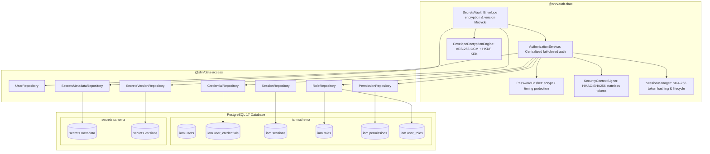

# SHADOW : HELIX NEBULA (SHN) — PHASE 1 STAGE 4
## Sovereign Identity, Granular RBAC & Secrets Vault Architecture Report

---

### 1. Executive Summary

Phase 1 Stage 4 establishes the sovereign identity, authentication, session lifecycle, role-based access control (RBAC), centralized fail-closed authorization, stateless security context propagation, and envelope-encrypted secrets vault for Shadow : Helix Nebula (SHN).

Adhering strictly to frozen Phase 0 specifications (0.3 BC-IAM/BC-SEC, 0.7 mod_auth_rbac/mod_secrets_vault, 0.10 Section 9, 0.11 Sections 3 & 6, 0.14 Section 19), this stage delivers:

1. **`@shn/auth-rbac`**: Sovereign identity authentication, session management, HMAC-signed security context signing, microsecond bitmask RBAC evaluation, AES-256-GCM envelope encryption, and secrets lifecycle management.
2. **Database Migration `003_identity_rbac_and_secrets_vault.sql`**: Forward-only, deterministic database migration adding schemas `iam` and `secrets`, including tables `iam.user_credentials`, `iam.sessions`, `iam.roles`, `iam.permissions`, `iam.role_permissions`, `iam.user_roles`, `secrets.metadata`, and `secrets.versions`. Seeds 17 canonical permissions, 6 canonical system roles, and complete role-permission mappings.
3. **Data Access Repositories**: High-performance PostgreSQL repositories in `@shn/data-access` for credentials, sessions, roles, permissions, secret metadata, and secret versions with tenant scoping and row-level locks.
4. **Comprehensive Test Suite**: Pure unit, integration, adversarial, multi-tenant isolation, and concurrency stress tests ensuring 100% pass rate across 182 tests platform-wide.

---

### 2. Package Responsibilities & Component Architecture



#### Monorepo Dependency DAG:
- `@shn/shared-kernel` (Primal leaf — zero runtime dependencies)
- `@shn/error-catalog` (Depends only on `@shn/shared-kernel`)
- `@shn/telemetry` (Depends on `@shn/shared-kernel`, `@shn/error-catalog`)
- `@shn/data-access` (Depends on `@shn/shared-kernel`, `@shn/error-catalog`, driver `pg`)
- `@shn/event-bus` (Depends on `@shn/shared-kernel`, `@shn/error-catalog`, `@shn/data-access`, `@shn/telemetry`)
- `@shn/auth-rbac` (Depends on `@shn/shared-kernel`, `@shn/error-catalog`, `@shn/data-access`, `@shn/telemetry`, `@shn/event-bus`)

Enforced mechanically via `scripts/check-deps.js` during `npm run lint:deps`.

---

### 3. Identity Verification & Session Lifecycle

#### 3.1 Scrypt Password Hashing (`SEC-AUT-001`)
- Password hashing uses native Node.js `crypto.scrypt` with parameters `N=16384`, `r=8`, `p=1`, `keylen=64`, and a cryptographically secure 16-byte random salt per user.
- Hash output format: `$scrypt$N=16384,r=8,p=1$<saltHex>$<hashHex>`.
- Plaintext passwords are NEVER persisted.
- Verification uses `timingSafeEqual` to eliminate timing side-channel leaks.

#### 3.2 User Enumeration Defense (`verifyDummy`)
- When an email address is not found in the database, the authentication service executes a full cost dummy scrypt computation (`verifyDummy`) with a fixed salt.
- This ensures response time parity between existing and non-existing accounts, defeating timing-based user enumeration attacks.

#### 3.3 Account Lockout Defense
- Tracks failed authentication attempts atomically in PostgreSQL (`iam.user_credentials.failed_attempts`).
- Reaching 5 consecutive failures triggers an automatic 15-minute temporary lockout (`locked_until = clock_timestamp() + interval '15 minutes'`).
- Successful authentication atomically clears `failed_attempts` and updates `last_authenticated_at`.

#### 3.4 Session & Token Storage
- Plaintext bearer tokens (`shn_sec_<hex>`) and refresh tokens (`shn_ref_<hex>`) are returned to the authenticated client but NEVER saved to the database.
- Database records only high-entropy SHA-256 digests (`token_hash`, `refresh_token_hash`).
- Session rotation generates fresh bearer and refresh tokens, updating digests in a single atomic transaction.
- Revocation immediately transitions status to `REVOKED`, invalidating subsequent requests.

---

### 4. Granular RBAC & Centralized Fail-Closed Authorization

#### 4.1 Canonical System Roles & Permissions (Phase 0.11 Section 3.2)
17 canonical permissions with distinct 32-bit single-bit flags:
| Permission Name | Bit | Description |
| :--- | :--- | :--- |
| `scope:read` | `1 << 0` (1) | View authorized scope boundaries, inclusions, exclusions |
| `scope:admin` | `1 << 1` (2) | Create, mutate, lock, or archive scope definitions |
| `workflow:read` | `1 << 2` (4) | Inspect workflow definitions, DAGs, and execution history |
| `workflow:author` | `1 << 3` (8) | Author, edit, compile, and validate declarative workflow graphs |
| `workflow:execute` | `1 << 4` (16) | Dispatch workflow runs and trigger task execution |
| `recon:passive` | `1 << 5` (32) | Execute passive OSINT and non-invasive network observation |
| `probing:active` | `1 << 6` (64) | Execute active port scanning, banner grabbing, service discovery |
| `scan:invasive` | `1 << 7` (128) | Execute invasive vulnerability scanning and exploitation |
| `report:draft` | `1 << 8` (256) | Generate and view draft security reports and findings |
| `report:sign_off` | `1 << 9` (512) | Officially approve, digitally seal, and deliver final reports |
| `secrets:read_metadata` | `1 << 10` (1024) | Inspect secret identifiers, aliases, lifecycle, and expiration |
| `secrets:read_material` | `1 << 11` (2048) | Decrypt and retrieve plaintext secret material (Audited) |
| `secrets:write` | `1 << 12` (4096) | Store, update, and manage secret definitions |
| `secrets:rotate` | `1 << 13` (8192) | Perform cryptographic key and secret material rotation |
| `secrets:revoke` | `1 << 14` (16384) | Immediately revoke or disable secret keys and versions |
| `audit:read` | `1 << 15` (32768) | Inspect immutable operational audit trail and security logs |
| `iam:admin` | `1 << 16` (65536) | Manage user identities, memberships, credentials, and roles |

#### 4.2 System Roles & Role-Permission Matrix
- `ORG_ADMIN`: All permissions (0x1FFFF).
- `WORKSPACE_ADMIN`: Scope admin, workflow full, recon, probing, invasive scan, report sign-off, secrets full, audit read.
- `OPERATOR`: Scope read, workflow author & execute, recon, probing, invasive scan, report draft, secrets read metadata & material, audit read.
- `ANALYST`: Scope read, workflow read, recon, probing, report draft, secrets read metadata, audit read.
- `AUDITOR`: Scope read, workflow read, recon, probing, report draft & sign-off, secrets read metadata, audit read.
- `OBSERVER`: Scope read, workflow read, recon.

#### 4.3 Microsecond Bitmask Evaluation (`API-INV-01`, `SEC-INV-01`)
```ts
const hasPermission = (token.permission_mask & requiredBit) === requiredBit;
```
Single bitwise AND evaluation executes in nanoseconds without recurring database lookups.

---

### 5. Cryptographic Security Context Signing & Verification

- **Stateless HMAC-SHA256 Token**: Issued at login and session refresh, containing:
  - `subject_id` (UUIDv7)
  - `subject_type` (`OPERATOR` | `SYSTEM` | `WORKER` | `AUTOMATION`)
  - `workspace_id` (UUIDv7)
  - `roles` (Alphabetically sorted, comma-joined)
  - `permission_mask` (Aggregated 32-bit integer)
  - `issued_at` (ISO 8601 UTC)
  - `expires_at` (ISO 8601 UTC, 15-minute default TTL)
  - `signature` (HMAC-SHA256 hex digest)
- **Deterministic Claims Serialization**: Canonical string `subject_id:subject_type:workspace_id:roles:mask:issued_at:expires_at` ensures cross-platform cryptographic verifiability.
- **Constant-Time Verification**: `timingSafeEqual` prevents timing attacks on signature validation.
- **Fail-Closed Expiration**: Expired tokens fail immediately with RFC 7807 `ERR_AUTH_TOKEN_EXPIRED` (HTTP 401).

---

### 6. Sovereign Secrets Vault & Envelope Encryption

#### 6.1 Cryptographic Hierarchy (`SEC-CRY-001`, `INV-15`)
1. **Master Root Key**: 256-bit root key stored in protected environment / HSM.
2. **Organization KEK**: Derived via `HKDF-SHA256(masterKey, salt="", info="shn:kek:org:<orgId>", 32)`. Guarantees strict cryptographic isolation between tenant organizations.
3. **Data Encryption Key (DEK)**: Ephemeral 256-bit AES key generated at random for each secret version.
4. **Wrapped DEK**: DEK is encrypted under the Organization KEK using AES-256-GCM with a distinct 12-byte IV and 16-byte authentication tag (60-byte payload).
5. **Ciphertext**: Plaintext secret is encrypted under the ephemeral DEK using AES-256-GCM with a distinct 12-byte IV and 16-byte authentication tag.

#### 6.2 In-Memory Zeroization (`zeroizeMemory`)
All sensitive temporary buffers containing plaintext, ephemeral DEKs, and derived KEKs are zeroized via `buffer.fill(0)` immediately in `finally` blocks post-use.

#### 6.3 Secret Lifecycle Operations
- **`createSecret`**: Requires `SECRETS_WRITE`. Stores metadata in `secrets.metadata` and encrypted material in `secrets.versions` (Version 1, status `ACTIVE`).
- **`getSecret`**: Requires `SECRETS_READ_MATERIAL`. Enforces workspace boundary. Unwraps DEK with Org KEK, decrypts ciphertext, records audited access, and returns zeroizable `DecryptedSecret`.
- **`getSecretMetadata`**: Requires `SECRETS_READ_METADATA`. Returns secret metadata, version count, tags, and policy without decrypting or exposing ciphertext.
- **`rotateSecret`**: Requires `SECRETS_ROTATE`. Encrypts new plaintext with a fresh ephemeral DEK, writes Version N+1, marks Version N as `SUPERSEDED`, and updates metadata `current_version`.
- **`revokeSecret`**: Requires `SECRETS_REVOKE`. Transitions metadata to `REVOKED` and marks all versions as `REVOKED`. Subsequent retrieval attempts are permanently denied fail-closed with HTTP 410.

---

### 7. Multi-Tenant Hermeticity & Adversarial Defense

1. **Workspace Boundary Enforcement**: Every secret query and role assignment strictly verifies matching `workspace_id`. Cross-workspace access attempts are rejected fail-closed with `ERR_AUTH_CROSS_WORKSPACE_DENIED` (HTTP 404).
2. **Cryptographic Tamper-Proofing**: Any mutation to database ciphertext, nonce, or auth tag causes AES-256-GCM authentication failure. The vault rejects the record fail-closed with `ERR_VAULT_DECRYPTION_FAILED` without leaking secret material.
3. **Audit Ledger Immutability Preservation**: Truncation and mutation operations on `audit.events` remain strictly blocked by native database triggers (`SEC-INV-11` / `DATA-INV-07`).

---

### 8. Verification & Quality Gates

#### Quality Gates Summary:
- `npm run lint:deps`: **PASSED** (0 architectural boundary violations).
- `npm run build`: **PASSED** (TypeScript project references compiled with composite declarations).
- `npm test`: **PASSED** (182 total tests passing, 0 failing).
  - Pure unit tests: **116 passed** (0 failed).
  - Integration tests: **66 passed** (0 failed).
- `git diff --check`: **PASSED** (0 whitespace errors or conflict markers).
