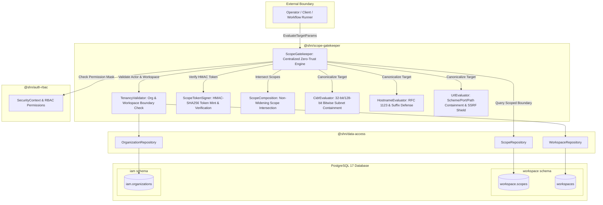
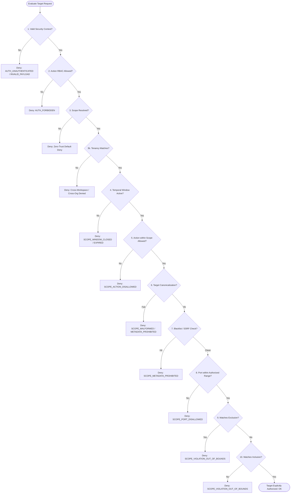

# SHADOW : HELIX NEBULA (SHN) — PHASE 1 STAGE 5
## Canonical Tenancy & Zero-Trust Scope Gatekeeper Architecture Report

---

### 1. Executive Summary

Phase 1 Stage 5 establishes the canonical multi-tenant boundary and the zero-trust target scope gatekeeper for the sovereign cybersecurity platform Shadow : Helix Nebula (SHN).

Adhering strictly to frozen Phase 0 specifications (Phase 0.1 Section 18, Phase 0.3 Context 3 BC-SCP, Phase 0.4 Invariants, Phase 0.7 Section 4.1.1 `mod_scope_gatekeeper`, Phase 0.10 Section 4.2 `SCOPE_BOUNDARY`, Phase 0.11 Section 4, and Phase 0.14 Section 20), this stage delivers:

1. **`@shn/scope-gatekeeper`**: Zero-runtime-dependency core package enforcing zero-trust target authorization, bitwise IP/CIDR containment, RFC 1123 hostname canonicalization, URL segment-aware path authorization, downward-narrowing scope intersection, tamper-resistant HMAC-SHA256 scope tokens, and multi-tenant isolation.
2. **Database Migration `004_tenancy_and_scope_gatekeeper.sql`**: Forward-only, deterministic migration creating table `workspace.scopes` with strict multi-tenant foreign keys, composite indexes, JSON schema constraints, temporal windows, and cryptographic scope digest sealing (`scope_sha256`).
3. **Data Access Repository**: High-performance PostgreSQL repository `ScopeRepository` in `@shn/data-access` enforcing tenant scoping (`DATA-INV-08`) across all queries.
4. **Comprehensive Test Suite**: Pure unit, integration, adversarial, concurrency, and security tests ensuring 100% pass rate across 204 unit tests and 86 integration tests platform-wide.

---

### 2. Architecture & Trust Boundaries



#### Monorepo Dependency DAG:
- `@shn/shared-kernel` (Primal leaf — zero runtime dependencies)
- `@shn/error-catalog` (Depends only on `@shn/shared-kernel`)
- `@shn/telemetry` (Depends on `@shn/shared-kernel`, `@shn/error-catalog`)
- `@shn/data-access` (Depends on `@shn/shared-kernel`, `@shn/error-catalog`, driver `pg`)
- `@shn/event-bus` (Depends on `@shn/shared-kernel`, `@shn/error-catalog`, `@shn/data-access`, `@shn/telemetry`)
- `@shn/auth-rbac` (Depends on `@shn/shared-kernel`, `@shn/error-catalog`, `@shn/data-access`, `@shn/telemetry`, `@shn/event-bus`)
- `@shn/scope-gatekeeper` (Depends on `@shn/shared-kernel`, `@shn/error-catalog`, `@shn/telemetry`, `@shn/data-access`, `@shn/event-bus`, `@shn/auth-rbac`)

Enforced mechanically via `scripts/check-deps.js` during `npm run lint:deps`.

---

### 3. Tenancy & Boundary Model

#### 3.1 Hierarchical Boundary (`INV-01`, `INV-06`, `SEC-INV-05`)
- **Organization (`OrganizationId`)**: Sovereign legal or enterprise boundary. No cross-organization data leakage or scope sharing is permitted under any circumstances.
- **Workspace (`WorkspaceId`)**: Discrete operational project environment within an organization. All scans, tasks, workflows, and scopes are strictly hermetic to a single workspace.
- **Hermetic Scoping (`DATA-INV-08`)**: All persistence lookups for scopes enforce `(id, workspace_id)` compound primary keys and where clauses, preventing tenant-hopping via guessed UUIDs.

#### 3.2 Mechanical Tenancy Enforcement
`TenancyValidator` provides static and persistence-verified boundary assertion:
1. Validates UUIDv7 structural compliance.
2. Asserts actor's `SecurityContext.workspace_id` matches the target resource's `workspace_id`.
3. Validates database hierarchy: verifies that the workspace belongs to the organization claimed by the actor.

---

### 4. Zero-Trust Scope Evaluation Pipeline

When an operation or workflow requests authorization for a target, `ScopeGatekeeper.evaluateTarget` processes the request through a 10-step fail-closed evaluation pipeline:



---

### 5. Deterministic Evaluators & Canonicalization Rules

#### 5.1 CIDR & IP Evaluator (`cidr-evaluator.ts`)
- **IPv4**: Parsed to unsigned 32-bit integers (`num >>> 0`). Netmask bit shifts enforce `prefix >= 0 && prefix <= 32`.
- **IPv6**: Parsed to 128-bit unsigned BigInts (`BigInt`). Supports RFC 5952 full expansion and compressed `::` representations.
- **Octal Ambiguity Defense (`SEC-INV-08`)**: Rejects any IPv4 octet with leading zeros (e.g., `010.0.0.1`), defeating parser confusion attacks where BSD sockets interpret leading zeros as octal while modern runtimes treat them as decimal.
- **SSRF & Metadata Shield (`SEC-INV-08`)**:
  - Rejects `169.254.0.0/16` (AWS/Azure/GCP link-local metadata).
  - Rejects `100.100.100.200/32` (Alibaba Cloud metadata).
  - Rejects `127.0.0.0/8` and `::1/128` (Loopback).
  - Rejects `fd00:ec2::/64` (AWS IPv6 metadata).
  - Rejects `fe80::/10` (IPv6 Link-Local).
  - Rejects `224.0.0.0/4` and `ff00::/8` (Multicast).

#### 5.2 Hostname Evaluator (`hostname-evaluator.ts`)
- **RFC 1123 Normalization**: Lowercases hostnames, validates 1-63 char label lengths and 253 max total length.
- **Trailing Dot Normalization**: Strips trailing dots (e.g. `example.com.` normalized to `example.com`).
- **Suffix Confusion Attack Defense**:
  - If scope specifies `example.com`, `evil-example.com` or `notexample.com` are strictly rejected.
  - Subdomains are only authorized if explicit wildcard (`*.example.com`) or dot-prefix (`.example.com`) is declared.
- **Prohibited Hostnames**: Hard blocks `metadata.google.internal`, `instance-data`, `localhost`, and any `.localhost` or `.metadata.google.internal` suffixes.

#### 5.3 URL Evaluator (`url-evaluator.ts`)
- **Strict Scheme Enforcement**: Permits ONLY `http:` and `https:`. Rejects `javascript:`, `file:`, `gopher:`, `data:`.
- **SSRF Parser Confusion Defense**: Outright rejects any URL containing userinfo (`@`) in authority (e.g. `http://example.com@169.254.169.254/`).
- **Port Normalization**: Normalizes default ports (strips `:80` for http and `:443` for https).
- **Segment-Aware Path Containment**: Resolves `.` and `..` segments. Strictly checks boundary segments: authorizing `/api` authorizes `/api/v1` and `/api`, but NEVER `/api-evil`. Rejects traversal attempts escaping the root (`..` past `/`).

#### 5.4 Downward-Narrowing Scope Composition (`scope-composition.ts`)
- Scope intersection ensures child scopes **never broaden** parent permissions:
  - **Inclusions**: Intersected (child must fall within parent inclusions).
  - **Exclusions**: Unioned (child inherits all parent exclusions plus any additional child exclusions).
  - **Port Ranges**: Intersected (only overlapping ports are permitted).
  - **Allowed Actions**: Intersected (child action subset).
  - **Temporal Window**: Narrowed (`max(parent.validFrom, child.validFrom)` to `min(parent.validUntil, child.validUntil)`).
- **Canonical Digest Sealing**: Scope definition canonical fields are sorted, JSON-serialized, and hashed via SHA-256 (`scope_sha256`) to ensure tamper evidence.

---

### 6. Scope Token Specification (`scope-token-signer.ts`)

For distributed, stateless, or offline task workers, the gatekeeper mints cryptographically signed scope tokens:
- **Format**: `shn_sct_<base64url(header)>.<base64url(claims)>.<base64url(sig)>`
- **Header**: `{"alg":"HS256","typ":"SHN-SCOPE-TOKEN"}`
- **Claims**:
  - `scope_id`, `organization_id`, `workspace_id`, `actor_id`
  - `inclusions`, `exclusions`, `allowed_actions`, `disallowed_actions`, `port_ranges`
  - `valid_from`, `valid_until`, `scope_sha256`, `version`, `nonce`, `issued_at`
- **Signature**: HMAC-SHA256 over `header.claims`. Verified using constant-time comparison (`crypto.timingSafeEqual`).
- **Security Protections**:
  - Replay / Tamper Resistance: Any mutation to claims (e.g. broadening inclusions, extending expiration, changing workspace) invalidates the signature.
  - Cross-Tenant Resistance: Evaluator verifies `claims.workspace_id === context.workspace_id` and `claims.actor_id === context.subject_id`.

---

### 7. Database Persistence & Scoped Queries

#### 7.1 Schema: `workspace.scopes` (`004_tenancy_and_scope_gatekeeper.sql`)
```sql
CREATE TABLE workspace.scopes (
    id UUID PRIMARY KEY,
    workspace_id UUID NOT NULL REFERENCES workspaces(id) ON DELETE CASCADE,
    organization_id UUID NOT NULL REFERENCES iam.organizations(id) ON DELETE CASCADE,
    name VARCHAR(128) NOT NULL,
    description TEXT,
    inclusions JSONB NOT NULL DEFAULT '[]'::jsonb,
    exclusions JSONB NOT NULL DEFAULT '[]'::jsonb,
    allowed_actions TEXT[] NOT NULL DEFAULT '{}',
    disallowed_actions TEXT[] NOT NULL DEFAULT '{}',
    port_ranges JSONB NOT NULL DEFAULT '[]'::jsonb,
    valid_from TIMESTAMPTZ NOT NULL,
    valid_until TIMESTAMPTZ NOT NULL,
    rate_limits JSONB,
    scope_sha256 CHAR(64) NOT NULL,
    status VARCHAR(32) NOT NULL DEFAULT 'ACTIVE',
    version INT NOT NULL DEFAULT 1,
    created_at TIMESTAMPTZ NOT NULL DEFAULT clock_timestamp(),
    updated_at TIMESTAMPTZ NOT NULL DEFAULT clock_timestamp(),
    CONSTRAINT chk_scope_status CHECK (status IN ('ACTIVE', 'REVOKED', 'EXPIRED')),
    CONSTRAINT chk_scope_validity CHECK (valid_until > valid_from),
    CONSTRAINT chk_scope_version CHECK (version >= 1)
);
```

#### 7.2 Repositories
`ScopeRepository` in `@shn/data-access`:
- `create(record)`: Inserts verified scope record.
- `findById(id, workspaceId)`: Scoped query enforcing workspace isolation (`DATA-INV-08`).
- `listByWorkspace(workspaceId)`: Returns all scopes belonging strictly to the workspace.
- `update(id, workspaceId, updates)`: Optimistic concurrency check with version increment.
- `revoke(id, workspaceId)`: Sets status to `REVOKED`.

---

### 8. Verification & Quality Gates

All platform quality gates passed cleanly:

| Quality Gate | Command | Result | Notes |
| :--- | :--- | :--- | :--- |
| **Dependency Linting** | `npm run lint:deps` | **PASSED** | Validated `@shn/scope-gatekeeper` and workspace boundaries |
| **TypeScript Build** | `npm run build` | **PASSED** | Clean compile across all packages |
| **Unit Test Suite** | `npm run test:unit` | **PASSED** | **204 tests passing across 49 test suites** |
| **Integration Test Suite** | `npm run test:integration` | **PASSED** | **86 tests passing across 30 test suites** |
| **Full Platform Tests** | `npm test` | **PASSED** | Combined unit + integration test run |
| **Git Diff Cleanliness** | `git diff --check` | **PASSED** | Zero whitespace or formatting defects |
| **Secrets Audit** | `git status` | **PASSED** | Zero secrets, credentials, or keys checked in |

---

### 9. Invariants & Security Guarantees Verified

- **`INV-01`**: Strict multi-tenant isolation across all boundaries.
- **`INV-06`**: Single source of truth for canonical target definitions.
- **`INV-09`**: Fail-closed authorization at all API and engine surfaces.
- **`INV-11`**: Explicit authorization required for any target engagement.
- **`INV-19`**: Tamper-evident scope envelopes sealed by SHA-256 digests.
- **`SEC-INV-01`**: Zero-trust deny-by-default execution.
- **`SEC-INV-05`**: Cross-tenant and cross-workspace access prevention.
- **`SEC-INV-08`**: Cloud metadata, loopback, and internal SSRF shield.
- **`DATA-INV-08`**: Scoped persistence queries enforcing tenant boundaries.
- **`API-INV-02`**: Strict TargetVerdict reporting reasons and error codes.

---

### 10. Conclusion & Handoff

SHN Phase 1 Stage 5: Tenancy & Scope Gatekeeper is completely implemented, verified, documented, and fully integrated with existing SHN subsystems. Stage 6 has not been started.
