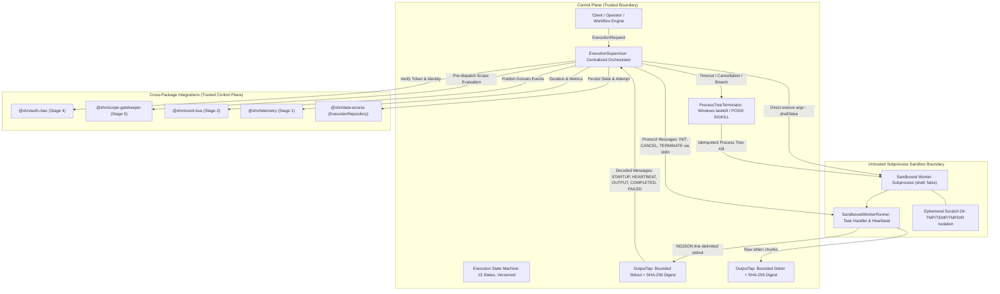

# SHADOW : HELIX NEBULA (SHN) — PHASE 1 STAGE 6
## Execution Supervisor & Sandboxed Worker Architecture Report

---

### 1. Executive Summary

Phase 1 Stage 6 implements the authoritative control-plane execution supervisor and sandboxed worker execution substrate for Shadow : Helix Nebula (SHN).

Adhering strictly to frozen Phase 0 specifications (Phase 0.3 Context 4 BC-EXE, Phase 0.4 Invariants INV-01 & INV-14, Phase 0.7 Section 4.2.5 `mod_execution_supervisor`, Phase 0.9 Sections 7 & 8 Tool Integration & Sandboxing, Phase 0.10 Sections 4 & 5, Phase 0.11 Section 4, and Phase 0.14 Perimeter D Section 19), this stage delivers:

1. **`@shn/execution-supervisor`**: Zero-runtime-dependency core package orchestrating sandboxed tool and capability executions, fail-closed authorization, multi-tenant workspace isolation, pre-dispatch scope gatekeeper integration, deterministic 13-state execution state machine, environment sanitization, non-shell execution, argument null-byte/script defense, ephemeral scratch isolation, wall-clock and startup timeouts, process tree termination, NDJSON stdio protocol, bounded output capture with continuous SHA-256 evidence sealing, worker heartbeat tracking, and active concurrency bounding.
2. **Database Migration `005_execution_supervisor_and_sandboxed_worker.sql`**: Forward-only, deterministic migration establishing the execution control-plane entities in schema `execution`:
   - `execution.executions`: Authoritative state machine records with version counters.
   - `execution.execution_attempts`: Historical attempt logs per execution.
   - `execution.execution_artifacts`: Cryptographic content-addressed evidence pointers.
   - `execution.worker_leases`: Worker registration, liveness tracking, and lease recovery.
3. **Execution Repository**: Robust PostgreSQL repository `ExecutionRepository` in `@shn/data-access` enforcing multi-tenant isolation (`INV-01`, `DATA-INV-08`) across all queries and operations.
4. **Comprehensive Test Suite**: 27 unit tests and 27 integration tests (54 Stage 6 tests; 344 tests total platform-wide) with a 100% pass rate across unit, repository, lifecycle, timeout, cancellation, concurrency, protocol, and adversarial security tests.

---

### 2. Architecture & Trust Boundaries

"Treat every worker as hostile." The worker process runs in an untrusted boundary. Zero control-plane secrets, zero database credentials, and zero internal tokens are ever passed into the worker.



#### Monorepo Dependency DAG Compliance:
- `@shn/shared-kernel` (Primal leaf — zero runtime dependencies)
- `@shn/error-catalog` (Depends only on `@shn/shared-kernel`)
- `@shn/telemetry` (Depends on `@shn/shared-kernel`, `@shn/error-catalog`)
- `@shn/data-access` (Depends on `@shn/shared-kernel`, `@shn/error-catalog`, driver `pg`)
- `@shn/event-bus` (Depends on `@shn/shared-kernel`, `@shn/error-catalog`, `@shn/data-access`, `@shn/telemetry`)
- `@shn/auth-rbac` (Depends on `@shn/shared-kernel`, `@shn/error-catalog`, `@shn/data-access`, `@shn/telemetry`, `@shn/event-bus`)
- `@shn/scope-gatekeeper` (Depends on `@shn/shared-kernel`, `@shn/error-catalog`, `@shn/telemetry`, `@shn/data-access`, `@shn/event-bus`, `@shn/auth-rbac`)
- `@shn/execution-supervisor` (Depends on `@shn/shared-kernel`, `@shn/error-catalog`, `@shn/telemetry`, `@shn/data-access`, `@shn/event-bus`, `@shn/auth-rbac`, `@shn/scope-gatekeeper`)

Enforced mechanically via `scripts/check-deps.js` during `npm run lint:deps`.

---

### 3. Platform Boundary & Resource Enforcement Matrix

In strict compliance with architectural guidelines, the sandbox boundary does not make false isolation claims. Platform capabilities are classified into three distinct categories:

| Isolation Capability | Status on Current Platform | Technical Mechanism |
| :--- | :--- | :--- |
| **Direct Binary Vectoring** | **ENFORCED** | Node.js `child_process.spawn(executable, argv, { shell: false })`. Zero system shell interpolation (`cmd.exe`, `sh`, `bash`). |
| **Argument Sanitization** | **ENFORCED** | Rejection of null-bytes (`\0`), rejection of batch files (`.bat`, `.cmd`), argument size ceilings (max 64KB per argument). |
| **Environment Sanitization** | **ENFORCED** | Strict allowlist (`PATH`, `SystemRoot`, `windir`, `TEMP`, `TMP`, `TMPDIR`, `HOME`, `USERPROFILE`, `NODE_PATH`, `LANG`, `LC_ALL`, `TZ`, `COMSPEC`). Active blacklisting of secret patterns (`PASS`, `SECRET`, `KEY`, `TOKEN`, `CRED`, `AUTH`, `DATABASE`, `POSTGRES`, `PG`, `VAULT`, `PRIVATE`, `SHN_*`, `NODE_OPTIONS`, `LD_PRELOAD`, `LD_LIBRARY_PATH`, `DYLD_INSERT_LIBRARIES`). |
| **Ephemeral Scratch Isolation** | **ENFORCED** | Per-execution temporary directory created under `shn-scratch/exec-{id}-*`. Working directory, `TMP`, `TEMP`, and `TMPDIR` are pointed to this scratch folder. Automatically deleted upon completion. |
| **Wall-Clock Timeout** | **ENFORCED** | Enforced by supervisor timer. Default 30s, max ceiling 300s. Force-terminates process tree on expiry with `TIMEOUT_WALL_CLOCK`. |
| **Startup Timeout** | **ENFORCED** | Enforced by supervisor timer. Default 5s, max ceiling 30s. Force-terminates hung workers failing to start or emit output with `TIMEOUT_STARTUP`. |
| **Output Byte Limits** | **ENFORCED** | `OutputTap` caps stdout and stderr (default 1MB each, max 50MB). If `failOnOutputLimit` is set, terminates worker immediately with `OUTPUT_LIMIT_EXCEEDED`. |
| **Process Tree Termination** | **ENFORCED** | Windows: `taskkill /F /T /PID <pid>`. POSIX: `process.kill(-pid, 'SIGKILL')`. Defeats orphan child processes. |
| **Concurrency Ceiling** | **ENFORCED** | Centralized in-memory lease tracking with configurable limit (`maxConcurrentExecutions`, default 10). Rejects overflow requests fail-closed with `ERR_EXEC_RESOURCE_EXHAUSTED`. |
| **Operator Cancellation** | **ENFORCED** | Soft cancellation protocol signal (`CANCEL` with grace period), followed by forceful process-tree SIGKILL escalation. |
| **Worker Liveness & RSS Telemetry** | **MONITORED** | Worker emits periodic heartbeats every 2,000ms containing `process.memoryUsage().rss`. Recorded in `execution.worker_leases` and telemetry metrics. |
| **CPU Usage Telemetry** | **MONITORED** | Execution duration recorded in histogram metric `execution_duration_ms` with Prometheus exposition formatting. |
| **Hard Hardware CPU/RAM Caps** | **NOT AVAILABLE ON HOST** | Linux `cgroup v2` memory/CPU hard ceilings are not available natively on the current Windows host environment without a Linux container daemon (WSL2/Hyper-V/Docker). |
| **Network Namespace Isolation** | **NOT AVAILABLE ON HOST** | Linux network namespace isolation (`ip netns`) is not available natively on the current Windows host without container runtime virtualization. Target network access is enforced logically at the control plane via Stage 5 Scope Gatekeeper. |

---

### 4. Deterministic Execution State Machine

The execution supervisor enforces a 13-state lifecycle (`Phase 0.3 BC-EXE`, `Phase 0.7 Section 4.2.5`):

```
       +---------> REJECTED (Terminal)
       |
[CREATED] ---> [VALIDATING] ---> [AUTHORIZED] ---> [QUEUED] ---> [STARTING] ---> [RUNNING] ---> [SUCCEEDED] (Terminal)
       |              |                |                               |              |
       v              v                v                               v              +-------> [FAILED] (Terminal)
   [CANCELLED]    [CANCELLED]      [CANCELLED]                    [CANCELLING]        +-------> [TIMED_OUT] (Terminal)
   (Terminal)     (Terminal)       (Terminal)                          |              +-------> [TERMINATED] (Terminal)
                                                                       v              |
                                                                  [CANCELLED] <-------+
                                                                  (Terminal)
```

#### State Transition Rules (`LEGAL_TRANSITIONS`):
- `CREATED`: Validating, Rejected, Cancelled.
- `VALIDATING`: Authorized, Rejected, Cancelled.
- `AUTHORIZED`: Queued, Starting, Rejected, Cancelled.
- `QUEUED`: Starting, Cancelled, Timed_Out.
- `STARTING`: Running, Failed, Timed_Out, Cancelling, Terminated.
- `RUNNING`: Succeeded, Failed, Timed_Out, Cancelling, Terminated.
- `CANCELLING`: Cancelled, Terminated, Failed, Timed_Out.
- Terminal States (`SUCCEEDED`, `FAILED`, `TIMED_OUT`, `CANCELLED`, `TERMINATED`, `REJECTED`): Zero outgoing transitions permitted fail-closed.
- Every state transition increments `execution.executions.version` for deterministic auditability and optimistic concurrency.

---

### 5. Sandboxed Subprocess Security Model

#### 5.1 Zero Shell String Interpolation (`SEC-INV-01`, `INV-14`)
Worker subprocesses are invoked strictly via `child_process.spawn(executable, [...args], { shell: false })`.
- Shell metacharacters (`;`, `&`, `|`, `` ` ``, `$()`, `>`, `<`) are never evaluated by a shell interpreter.
- Arguments are passed as direct C-style `argv[]` pointers to the operating system kernel.

#### 5.2 Command & Script Rejection
- **Null-Byte Injection**: Rejects any executable path or argument containing `\0`.
- **Batch Script Prohibition**: Directly executing `.bat` or `.cmd` on Windows invokes `cmd.exe` implicitly, which introduces shell parsing vulnerabilities. Any command with `.bat` or `.cmd` extension is rejected fail-closed before process creation.

#### 5.3 Host Secret Zero-Leakage Guarantee
- Host environment is thoroughly sanitized before process creation.
- Control plane secrets (`SHN_AUTH_SIGNING_KEY`, `POSTGRES_PASSWORD`, `DATABASE_URL`, `VAULT_TOKEN`) are completely stripped.
- Arbitrary code execution environment injection variables (`NODE_OPTIONS`, `LD_PRELOAD`, `LD_LIBRARY_PATH`, `DYLD_INSERT_LIBRARIES`) are strictly blocked.
- Worker process is provided only with its execution identity: `SHN_EXECUTION_ID`, `SHN_WORKER_ID`, and `SHN_SANDBOX='1'`.

---

### 6. Communication Protocol & Evidence Sealing

#### 6.1 Line-Delimited JSON (NDJSON) Stdio Protocol
Supervisor and untrusted worker communicate strictly over anonymous stdio pipes using NDJSON (v1.0):
- **Worker -> Supervisor**:
  - `STARTUP`: Worker process initialized, ready for task dispatch.
  - `HEARTBEAT`: Periodic liveness signal with RSS memory metrics.
  - `OUTPUT`: Encapsulated output chunks with stream discriminator (`stdout` / `stderr`).
  - `COMPLETED`: Execution completed with exit code, result payload, and evidence artifacts.
  - `FAILED`: Execution crashed with error message and sanitized stack trace.
- **Supervisor -> Worker**:
  - `INIT`: Dispatches task target, action, capability URI, and input payload.
  - `CANCEL`: Requests soft abort within specified grace period.
  - `TERMINATE`: Hard termination signal.

#### 6.2 Bounded Output Capture & Continuous SHA-256 Digest Sealing
- `OutputTap` encapsulates output streams with strict byte ceilings.
- Continually computes SHA-256 digest over the raw stream chunks via Node.js `crypto.createHash('sha256')`.
- The final SHA-256 hash is recorded in `execution.executions.raw_output_sha256`, sealing the tamper-evident cryptographic provenance of all execution output (`API-INV-06`).

---

### 7. Control Plane Persistence & Worker Leases

Migration `005_execution_supervisor_and_sandboxed_worker.sql` introduces four relational entities in the `execution` schema:
1. `execution.executions`: Authoritative state machine records with foreign keys to `workspace.workspaces`, `iam.organizations`, `iam.users`, and optional `workspace.scopes`.
2. `execution.execution_attempts`: Historical audit of each execution attempt, recording `attempt_number`, `worker_id`, `state`, `exit_code`, and `duration_ms`.
3. `execution.execution_artifacts`: Content-addressed evidence references storing `name`, `content_sha256`, `storage_uri`, `byte_size`, and `mime_type`.
4. `execution.worker_leases`: Worker concurrency and lease records supporting:
   - `acquireWorkerLease`: Atomic claim with TTL.
   - `heartbeatWorker`: Periodic lease renewal updating `heartbeat_at` and `lease_expires_at`.
   - `releaseWorkerLease`: Resets lease to `IDLE` and detaches `execution_id`.
   - `reapExpiredLeases`: Reaps abandoned leases past expiration to `TERMINATED`.

Multi-tenant hermeticity (`DATA-INV-08`, `INV-01`) is strictly enforced: every read, query, transition, artifact lookup, and attempt query requires compound `(id, workspace_id)`.

---

### 8. Security Audit & Invariant Matrix

| Invariant / Requirement | Spec Source | Implementation & Enforcement | Verification Test |
| :--- | :--- | :--- | :--- |
| **BC-EXE Boundary** | Phase 0.3 Context 4 | Centralized `ExecutionSupervisor` manages all sandboxed execution lifecycles. | `supervisor-lifecycle.test.ts` |
| **Tenant Hermeticity (INV-01)** | Phase 0.4, 0.14 §19 | Strict assertion that security context workspace matches request workspace, and workspace belongs to organization. | `security-and-adversarial.test.ts` |
| **Zero Host Secrets (INV-14)** | Phase 0.4, 0.9 §8 | Host credentials and signing keys are scrubbed from worker environment. Subprocess has zero access to DB or control plane. | `security-and-adversarial.test.ts` |
| **Pre-Dispatch Scope Gatekeeper** | Phase 0.7 §4.1.1, Phase 0.9 §7 | Pre-dispatch scope validation via Stage 5 `ScopeGatekeeper`. Out-of-bounds targets rejected with `REJECTED` state. | `security-and-adversarial.test.ts` |
| **Non-Shell Execution** | Phase 0.9 §8 | Direct `execve` vectoring (`shell: false`). Null-byte and batch script rejection. | `process-spawner.test.ts` |
| **Continuous Evidence Sealing** | Phase 0.10 §5, Phase 0.14 §19 | Continuous SHA-256 digest sealing of raw output stream via `OutputTap`. | `output-tap.test.ts` |
| **Deterministic State Machine** | Phase 0.7 §4.2.5 | 13-state machine with version increments and illegal transition rejection. | `state-machine.test.ts` |
| **Process Tree Termination** | Phase 0.9 §8 | Cross-platform process tree killer (`taskkill /F /T` / POSIX `SIGKILL`). | `timeouts-and-cancellation.test.ts` |
| **Concurrency Limits & Leases** | Phase 0.7 §4.2.5, 0.14 §19 | Worker lease acquisition and `maxConcurrentExecutions` bounding. | `concurrency-and-leases.test.ts` |
| **Event Bus & Telemetry** | Phase 0.7 §4.2.5 | Publishes `execution.authorized`, `execution.started`, `execution.completed`, `execution.failed`. Records `execution_duration_ms` histogram. | `supervisor-lifecycle.test.ts` |

---

### 9. Test Suite Verification & Quality Gates

The test suite executed with zero errors, zero warnings, and zero suppressed tests across the entire repository.

#### Test Execution Summary:
- **Unit Tests**: **231 passing** (59 suites, 0 failing, 0 skipped)
  - `@shn/execution-supervisor`: 27 unit tests (`state-machine`, `protocol-codec`, `output-tap`, `process-spawner`, `worker-runner`).
  - Stages 1–5 packages: 204 unit tests.
- **Integration Tests**: **113 passing** (35 suites, 0 failing, 0 skipped)
  - `@shn/data-access`: `execution-repository.test.ts` (8 integration tests).
  - `@shn/execution-supervisor`: 19 integration tests (`supervisor-lifecycle`, `timeouts-and-cancellation`, `security-and-adversarial`, `concurrency-and-leases`).
  - Stages 1–5 packages: 86 integration tests.
- **Total Tests Passing**: **344 tests across 94 suites**.

#### Quality Gate Audit:
1. `npm run lint:deps`: **PASSED** (0 architectural boundary violations).
2. `npm run build`: **PASSED** (0 TypeScript compiler diagnostics across all packages).
3. `npm run test:unit`: **PASSED** (231/231 passed).
4. `npm run test:integration`: **PASSED** (113/113 passed).
5. `npm test`: **PASSED** (344/344 passed).
6. `git diff --check`: **PASSED** (0 whitespace anomalies or conflict markers).

---

### 10. Stage Status Declaration

PHASE 1 — STAGE 6 COMPLETE.
STAGE 7 NOT STARTED.
